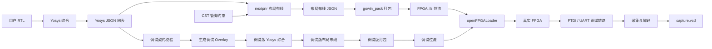
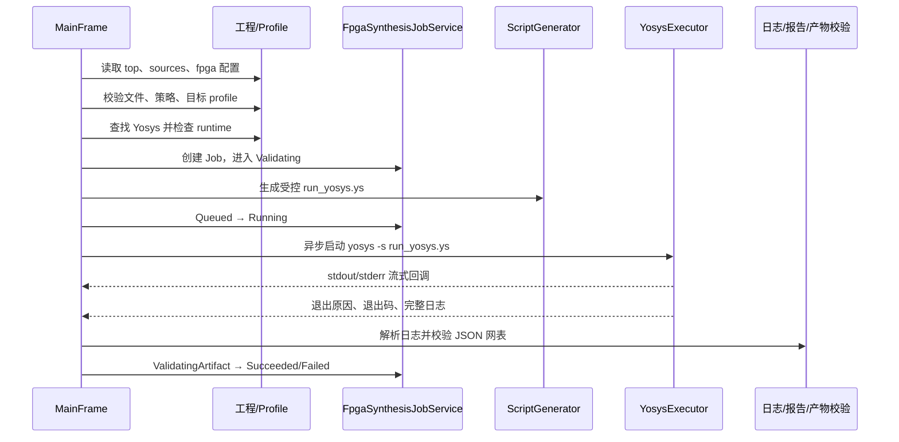
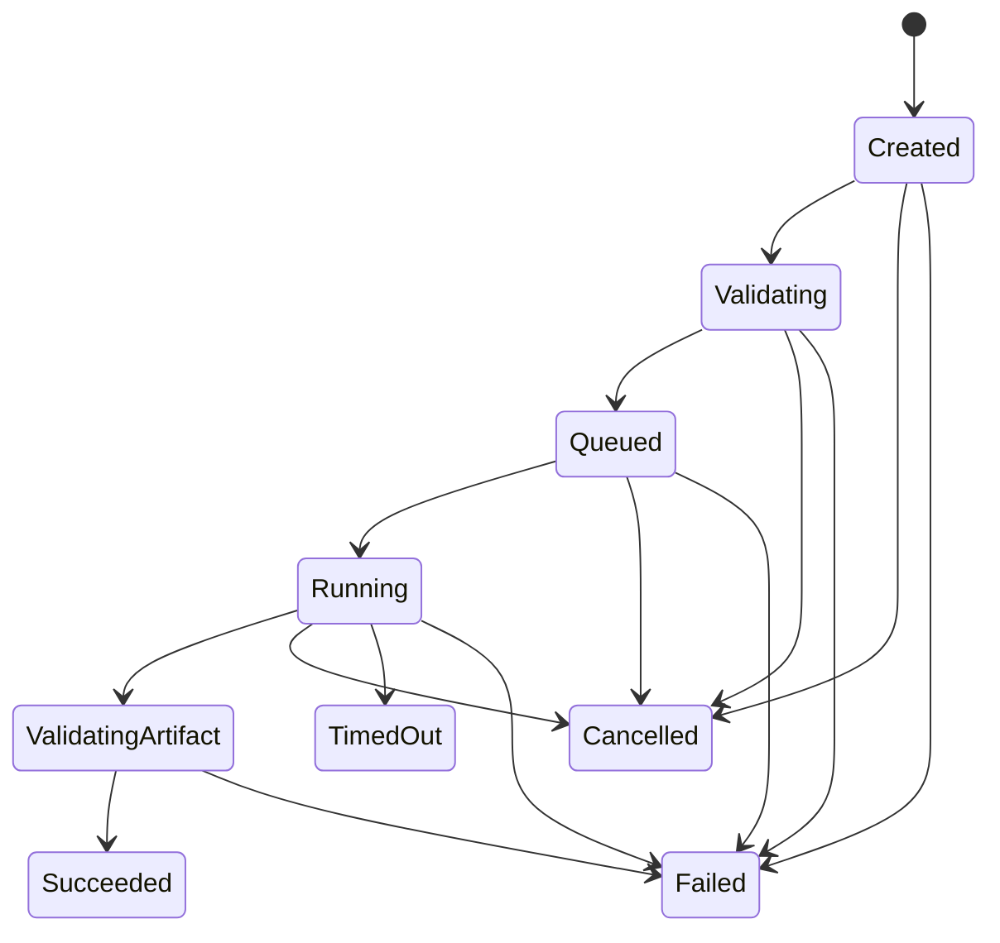
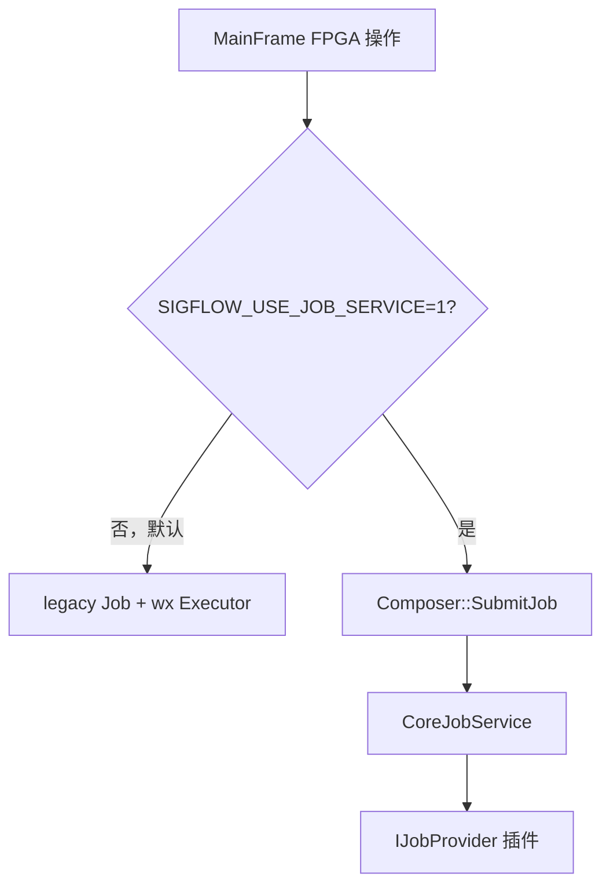
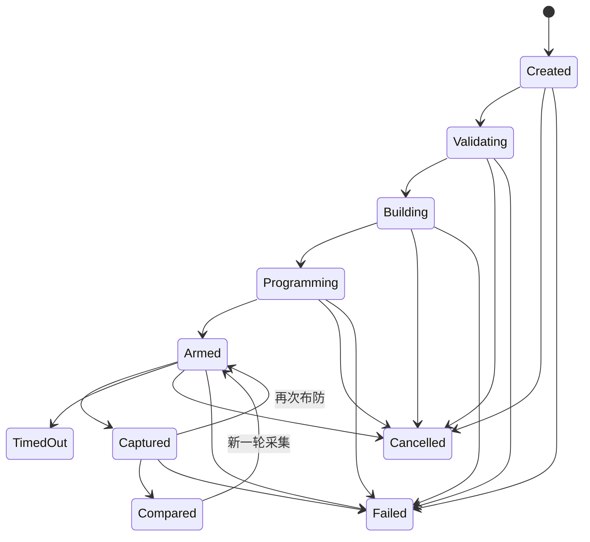
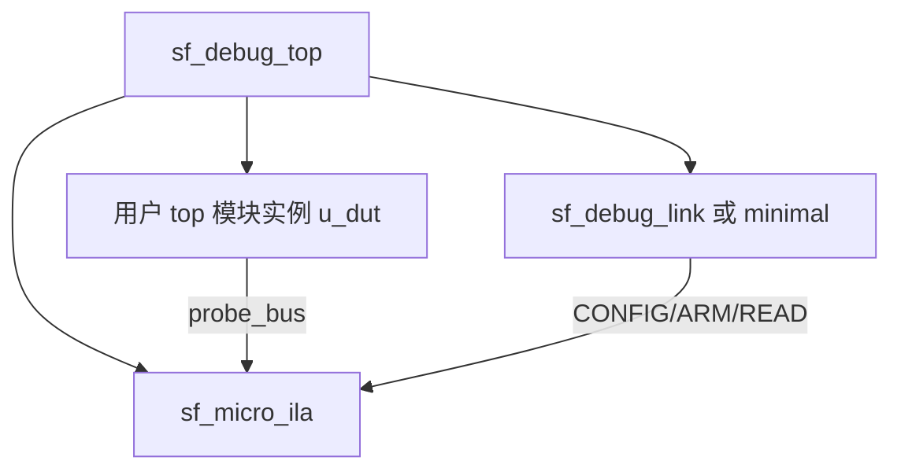

# SigFlow Debug 与 Synth 代码导读

> 本文面向第一次接触 SigFlow FPGA 工具链代码的开发者，按“先理解概念，再跟踪一次真实调用”的顺序介绍 Synth（综合与 FPGA 实现链）和 Debug（TraceBridge 硬件调试链）。  
> 本文依据当前仓库代码编写。所附架构图用于表达概念关系，不等同于当前代码中的类或 Job 边界。

## 1. 先建立整体认识

在 SigFlow 中，这两部分解决的是两个不同层次的问题：

| 部分 | 回答的问题 | 主要输入 | 主要输出 |
| --- | --- | --- | --- |
| Synth / FPGA implementation | “这份 RTL 能否变成目标 FPGA 可以运行的位流？” | RTL、顶层模块、目标器件、管脚约束、综合策略 | Yosys JSON 网表、布局布线结果、`.fs` 位流、报告 |
| Debug / TraceBridge | “设计下载到真实 FPGA 后，内部信号实际是怎样变化的？” | 普通设计、调试契约、探针、触发条件、采样时钟 | 调试位流、原始采样、硬件 VCD、波形比较结果 |

两者的关系可以简化为：



最需要记住的三点是：

1. **Yosys 综合不是完整的 FPGA 构建。**Yosys 输出逻辑网表；之后还需要 nextpnr、gowin_pack 和 openFPGALoader。
2. **Debug 不是读取普通位流。**它会生成带片上采样核和 UART 调试链路的特殊调试位流。
3. **Debug 复用 Synth 工具链。**TraceBridge 增加 Overlay 后，再走一次 Yosys → nextpnr → gowin_pack；因此普通综合、目标板配置和约束有问题时，Debug 也无法成功。

## 2. 如何理解所附架构图

图中 Synth 一侧包含：

- Synthesis job；
- Yosys synthesis；
- Placement routing；
- Gowin packing；
- Constraint validation；
- Target profiles；
- FPGA programmer。

这是正确的产品级分层，但当前代码并不是由一个 `SynthesisJob` 对象统一执行所有阶段：

- `FpgaSynthesisJobService` 主要管理 **Yosys 综合 Job**；
- `NextpnrJobService` 管理 **布局布线 Job**；
- pack 和 flash 还会使用 `main/jobs` 下的通用工具 Job；
- `MainFrame` 目前承担了多个阶段的编排；
- 插件化路径则把 synth、pnr、pack、flash 分别注册为 `IJobProvider`。

图中 Debug 一侧包含：

- Debug session；
- Debug acquisition；
- Device transports；
- FPGA hardware。

这与当前代码边界基本一致，但还缺少图中未画出的关键构建阶段：Debug session 在开始采集前，通常先生成 Overlay，并重新执行综合、布局布线、打包和烧录。

## 3. 两套经常混淆的“Job”体系

阅读 Synth 代码时会遇到三套相近的类型。

### 3.1 FPGA 专用 legacy Job

主要类型包括：

- `SynthesisJob` / `FpgaSynthesisJobService`；
- `NextpnrJob` / `NextpnrJobService`；
- `main/jobs/JobService` 下的 `ToolJob`。

这套路径直接服务于现有 wxWidgets GUI，Job 数据一般保存在工程目录中，由 `MainFrame` 负责创建执行器、更新状态和刷新界面。

### 3.2 插件化 CoreJobService

插件化工程引入了：

- `eda::CoreJobService`；
- `eda::IJobProvider`；
- `eda-synth-yosys`、`eda-pnr-nextpnr`、`eda-pack-gowin`、`eda-program-openfpgaloader` 等插件。

当环境变量 `SIGFLOW_USE_JOB_SERVICE=1` 时，GUI 的部分 FPGA 操作会进入 `Composer::SubmitJob()`，再由 `CoreJobService` 调用对应插件。默认情况下，此开关仍然关闭，GUI 继续走 legacy 路径。

### 3.3 DebugSession

`DebugSession` 不是普通工具 Job。它表示一次完整的硬件调试实验，生命周期横跨：

```text
调试契约 → 调试构建 → 烧录 → 布防 → 采集 → 比较
```

一个 DebugSession 内部会调用 Yosys、nextpnr、gowin_pack 和 programmer，但它还要记录探针布局、触发条件、硬件指纹和采集结果，因此不能简单等同于 SynthesisJob。

## 4. Synth：从 RTL 到可下载位流

### 4.1 用户入口与总调度位置

GUI 菜单和 FPGA 工具窗口最终调用 `MainFrame`：

- `DoFpgaSynthesis()`：打开 Yosys 页面；
- `RunFpgaSynthesis()`：真正启动综合；
- `RunFpgaRoute()`：启动 nextpnr；
- `RunFpgaPack()`：生成 `.fs`；
- `RunFpgaProgram()`：调用 openFPGALoader 下载位流。

因此阅读真实执行流程时，应先从 `main/MainFrame.cpp` 的这些函数开始，而不是先看某个插件实现。

### 4.2 工程配置从哪里来

Synth 的主要工程输入来自 `sigflow.project`：

```json
{
  "build": {
    "top_module": ["min_led_uart_top"]
  },
  "paths": {
    "source_files": ["rtl/min_led_uart_top.v"],
    "library_files": []
  },
  "fpga": {
    "target_profile": "tang-nano-9k",
    "yosys_strategy": "baseline",
    "openfpgaloader_args": ["-b", "tangnano9k", "${bitstream}"]
  }
}
```

`LoadFpgaProjectOptions()` 还支持以下配置：

| 配置项 | 作用 |
| --- | --- |
| `fpga.target_profile` | 选择目标板/目标器件配置 |
| `fpga.yosys_path` | 指定 Yosys 可执行文件 |
| `fpga.yosys_strategy` | `baseline`、`debug` 或 `resource_optimized` |
| `fpga.yosys_time_limit_sec` | Yosys 超时限制 |
| `fpga.yosys_memory_limit_mib` | Yosys 内存限制 |
| `fpga.yosys_log_limit_kib` | 内存中保留的日志上限 |
| `fpga.nextpnr_path` | nextpnr 可执行文件 |
| `fpga.nextpnr_args` | nextpnr 附加参数；其中 `cst=<path>` 可指定约束 |
| `fpga.gowin_pack_path` | gowin_pack 路径 |
| `fpga.gowin_pack_args` | 打包附加参数 |
| `fpga.openfpgaloader_path` | openFPGALoader 路径 |
| `fpga.openfpgaloader_args` | 下载参数，支持 `${bitstream}` 占位符 |

工具发现由统一 Toolchain 完成，搜索优先级可概括为：

```text
工程显式配置 → SigFlow 随包 runtime → 环境变量 → PATH
```

常用环境变量包括 `SIGFLOW_YOSYS`、`SIGFLOW_NEXTPNR`、`SIGFLOW_GOWIN_PACK` 和 `SIGFLOW_OPENFPGALOADER`。

### 4.3 Target profile 解决什么问题

目标配置把“板卡/器件差异”从执行逻辑中分离出来。Tang Nano 9K 的 profile 提供：

- Yosys 器件族：`gw1n`；
- Yosys 命令：`synth_gowin -family gw1n`；
- nextpnr device：`GW1NR-LV9QN88PC6/I5`；
- nextpnr family：`GW1N-9C`；
- openFPGALoader board：`tangnano9k`；
- TraceBridge 默认调试 UART 引脚和波特率。

这意味着更换 FPGA 板卡时，理想做法是新增/替换 profile 和管脚数据库，而不是在 `MainFrame` 中复制一套流程。

### 4.4 Yosys 综合的实际执行顺序

`RunFpgaSynthesis()` 的执行顺序如下：



在创建 Job 以前，代码会先检查工具是否存在以及 Yosys runtime 是否完整。这样缺少工具时不会生成一个实际上从未启动过的 Failed Job。

#### 受控 Yosys 脚本

旧 GUI 适配层 `FpgaYosysScriptGenerator` 会把请求转换为 wx-free 的插件层请求，实际脚本生成逻辑位于 `InnerPlugin/eda-synth-yosys`。

脚本的核心职责是：

1. 读取工程 RTL；
2. 设置顶层模块；
3. 根据目标 profile 选择 `synth_gowin` 等综合命令；
4. 根据策略调整优化；
5. 输出 Yosys JSON 网表。

JSON 网表是后续多个模块的共同输入：

- nextpnr 使用它进行布局布线；
- Pin Binding/Constraint 模块从中提取顶层端口；
- Debug 在生成 Overlay 前用它校验顶层端口和探针；
- artifact validator 检查文件结构、顶层模块和基本完整性。

### 4.5 SynthesisJob 状态机

普通综合 Job 的状态为：



状态的意义不是单纯给 UI 显示：

- `Validating` 表示配置、工具和输入检查已开始；
- `Queued` 表示即将交给进程执行器；
- `Running` 表示工具进程已经启动；
- `ValidatingArtifact` 表示工具退出成功，但仍需检查输出网表；
- `Succeeded` 表示进程和产物都有效；
- 应用重启时，遗留的 `Running` Job 会被恢复为 `Failed`，避免显示假运行状态。

### 4.6 YosysExecutor 做了什么

`YosysExecutor` 是工具进程执行层，负责：

- 在后台线程启动 Yosys；
- 设置工作目录、超时、内存限制；
- 捕获 stdout/stderr；
- 对 GUI 流式输出；
- 限制内存中的日志长度；
- 将合并日志写入磁盘；
- 取消时终止工具进程；
- 把结果归类为 Success、NonZeroExit、Cancelled、TimedOut 或 LaunchFailed。

如果工程没有配置超时，执行器仍使用有限的默认超时，避免工具永久停留在 Running。

### 4.7 综合输出目录

legacy 综合 Job 通常位于工程内 `.sigflow` Job 目录中，具体由 `FpgaSynthesisJobService::GetPaths()` 生成，逻辑结构为：

```text
<job-root>/
├── inputs/
├── scripts/
│   └── run_yosys.ys
├── logs/
│   └── yosys.combined.log
├── artifacts/
│   ├── <top>.json
│   └── <top>.manifest.json
├── reports/
│   ├── runtime-manifest.json
│   ├── synthesis.analysis.json
│   └── synthesis.summary.md
└── manifest.json
```

另外，当前代码仍会把成功网表复制到兼容位置：

```text
<project>/yosys/<top>.json
```

后续 legacy nextpnr 和 Debug 流程目前仍会读取这个兼容路径。

### 4.8 从网表到位流

Yosys 成功只完成了第一步，后面还有三个独立阶段。

#### 4.8.1 约束校验

CST 约束描述顶层端口与 FPGA 物理管脚的关系。相关代码完成：

- 从 Yosys JSON 提取端口；
- 检查 CST 文件是否存在、可读、非空；
- 检查语法、重复管脚、无效管脚、未绑定端口；
- 使用目标板 pin database 校验管脚可用性；
- 生成或导入 CST。

约束错误不是 Yosys 综合错误。一个设计可以成功综合，但因管脚冲突或 CST 缺失而无法布局布线。

#### 4.8.2 nextpnr 布局布线

`RunFpgaRoute()` 读取：

- `<project>/yosys/<top>.json`；
- 目标器件与 family；
- CST 约束；
- nextpnr 附加参数。

`NextpnrExecutor` 负责输入校验、命令行构建、异步执行、取消、日志解析和产物验证。输出包括布局布线 JSON、资源/时序分析报告及 Job manifest。

#### 4.8.3 gowin_pack 打包

`RunFpgaPack()` 使用布局布线 JSON 生成 Gowin `.fs` 位流。`FpgaPackService` 会记录：

- 输入 PnR JSON 的大小和 SHA-256；
- 位流路径、大小和 SHA-256；
- pack 工具路径和哈希；
- 目标器件；
- 退出码和完成时间。

这样后续可以确认某个位流确实由指定 PnR 产物生成，而不是仅凭文件名判断。

#### 4.8.4 openFPGALoader 烧录

`RunFpgaProgram()`：

1. 查找 openFPGALoader；
2. 校验位流存在；
3. 根据 target profile 生成板卡参数；
4. 默认要求用户确认；
5. 异步执行下载；
6. 根据退出状态和工具输出确定是否成功。

如果当前位流属于 DebugSession，还会先校验 session ID、记录路径和 SHA-256，防止把旧调试位流误认为当前会话位流。

### 4.9 legacy 与插件化路径如何共存

当前是迁移期结构：



插件与 Job 类型的对应关系是：

| Job type | 插件 | 主要能力 |
| --- | --- | --- |
| `synth` | `eda-synth-yosys` | RTL → Yosys JSON |
| `pnr` | `eda-pnr-nextpnr` | 网表 + CST → PnR JSON |
| `pack` | `eda-pack-gowin` | PnR JSON → `.fs` |
| `flash` | `eda-program-openfpgaloader` | `.fs` → FPGA |

阅读或修改时必须先判断调用点走哪条路径。只改插件不一定影响默认 GUI；只改 legacy 适配层也不一定影响 Agent/`CoreJobService`。

## 5. Debug：TraceBridge 硬件调试链

### 5.1 TraceBridge 的基本思想

普通仿真观察的是软件模型；TraceBridge 观察的是已经运行在 FPGA 内部的真实信号。

它的做法类似一个很小的片上逻辑分析仪：

1. 用户选择需要观察的内部信号；
2. SigFlow 把这些信号接到 `probe_bus`；
3. 在设计中加入采样 RAM、触发器和 UART 控制模块；
4. 重新生成调试位流并下载；
5. FPGA 命中触发条件后冻结采样；
6. PC 通过 UART/FTDI 读回样本；
7. SigFlow 将样本解码成 VCD，并与仿真波形比较。

它不是传统软件断点调试：FPGA 不会逐行执行 Verilog，也不会停在某条语句上。这里的“调试”是信号采集、触发、波形分析与源代码定位。

### 5.2 DebugContract：一次实验的统一配置

`debug-contract.json` 是 Debug 的核心输入。它把一次实验需要的信息放在同一份结构化文档中：

| 字段 | 含义 |
| --- | --- |
| `session_id` | 调试会话 ID |
| `target_profile` | 板卡及版本 |
| `top_module` | 用户设计顶层模块 |
| `sample_clock` | 采样时钟信号和频率 |
| `clock_domains` | 多时钟域描述 |
| `probes` | 观察信号、位宽、在 32-bit probe bus 中的位置 |
| `trigger` | 触发类型、mask/value 或高级触发参数 |
| `capture` | 深度、预触发样本数、抽样倍率 |
| `transport` | UART 协议、波特率、端口名和物理管脚 |
| `fingerprints` | 源码、工具链和位流指纹 |

当前默认限制和建议值包括：

- 总探针宽度最多 32 bit；
- 默认深度 1024；
- 默认波特率 921600；
- Tang Nano 9K 默认调试引脚 17/18；
- 当前统一 Overlay 只支持一个采样时钟域；多时钟契约会被明确拒绝。

契约校验会检查：

- 至少有一个探针；
- 探针 ID、路径和位宽有效；
- bit offset 不越界；
- capture depth、decimation 合法；
- transport 必须是支持的 UART 配置；
- protocol 必须是 `minimal` 或 `full`；
- 波特率属于支持列表；
- 触发类型和十六进制 mask/value 合法。

### 5.3 DebugSession 状态机

DebugSession 使用独立状态机记录一次完整实验：



各状态对应：

- `Created`：会话目录与 manifest 已创建；
- `Validating`：验证契约、普通网表、端口和约束；
- `Building`：生成 Overlay 并运行调试构建；
- `Programming`：调试位流已准备好，等待或正在下载；
- `Armed`：硬件已准备采集；
- `Captured`：样本已读回并生成 VCD；
- `Compared`：已经与参考仿真/重放波形比较；
- `TimedOut`、`Cancelled`、`Failed`：终止原因。

状态迁移会写入 manifest，非法跳转会被拒绝。例如不能从 Created 直接进入 Captured。

### 5.4 DebugSession 目录

每个会话保存在：

```text
<project>/.sigflow/debug/<session-id>/
├── manifest.json
├── overlay/
│   ├── sf_debug_top.sv
│   └── debug.cst
├── scripts/
│   ├── run_yosys.ys
│   ├── nextpnr_args.txt
│   └── gowin_pack_args.txt
├── logs/
├── artifacts/
│   ├── sf_debug_top.pre.json
│   ├── sf_debug_top.json
│   ├── sf_debug_top.pnr.json
│   ├── sf_debug_top.fs
│   ├── capture.raw
│   └── capture.vcd
└── reports/
```

manifest 记录协议、采样时钟、波特率、UART 分频误差、采样深度、Overlay 路径、网表、PnR 结果、位流路径与哈希、工具版本和状态历史。

### 5.5 为什么 Debug 先要求普通综合成功

`RunTraceBridgeDebugBuild()` 当前先读取：

```text
<project>/yosys/<top>.json
```

它使用普通 Yosys 网表解析顶层端口并检查调试契约。因此首次调试或 RTL 改动后，应先完成一次普通综合。

这一步并不是直接复用普通网表生成最终调试位流。它主要用于：

- 确认顶层模块存在；
- 获取顶层端口、方向和位宽；
- 为生成 wrapper 和约束提供可信输入；
- 尽早发现探针/端口配置问题。

之后 Debug 仍会把用户 RTL 和调试 RTL 一起重新综合。

### 5.6 Overlay 是什么

Overlay 是一个只存在于调试会话目录中的影子设计。它不修改用户 RTL，而是生成新的顶层 `sf_debug_top`：



`DebugOverlayBuilder` 主要完成四件事。

#### 5.6.1 生成 wrapper

生成的 `sf_debug_top.sv`：

- 实例化用户 DUT；
- 增加 `dbg_rx`、`dbg_tx`，以及可选的 `dbg_rst_n`；
- 构造 32-bit `probe_bus`；
- 实例化 `sf_micro_ila`；
- 实例化 minimal 或 full UART debug link；
- 连接触发 mask/value、mode、count 和采样控制信号。

#### 5.6.2 绑定内部信号

顶层端口可以在 wrapper 中直接连接。内部层次信号不能简单写成普通 Verilog 层次引用，否则 Yosys 可能把它当成未驱动 wire。

当前做法是在 Yosys 脚本中：

1. 先 `flatten`；
2. 再用 `connect -set` 将内部网连接到 `probe_bus`；
3. 在综合前输出 `sf_debug_top.pre.json`，用于检查探针是否真实存在；
4. 最后运行 `synth_gowin` 并输出调试网表。

#### 5.6.3 合并约束

Overlay 不能丢失用户原有的时钟和 IO 约束。`BuildMergedCst()` 会：

- 查找并读取用户 CST；
- 检查用户 CST 自身是否有重复端口或管脚冲突；
- 检查 `dbg_rx`、`dbg_tx`、`dbg_rst_n` 是否与用户端口重名；
- 检查调试管脚是否已被用户设计占用；
- 在用户约束后追加调试 UART 约束。

没有有效用户 CST 时，调试构建直接失败，而不是生成一个丢失原 IO 约束的位流。

#### 5.6.4 检查 UART 时钟误差

采样时钟也驱动调试 UART。Overlay 会计算 UART 分频和误差，误差超过 2.5% 时拒绝构建，避免得到“能烧录但无法通信”的位流。

### 5.7 调试构建的完整流程

一次“构建调试位流”大致执行：

```text
读取项目和 target profile
  ↓
读取普通 Yosys JSON，解析顶层端口
  ↓
创建 DebugSession
  ↓
Validate：契约、探针、时钟、CST、UART 管脚
  ↓
生成 Overlay、调试 Yosys 脚本和合并 CST
  ↓
Building：Yosys 重新综合用户 RTL + 调试核
  ↓
校验调试网表中的探针
  ↓
nextpnr 对 sf_debug_top 布局布线
  ↓
gowin_pack 生成 sf_debug_top.fs
  ↓
记录位流 SHA-256 与构建元数据
  ↓
Programming：等待下载，或继续一键下载与采集
```

调试构建复用现有 `YosysExecutor`、`NextpnrExecutor`、pack 和 programmer，但产物保存在 DebugSession 目录中，与普通构建分开。

### 5.8 烧录前为什么还要校验位流

`DebugSessionService::ValidateBitstreamForProgramming()` 会检查：

- session 的 `buildId` 与 session ID 一致；
- session 状态允许烧录；
- 用户选择的文件路径就是该 session 记录的位流；
- 位流 SHA-256 与 manifest 一致。

这能阻止最常见且最危险的调试错误：界面显示的是新契约，但 FPGA 中实际运行的是旧调试位流。

烧录成功后 session 进入 `Armed`，失败则进入 `Failed`。

### 5.9 传输抽象 ITransport

`ITransport` 只定义五个核心动作：

- `Open()`；
- `Close()`；
- `IsOpen()`；
- `Read()`；
- `Write()`。

这样协议和采集逻辑不需要知道底层是串口、libftdi 还是测试管道。

#### 5.9.1 FtdiTransport

真实 Tang Nano 9K 路径优先尝试 `FtdiTransport`：

- 直接通过 libftdi 访问 0403:6010 的通道 B；
- 绕过某些板载桥接芯片不完整的 `ftdi_sio`/tty 模拟；
- 处理 libftdi 读取流中可能出现的 FTDI 状态字节；
- 烧录后设备重新绑定时会进行有限次数重试。

#### 5.9.2 SerialTransport

当 libftdi 不可用、设备不存在或打开失败时，回退到 `SerialTransport`。平台差异由 `platform/SerialPort` 封装，配置为 8N1、无流控和带超时读写。

#### 5.9.3 PipeTransport

`PipeTransport` 用于无硬件回归测试，在同一进程创建 host/device 两端：

- Windows 使用本地命名管道；
- POSIX 使用本地 socket；
- 协议、重试、断链和采集逻辑可以在没有 FPGA 时验证。

### 5.10 minimal 与 full 两种协议

#### full 协议

full 协议的线格式为：

```text
0x00 | COBS(payload) | 0x00
payload = version | type | seq | len | data | CRC16
```

支持的主要命令包括：

| 命令 | 作用 |
| --- | --- |
| `PING/PONG` | 链路与协议版本检查 |
| `GET_INFO/INFO` | 获取 IP 版本、指纹、深度、宽度和状态 |
| `CONFIG/ACK` | 设置 mask、value、抽样倍率和触发模式 |
| `ARM/ACK` | 清理旧状态并开始采集 |
| `STATUS` | 查询 busy、triggered、done、trigger index |
| `READ/SAMPLES` | 分块读取采样 |
| `RESET` | 复位调试核 |

序号、CRC 和有限重试用于识别损坏、重复或丢失的数据帧。

#### minimal 协议

minimal 协议用于专用 UART，采用更简单的固定帧格式，不使用 COBS/CRC。它消耗更少 FPGA 资源，适合资源紧张的教学板卡；代价是链路保护和通用性弱于 full 协议。

上位机根据 `contract.transport.protocol` 选择 `DebugProtocol` 或 `MinimalDebugProtocol`。

### 5.11 DebugAcquisition 的十个阶段

`DebugAcquisition::Acquire()` 是采集主流程：

| 阶段 | 主要动作 |
| --- | --- |
| 1. SyncCalibrate | 可选发送同步前导，校准链路 |
| 2. GetInfo | 读取硬件 IP 版本、指纹、宽度和深度 |
| 3. MapTrigger | 将契约触发条件转换为 mode/mask/value/count |
| 4. Configure | 把采集参数写入 FPGA |
| 5. Arm | 启动采集 |
| 6. PollStatus | 定期查询状态，直到 done、取消或超时 |
| 7. ReadSamples | 分块回读所有样本 |
| 8. SaveRaw | 保存 `capture.raw` |
| 9. DecodeVcd | 按探针位布局解码为 `capture.vcd` |
| 10. Done | 返回结果并推进会话状态 |

关键保护包括：

- 每个阻塞点检查取消标志；
- 命令有独立超时和重试次数；
- 可选断线自动重连；
- full 协议先校验板上 fingerprint；
- STATUS 超时进入 `TimedOut`；
- 采样读取不完整时不生成假装完整的成功结果；
- 进度回调可能来自 worker 线程，GUI 必须通过 `CallAfter` 切回主线程。

### 5.12 从环形样本到 VCD

片上采样 RAM 使用环形存储。`triggerIndex` 表示触发样本所在位置。`CaptureDecoder` 根据逻辑时间顺序重新排列样本，并按 DebugContract 中的：

- probe ID；
- 层次路径；
- width；
- bit offset；

拆分 32-bit 样本，生成 WavePanel 可读取的 VCD。

保留两种产物很重要：

- `capture.raw` 是协议级原始证据，可用于重新解码和问题复现；
- `capture.vcd` 是展示和比较格式，不应替代原始证据。

### 5.13 两种 Debug 使用方式

#### 方式 A：只采集已经准备好的调试位流

`RunTraceBridgeCapture()` 假定硬件已经下载了合适的调试位流：

1. 创建 DebugSession；
2. 生成信号映射 sidecar；
3. 将 session 推进到 Armed；
4. 优先打开 libftdi，失败后尝试串口；
5. 执行 acquisition；
6. 生成并打开 `capture.vcd`。

它适合硬件链路排查，但调用者必须确保板上位流与契约匹配。

#### 方式 B：构建、下载并采集

一键流程由 `RunTraceBridgeDebugBuild()` 开始：

```text
普通综合前置检查
→ 调试 Overlay 构建
→ Yosys
→ nextpnr
→ gowin_pack
→ 校验并记录位流
→ 用户确认下载
→ openFPGALoader
→ 采集
```

这是最完整、最不容易误用旧位流的使用方式。

### 5.14 波形比较、重放和定位

采集完成后，TraceBridge 还提供：

- `WaveformAligner`：使用复位、触发点等锚点对齐硬件和参考波形；
- `WaveformComparator`：寻找首个差异时间和差异信号；
- `ReplayScenario`：从硬件输入变化生成可重复的 Verilator 场景；
- `RootCauseGraph`：根据依赖关系排序上游候选；
- `DebugMappingBuilder`：生成 signal map 和 dependency graph；
- `DebugBehaviorSummary`：生成结构化行为摘要；
- `TraceBridgeWindow`：管理采集、比较、会话导入导出和 WavePanel 展示。

这些模块解决的是“采到了什么之后，怎样变成可理解、可复现的问题”，而 `DebugAcquisition` 只负责可靠地把样本取回来。

## 6. Synth 与 Debug 的共用边界

| 共用能力 | Synth 中的作用 | Debug 中的作用 |
| --- | --- | --- |
| `sigflow.project` | 定义顶层和源文件 | 确定被调试设计 |
| Target profile | 选择 Yosys/nextpnr/烧录参数 | 还提供默认调试引脚/波特率 |
| Yosys | 生成普通网表 | 将用户设计和调试核重新综合 |
| Yosys JSON | nextpnr 输入、端口提取 | 前置端口校验、探针检查 |
| CST | 用户 IO 管脚约束 | 与调试 UART 约束合并 |
| nextpnr | 普通设计布局布线 | 调试 Overlay 布局布线 |
| gowin_pack | 普通 `.fs` | 调试 `.fs` |
| openFPGALoader | 下载普通位流 | 下载受 session/hash 约束的调试位流 |
| WavePanel/VCD | 仿真波形展示 | 硬件采集和差异展示 |

## 7. 关键代码地图

### 7.1 Synth 主线

| 文件 | 阅读重点 |
| --- | --- |
| `main/MainFrame.cpp` | 当前 GUI 编排入口；搜索 `RunFpgaSynthesis/Route/Pack/Program` |
| `main/FpgaSynthesisJob.*` | 综合 Job 状态、manifest、重试和恢复 |
| `main/FpgaYosysScriptGenerator.*` | legacy wx 适配层 |
| `InnerPlugin/eda-synth-yosys/` | 真正的 wx-free 脚本生成、执行、产物校验 |
| `main/FpgaYosysExecutor.*` | Yosys 异步进程、超时、日志和取消 |
| `main/FpgaYosysRuntime.*` | 目标 profile 和 Yosys runtime 完整性检查 |
| `main/fpga/FpgaYosysLogParser.*` | Yosys 日志结构化解析 |
| `main/fpga/FpgaYosysReport.*` | 综合分析报告与摘要 |
| `main/fpga/NextpnrJob.*` | 布局布线 Job 状态 |
| `main/fpga/NextpnrExecutor.*` | nextpnr 参数、执行和结果处理 |
| `main/fpga/FpgaPackService.*` | pack 适配与产物 manifest |
| `main/fpga/FpgaConstraint.*` | 端口、管脚绑定和 CST 生成 |
| `main/fpga/CstValidator.*` | CST 文件级校验 |
| `main/fpga/target-profiles/` | 板卡和器件数据 |
| `main/Composer.*` | 插件发现、provider 选择与 CoreJobService 入口 |
| `core/src/eda-core/JobService.*` | 插件化 Job 运行、持久化和恢复 |

### 7.2 Debug 主线

| 文件 | 阅读重点 |
| --- | --- |
| `main/debug/DebugContract.*` | 调试实验输入模型、默认值和校验 |
| `main/debug/DebugSession.*` | 状态机、目录、manifest、位流归属校验 |
| `main/debug/DebugOverlayBuilder.*` | wrapper、Yosys 脚本、合并 CST |
| `main/debug/DebugNetlistValidator.*` | 顶层端口和探针验证 |
| `main/debug/DebugFingerprint.*` | 源码/工具链/位流指纹 |
| `main/debug/ITransport.h` | 传输抽象边界 |
| `main/debug/FtdiTransport.*` | libftdi 真实硬件通道 |
| `main/debug/SerialTransport.*` | 普通串口通道 |
| `main/debug/PipeTransport.*` | 无硬件测试通道 |
| `main/debug/DebugProtocol.*` | full/minimal 协议和重试 |
| `main/debug/DebugAcquisition.*` | 端到端采集编排 |
| `main/debug/CaptureDecoder.*` | raw 样本到 VCD |
| `main/debug/WaveformAligner.*` | 波形对齐 |
| `main/debug/WaveformComparator.*` | 首差异分析 |
| `main/debug/ReplayScenario.*` | 硬件输入重放 |
| `main/debug/DebugMappingBuilder.*` | 信号到源码/SFTree/依赖图映射 |
| `main/debug/TraceBridgeWindow.*` | Debug UI 与工作流入口 |
| `rtl/debug/` | FPGA 内部 ILA、UART link 和 CDC RTL |

## 8. 推荐阅读顺序

如果目标是一天内建立可工作的理解，建议按以下顺序阅读。

### 第一轮：只建立流程

1. 本文第 1～6 节；
2. `examples/tracebridge_tangnano9k/sigflow.project`；
3. `examples/tracebridge_tangnano9k/debug-contract.json`；
4. `MainFrame::RunFpgaSynthesis()`；
5. `MainFrame::RunTraceBridgeDebugBuild()`；
6. `MainFrame::RunTraceBridgeCapture()`。

第一轮不要立即钻进协议字节和报告解析器，先回答“数据从哪里来，经过哪些阶段，保存到哪里”。

### 第二轮：理解状态与产物

1. `FpgaSynthesisJob.h/.cpp`；
2. `DebugSession.h/.cpp`；
3. `FpgaYosysExecutor.h/.cpp`；
4. `DebugAcquisition.h/.cpp`；
5. 查看一个实际 Job/session 的 manifest、脚本、日志和 artifacts。

### 第三轮：理解边界实现

1. `InnerPlugin/eda-synth-yosys`；
2. `DebugOverlayBuilder`；
3. `DebugProtocol`；
4. `rtl/debug/sf_micro_ila.sv`；
5. `rtl/debug/sf_debug_link*.sv`；
6. `CaptureDecoder` 和波形比较链。

## 9. 跟踪一个具体例子

仓库中的 `examples/tracebridge_tangnano9k` 是最适合配合代码阅读的样例。

### 9.1 普通 Synth

1. `sigflow.project` 指定 `min_led_uart_top` 和 RTL；
2. Yosys 生成 `yosys/min_led_uart_top.json`；
3. CST 约束绑定普通用户 IO；
4. nextpnr 生成 `nextpnr/min_led_uart_top.pnr.json`；
5. gowin_pack 生成 `nextpnr/min_led_uart_top.fs`；
6. openFPGALoader 将位流写入 Tang Nano 9K。

### 9.2 Debug

1. `debug-contract.json` 选择 `led[3:0]` 和 `state[3:0]`；
2. 二者被分配到 32-bit probe bus 的 bit 0～7；
3. sample clock 为 27 MHz；
4. UART 使用 921600 baud，管脚为 17/18；
5. Overlay 生成 `sf_debug_top`；
6. 调试版 Yosys/nextpnr/pack 生成 session 专属 `.fs`；
7. 下载后通过 FTDI/UART 配置和布防；
8. 读回 1024 个 32-bit 样本；
9. 解码出 `led`、`state` 的 `capture.vcd`；
10. 可在 WavePanel 中查看，或与仿真/重放波形比较。

## 10. 常见故障应从哪里排查

| 现象 | 优先检查 | 原因分类 |
| --- | --- | --- |
| 找不到 Yosys | 工程路径、随包 runtime、环境变量、PATH | 工具发现 |
| Yosys 启动后立即失败 | `run_yosys.ys`、combined log、source path | 脚本/RTL |
| 有 JSON 但不能 route | artifact validator、top module | 产物完整性 |
| nextpnr 报管脚错误 | CST、target profile、pin database | 约束 |
| pack 成功但烧录失败 | `.fs` hash、openFPGALoader 输出、板卡名 | 位流/设备 |
| Debug 提示先综合 | `<project>/yosys/<top>.json` 不存在或过旧 | Debug 前置条件 |
| Overlay 生成失败 | probe path、时钟域、CST、UART 管脚冲突 | 调试契约 |
| 调试位流下载后无响应 | 位流/session 不匹配、波特率误差、FTDI/串口选择 | 硬件链路 |
| PING 成功但采集超时 | 触发条件未命中、采样时钟不运行 | 触发/时钟 |
| GET_INFO 指纹不一致 | FPGA 上是旧位流或契约已变化 | 版本归属 |
| VCD 信号恒定 | probe 被优化、内部网绑定错误、选错时钟 | Overlay/综合 |
| raw 有数据但 VCD 错位 | bit offset、width、trigger index | 解码 |

排查原则是沿产物边界逐段确认：

```text
输入配置 → 生成脚本 → 工具日志 → 工具产物 → manifest/hash
→ 烧录结果 → 协议响应 → raw 样本 → VCD → 比较结果
```

不要从最终 VCD 直接猜 RTL 问题；先证明前面的位流、协议、指纹和解码都可信。

## 11. 测试与验证入口

### Synth/工具链

相关 CTest/Smoke 包括：

- `eda_synth_yosys_smoke`；
- `eda_pnr_nextpnr_smoke`；
- `eda_pack_flash_smoke`；
- `eda_target_profile_smoke`；
- `eda_gowin_cst_smoke`；
- `eda_constraint_sheet_smoke`；
- `fpga_flow_probe`。

这些测试主要验证组件和无硬件流程。完整真实流程仍需要本机 Yosys、nextpnr、Apicula、openFPGALoader 和目标板。

### Debug 无硬件回归

Windows 下可运行：

```powershell
powershell -ExecutionPolicy Bypass -File tools/run_debug_ci.ps1
```

它覆盖：

- DebugContract 和 DebugSession；
- 多时钟结构门禁；
- ILA/UART 行为模型；
- Overlay 生成；
- PipeTransport 回环；
- full/minimal 协议；
- raw/VCD 解码；
- acquisition；
- 波形对齐、比较、重放和映射。

### Debug 实物验证

使用：

```powershell
powershell -ExecutionPolicy Bypass -File tools/run_tracebridge_hardware_smoke.ps1 `
  -Port COM7 -Baud 921600 `
  -ExpectedDepth 1024 -ExpectedWidth 32 `
  -ReadCount 1024 -Decimation 1
```

实物测试与无硬件测试的边界不同：Pipe 回环能证明协议和采集软件逻辑，不能证明板上 UART 引脚、时钟、JTAG/FTDI 驱动或真实位流正确。

## 12. 当前实现中的重要边界

理解以下现状可以避免读代码时产生错误预期：

1. GUI 默认仍走 legacy FPGA Job 路径；插件化 CoreJobService 需要 `SIGFLOW_USE_JOB_SERVICE=1`。
2. “SynthesisJob”当前主要表示 Yosys 综合，不是完整的 synth→pnr→pack→flash 总 Job。
3. Debug build 当前依赖普通综合兼容路径 `<project>/yosys/<top>.json`。
4. TraceBridge 统一 Overlay 当前只支持单采样时钟；多时钟采集并未完整开放。
5. probe bus 当前总宽度为 32 bit，采样深度默认 1024。
6. minimal 协议资源小，但不具备 full 协议同等的 COBS/CRC 保护。
7. FTDI 直连是 Tang Nano 9K 的优先路径，串口是回退路径；不同板卡可能需要不同 transport 实现。
8. 普通构建产物与 DebugSession 产物属于不同命名空间，不能只按文件名互换。
9. 组件 smoke 通过不代表完整硬件闭环通过；最终仍需验证目标板、位流、调试链路和真实采样。

## 13. 与教育版 Agent 的关系

对教育版 Agent 来说，Synth 和 Debug 提供的是可信事实源，而不是让模型直接控制任意命令行。

适合通过受限接口提供给 Agent 的信息包括：

- Synth Job 状态、日志摘要、规范化诊断、资源和时序指标；
- Job 与 revision/snapshot/target profile 的绑定；
- artifact ID、schema、hash 和受限内容；
- DebugSession 状态、契约摘要、指纹和失败阶段；
- `capture.vcd` 的信号列表和精确区间查询；
- 首差异、映射状态和可信度。

不应直接交给 Agent 的能力包括：

- 任意工具可执行路径；
- 任意工作目录或输出路径；
- 任意 Yosys/nextpnr/openFPGALoader 参数；
- 未经用户批准的烧录；
- 不属于当前 project/revision/session 的位流或采集结果。

可以把两块的 Agent 边界理解为：

```text
Agent 负责解释、规划和选择受限能力
SigFlow 负责验证工程版本、执行工具、管理状态、校验产物和接触硬件
```

## 14. 一句话记忆每个核心对象

| 对象 | 一句话理解 |
| --- | --- |
| `SynthesisJob` | 一次可追踪的 Yosys 综合记录 |
| `YosysExecutor` | 受超时、取消和日志约束的 Yosys 进程运行器 |
| `TargetProfile` | 板卡/器件相关参数的集中配置 |
| `NextpnrJob` | 一次可追踪的布局布线记录 |
| `FpgaPackService` | 验证 PnR 输入并记录位流来源 |
| `DebugContract` | 一次硬件采样实验的完整声明 |
| `DebugSession` | 从构建到比较的调试生命周期和证据目录 |
| `DebugOverlayBuilder` | 在不改用户 RTL 的前提下插入调试核 |
| `ITransport` | 隔离 FTDI、串口和测试管道差异 |
| `DebugProtocol` | 把读写字节流变成可靠调试命令 |
| `DebugAcquisition` | 编排布防、等待、读回、保存和解码 |
| `CaptureDecoder` | 把环形采样数据变成可查看的 VCD |

掌握这些对象及其产物边界后，再阅读日志解析、波形比较和 UI 代码会容易很多。
