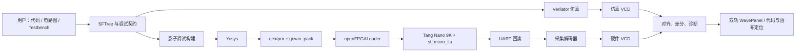
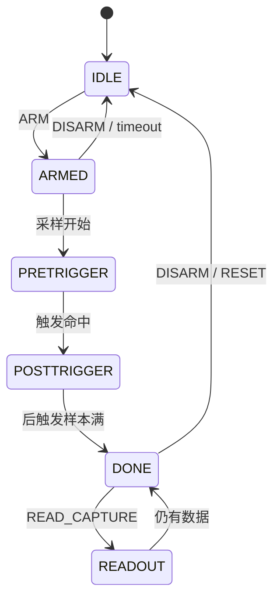
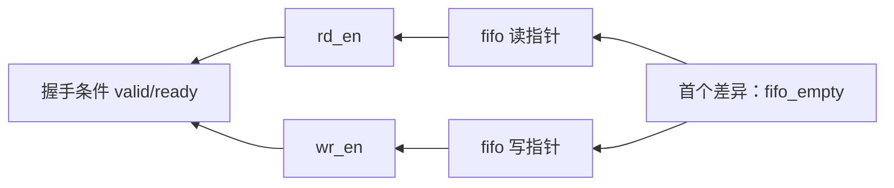
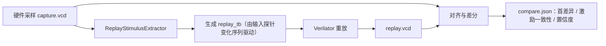
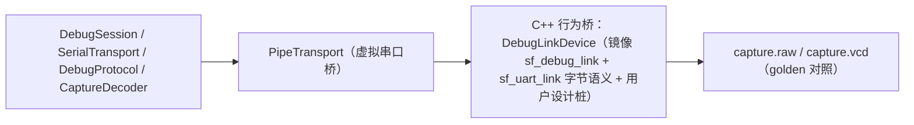

# SigFlow TraceBridge 软硬件联合调试平台设计

> 文档状态：规划稿  
> 目标版本：MVP 1.0  
> 目标硬件：Sipeed Tang Nano 9K（GW1NR-LV9QN88PC6/I5）  
> 设计原则：围绕现有 SigFlow 能力补齐“板上真实波形”的闭环，不把平台扩展成新的综合器、仿真器或通用逻辑分析仪。

## 1. 摘要

SigFlow TraceBridge 是嵌入 SigFlow 的小型软硬件联合调试平台。它将 RTL/电路图、Verilator 仿真波形、FPGA 调试构建和 Tang Nano 9K 板上采样统一为一个可复现的调试会话：用户选择信号并配置触发条件，IDE 生成不污染原工程的调试构建，下载至 FPGA 后从板上回读采样数据，最后将真实波形与仿真 VCD 对齐、比较并定位首个分歧。

平台首先服务于课程设计、小型 FPGA 原型和数字逻辑教学中的高频问题：仿真正确但上板错误、约束或时钟错误、复位时序问题、FIFO/握手死锁、状态机跑飞和接口位宽/符号问题。

## 2. 现有工程基础与设计依据

| 已有能力 | 工程位置 | 对 TraceBridge 的作用 |
| --- | --- | --- |
| Verilog 结构化、SFTree、代码/画布同步 | `main/SigTree.*`、`main/VerilogStructuring.*` | 提供信号层级、来源和可视化定位能力 |
| 文本编辑、异步分析与诊断 | `main/SigTextEditor.*`、`main/TreeSitterLinter.*` | 作为探针选择和异常回跳入口 |
| Verilator 仿真、testbench 解析和 VCD 输出 | `main/Simulation/` | 生成参考波形和可重放场景 |
| VCD 波形面板 | `main/WavePanel.*` | 承载仿真/硬件双轨波形显示 |
| Yosys 运行时、综合任务和产物校验 | `main/FpgaYosysRuntime.*`、`main/FpgaSynthesisJob.*` | 生成受控、可追溯的调试综合任务 |
| nextpnr 日志/报告解析 | `main/fpga/Nextpnr*` | 展示插桩造成的资源和时序影响 |
| 引脚数据库、CST 校验和绑定界面 | `main/fpga/FpgaPin*`、`main/fpga/CstValidator.*` | 为调试 UART 提供可靠约束与冲突检查 |
| 本地 FPGA 运行时 | `external/fpga-tools/runtime/` | 已包含 `yosys.exe`、`nextpnr-himbaechel.exe`、`openFPGALoader.exe`、`gowin_pack.exe` |

现有目标配置已固定为 Tang Nano 9K，并采用 Gowin Yosys 综合、nextpnr-himbaechel 布局布线和 openFPGALoader 下载。因此首版不引入其他厂商板卡、商业 ILA 或外部云服务。

## 3. 产品目标与非目标

### 3.1 产品目标

1. 在不修改用户 RTL 的前提下，生成带探针的调试构建并下载到板卡。
2. 在一个指定采样时钟域中捕获 FPGA 内部信号，支持预触发和后触发样本。
3. 将采集数据转换为 VCD，并与 Verilator 波形在同一面板中显示。
4. 用构建指纹保证“当前 IDE 工程、下载 bitstream、采集波形”来自同一设计版本。
5. 在资源和时序预算有限的前提下给出探针选择建议与可解释诊断。

### 3.2 明确非目标

1. 不替代 ModelSim、Verilator 或完整 SystemVerilog/UVM 验证平台。
2. 不支持无限深度采样、DDR 缓冲、以太网流式波形或高速 SerDes 调试。
3. MVP 的统一回读协议仍以单采样域为边界；多时钟 CDC 与独立采样核已具备，
   但多域统一配置、域选择和回读不纳入本轮验收。
4. 不通过 Gowin 私有 JTAG 协议传输数据；调试数据使用普通 UART，降低板卡和驱动不确定性。
5. 不默认将 AI 作为调试决策者；AI 只解释结构化结果，不能修改构建、约束或源代码。

## 4. MVP 规模边界

| 项目 | MVP 指标 | 后续扩展 |
| --- | ---: | --- |
| 支持板卡 | Tang Nano 9K 一种 | 由 Target Profile 扩展 |
| 调试时钟域 | 1 个统一回读域 | 每域独立采样核与多域回读协议 |
| 探针容量 | 32 bit 总宽度 | 64/128 bit 或分组采样 |
| 采样深度 | 1024 样本 | 2048/4096 样本 |
| 触发条件 | 掩码比较、边沿、组合 AND | 序列触发、计数触发 |
| 板上回读 | UART，默认 3 Mbaud | USB/JTAG/以太网插件 |
| 参考波形 | Verilator VCD | 多仿真器统一适配 |
| 插桩范围 | 顶层端口、显式选定的顶层内部网 | 跨模块影子 RTL 自动插桩 |

32 bit × 1024 样本需要 32 Kbit 原始采样存储。加上触发器、UART、控制状态机和少量元数据，Tang Nano 9K 的片上存储与逻辑资源足以支撑该规模，同时不会掩盖用户设计本身的资源/时序特征。

## 5. 总体架构



平台由五个相互独立的层组成：

1. **调试契约层**：描述探针、时钟、触发器、传输引脚和版本信息，是所有后续步骤的唯一输入。
2. **调试构建层**：以影子副本方式生成插桩 RTL、约束和工具脚本，复用现有 Yosys/nextpnr/下载流程。
3. **板上采样层**：以小型可综合 `sf_micro_ila` IP 采集和缓存目标时钟域数据。
4. **传输与归档层**：通过 UART 协议回读、CRC 校验、保存原始帧、生成硬件 VCD。
5. **比较与呈现层**：在现有波形面板展示双轨信号，用锚点对齐后给出首个分歧和建议。

## 6. 调试契约与会话产物

### 6.1 调试契约

每次调试均生成一个不可变 `debug-contract.json`。它应由 IDE 表单生成，而不是让用户手写；保留 JSON 是为了便于版本管理、导入导出、自动化和回归测试。

契约文件由 FPGA 菜单中的 `debug_contract` 配置界面生成，默认保存为工程根目录的
`debug-contract.json`。TraceBridge 负责加载和使用契约，不会把运行时编辑内容自动回写到
`sigflow.project`。

```json
{
  "schema_version": "1.0",
  "session_id": "20260806-143210-a81f",
  "target_profile": "tang-nano-9k@1.0.0",
  "top_module": "uart_top",
  "sample_clock": { "signal": "clk_27m", "frequency_hz": 27000000 },
  "probes": [
    { "id": "tx_busy", "path": "uart_top.tx_busy", "width": 1, "bit_offset": 0 },
    { "id": "state", "path": "uart_top.state", "width": 4, "bit_offset": 1 }
  ],
  "trigger": { "kind": "mask_equal", "mask": "0x0000001f", "value": "0x00000012" },
  "capture": { "depth": 1024, "pretrigger_samples": 512, "decimation": 1 },
  "transport": { "kind": "uart", "tx_port": "UART_TX", "rx_port": "UART_RX", "baud": 3000000 },
  "source_fingerprint": "sha256:...",
  "toolchain_fingerprint": "sha256:..."
}
```

### 6.2 会话目录

```text
.sigflow/debug/<session-id>/
├── debug-contract.json       # 由 GUI 自动生成的用户配置和最终解析结果
├── manifest.json             # 构建指纹、工具版本、状态转换
├── overlay/                  # 影子 RTL、调试核和约束补丁
├── scripts/                  # Yosys/nextpnr/gowin_pack 脚本
├── logs/                     # 原始工具输出与结构化报告
├── artifacts/                # json/netlist/fs/bitstream
├── capture.raw               # UART 原始帧，便于协议回放
├── capture.vcd               # 可在现有波形面板打开的硬件波形
└── compare.json              # 对齐结果、首个分歧、诊断建议
```

### 6.3 构建指纹

指纹至少覆盖 RTL 内容哈希、顶层模块、约束内容、目标板配置、探针排序与位宽、触发参数、调试核版本、Yosys/nextpnr/gowin_pack 版本。调试核的 `GET_INFO` 响应必须携带前 64 bit 指纹和协议版本；IDE 接收到不匹配数据时禁止与当前波形比较，并明确提示“当前硬件不是本会话下载版本”。

## 7. 硬件设计：sf_micro_ila

### 7.1 模块划分

| RTL 模块 | 职责 |
| --- | --- |
| `sf_debug_hub.sv` | 命令寄存器、采集状态机、指纹和状态返回 |
| `sf_trigger.sv` | 掩码相等、边沿检测、触发条件组合 |
| `sf_capture_ram.sv` | 环形写入、触发冻结、顺序读出 |
| `sf_uart_link.sv` | UART 收发、COBS 解帧、CRC-16 和帧序号 |
| `sf_cdc_control.sv` | UART 控制域到采样域的请求/应答同步 |
| `sf_debug_top.sv` | 由生成器创建，连接用户设计、采样核和 UART 引脚 |

### 7.2 采集状态机



采样 RAM 始终以环形方式写入。触发前保留最近 `pretrigger_samples` 个样本；触发后继续采集，达到 `depth` 后冻结地址和写指针。上位机读取时按逻辑时间顺序重排环形数据，因此波形的时间零点可定义为触发时刻。

> **P1a 精简决策（已实现）**：采集核合并为单模块 `sf_micro_ila.sv`，状态机简化为
> IDLE → RUNNING → DONE；触发支持掩码相等和上升/下降沿（`mask=0` 即立即触发），
> 组合 AND 留作后续增强；"触发前保留/触发后继续"的地址逻辑移除，预触发重排统一由宿主
> （CaptureDecoder）按 `trigger_index` 完成（相对触发时刻 k 的样本 =
> `mem[(trigger_index + k) % DEPTH]`）。存储用 Gowin BSRAM
> （`ram_style="block"`，yosys 映射为 DPX9B），`DEPTH`/`WIDTH` 参数化，默认 32x1024。

> **增强触发与边采边传（P1a.2，已实现）**：在保持单模块与默认行为不变的前提下，
> 新增采样门控 `sample_en` 和增强触发引擎（复用掩码比较器 + 共享 16-bit 计数器）：
> `trigger_mode=0` 掩码相等，`trigger_count=N` 时第 N 次匹配触发（N=1 即原行为）；
> `trigger_mode=1` 停滞——掩码子集连续 N 个采样周期不变；
> `trigger_mode=2` 握手超时——`hs_valid && !hs_ready` 连续 N 拍；
> `trigger_mode=3/4` 分别为上升沿/下降沿，并支持第 N 次边沿触发。
> 存储为 DPX9B 真双端口 BSRAM：写端口（wptr）与读端口（rd_addr）完全独立，
> `busy=1` 采集进行中即可并发读回，支持“边采边传”（Loopback CI 已覆盖）。

### 7.3 时钟和 CDC 约束

当前统一 Overlay 只支持一个用户指定的采样时钟。多时钟契约要求每个探针声明
clock_domain，异步观察必须显式标记；控制域到采样域使用 CDC toggle-handshake，
不能将多位控制总线直接跨域采样。每个域的独立采样原语已通过 Yosys 门禁。

界面必须对以下情况显示黄色/红色告警：

- 选中信号未能推断时钟域；
- 探针来自多个时钟域；
- 用户选择的采样时钟为门控时钟或不稳定时钟；
- 采样频率低于待观察脉冲宽度；
- 探针插入后时序裕量低于配置阈值。

### 7.4 综合可见性

生成的调试连接对关键网施加 `(* keep *)` 属性，并在构建后检查 Yosys JSON netlist 中所有探针是否存在、位宽是否一致。若被优化、折叠或位宽改变，构建必须失败而非下载一个“看似成功但没有有效探针”的 bitstream。

## 8. UART 传输协议

### 8.1 物理连接

调试口优先使用板上可用 UART 资源；若设计已占用 UART，则由引脚绑定面板选择两个普通 GPIO，并要求用户连接 USB-TTL 转换器的 `TX/RX/GND`。IDE 需要检查传输引脚与用户端口、保留 JTAG、供电和时钟引脚不存在冲突。

### 8.2 帧格式

```text
0x00 | COBS(payload) | 0x00
payload = version | type | sequence | length | data | crc16
```

| 帧类型 | 方向 | 说明 |
| --- | --- | --- |
| `PING` / `PONG` | 双向 | 连接和协议版本检查 |
| `GET_INFO` / `INFO` | 主机→FPGA | 返回核版本、指纹、深度、状态和错误计数 |
| `CONFIG` / `ACK` | 主机→FPGA | 设置触发掩码、比较值、深度和抽样倍率 |
| `ARM` / `ACK` | 主机→FPGA | 清空旧采样并开始采集 |
| `STATUS` | 双向 | 查询 ARM、TRIGGERED、DONE、CRC 错误状态 |
| `READ_CAPTURE` / `SAMPLES` | 主机→FPGA | 分块回读采样数据 |
| `RESET` | 主机→FPGA | 恢复 IDLE 状态 |

每个 `SAMPLES` 帧带序号、块序号和 CRC。主机允许有限次数重读，仍失败则保留 `capture.raw` 并报出具体缺失块，禁止生成误导性的完整 VCD。

## 9. 软件设计

### 9.1 建议代码布局

```text
main/debug/
├── DebugContract.h/.cpp       # JSON 解析、校验和指纹
├── DebugSession.h/.cpp        # 会话状态、目录、manifest
├── DebugOverlayBuilder.h/.cpp # 影子 RTL/约束/脚本生成
├── DebugBuildService.h/.cpp   # 复用现有 FPGA 作业链
├── SerialTransport.h/.cpp     # Windows 串口枚举、读写和超时
├── DebugProtocol.h/.cpp       # COBS、CRC、帧编解码
├── CaptureDecoder.h/.cpp      # 原始帧→样本→VCD
├── WaveformAligner.h/.cpp     # 复位/输入/触发锚点对齐
├── WaveformComparator.h/.cpp  # 首个差异与依赖排序
└── DebugPanel.h/.cpp          # 调试会话 UI

rtl/debug/
├── sf_debug_hub.sv
├── sf_trigger.sv
├── sf_capture_ram.sv
├── sf_uart_link.sv
├── sf_cdc_control.sv
└── README.md
```

### 9.2 IDE 交互流程

1. 用户在“TraceBridge”面板选择顶层模块、采样时钟、探针和触发条件。
2. IDE 校验信号解析结果、总位宽、时钟域、UART 引脚和资源预算，生成调试契约。
3. 用户执行“构建并下载调试镜像”；IDE 创建影子工作区并运行既有 Yosys、nextpnr、打包和下载流程。
4. IDE 通过串口 `PING` 与 `GET_INFO` 验证板上核、指纹和参数。
5. 用户点击“布防”；平台等待触发，完成后自动分块读取并生成硬件 VCD。
6. 用户执行“与仿真比较”；平台加载指定仿真 VCD，锚点对齐并在 WavePanel 标记首个差异。
7. 用户可点击异常信号跳转至 RTL 行、SFTree 节点和电路图元素；也可导出会话包用于复现。

### 9.3 波形对齐与比较算法

严格按绝对时间戳比较会因上电、复位和串口布防时刻不同而失效。MVP 采用三层锚点：

1. **一级锚点**：复位释放边沿；无复位探针时使用用户指定的同步标志。
2. **二级锚点**：触发命中样本；比较硬件触发值与仿真中相同条件的第一个命中点。
3. **三级锚点**：顶层输入事务变化序列，用于消除固定周期偏差。

对齐后，比较器从锚点向前后扫描。输出“首个不同采样点、信号、期望值、实测值、最近变化的上游探针、置信度”。只有在信号宽度、采样周期与对齐质量满足阈值时才给出确定性结论，否则标为“待人工确认”。

### 9.4 资源与时序预算

调试面板显示四类预算：探针位宽、采样 RAM、插桩 LUT/寄存器估计和上一次实现的时序裕量。建议规则如下：

- 宽度超过 32 bit：按信号相关性建议拆为两个采集组；
- BSRAM 压力高：优先降低深度，再降低探针宽度；
- 时序裕量不足：建议降低采样时钟、在寄存器后取样或减少高扇出探针；
- 触发条件过复杂：提示改为状态码/错误标志触发，避免组合逻辑拉长关键路径。

## 10. 创新点与可展示价值

| 创新点 | 实现方式 | 可展示效果 |
| --- | --- | --- |
| 调试契约 | 单一 JSON 驱动仿真、构建、硬件和比较 | 一键导入他人的完整故障现场 |
| 影子调试构建 | 原 RTL 不改动，插桩仅存在于会话 overlay | Git 工作区干净、结果可复现 |
| 构建指纹闭环 | 硬件回传设计/工具/探针哈希 | 防止用旧 bitstream 误判新波形 |
| 语义双轨比较 | 复位、触发和输入事务三层对齐 | 输出“第一个差异”，不是两张孤立波形 |
| Capture-to-Scenario | 从硬件输入变化生成 testbench 片段 | 将板上异常回灌到 Verilator 复现 |
| 资源感知探针建议 | 将探针选择与 nextpnr 报告联动 | 在 9K 器件上保持调试构建可用 |
| AI 解释插件 | 消费结构化报告，仅生成解释和排查建议 | 提升教学和初学者使用体验，同时保持可控 |

## 11. 示例：UART 发送状态机调试

1. 用户选择 `clk_27m` 为采样时钟，选择 `tx_busy`、`state[3:0]`、`fifo_empty`、`uart_tx` 等共 16 bit 信号。
2. 设置触发条件为 `state == SEND && fifo_empty == 1`，捕获 512 个预触发和 512 个后触发样本。
3. 仿真 VCD 显示状态机应在两个周期后回到 IDLE；硬件采样显示 `tx_busy` 一直为高。
4. 比较器定位到触发后第 2 个时钟沿的 `fifo_empty` 首先偏离预期，并高亮对应 RTL 语句。
5. 用户导出硬件输入变化，生成最小 testbench，再在 Verilator 中验证复位同步或 FIFO 读使能修复。

## 12. 验收标准

### 12.1 功能验收

- 能对现有 `counter`、`full_adder`、`led_blink` 类示例生成和下载调试构建。
- 能读取 1024 个 32-bit 样本，帧 CRC 错误时可靠重读或明确失败。
- 生成的 `capture.vcd` 可直接由现有 WavePanel 打开。
- 用户 RTL 文件和项目配置在调试构建后内容不改变。
- 有效探针被优化掉、UART 引脚冲突或板上指纹不一致时必须阻断后续操作。
- 对人工注入的复位/握手错误，比较器能定位到预期的首个差异信号。

### 12.2 非功能验收

- 在 3 Mbaud UART 下，1024×32-bit 样本的完整回读、校验和 VCD 生成应在 5 秒内完成。
- 调试构建失败时保留脚本、日志和输入清单，用户可以离线复现。
- 协议解析、契约校验、VCD 解码和比较器应具备无硬件依赖的单元测试。
- 每个会话都能打包为单一归档文件，其他开发者导入后可查看波形和构建信息。

## 13. 风险、限制与缓解措施

| 风险 | 影响 | 缓解措施 |
| --- | --- | --- |
| 内部网在综合中被优化 | 采样到空/错误信号 | `keep` 属性 + 综合 JSON 产物校验 |
| 多时钟域直接采样 | 出现亚稳和误诊断 | MVP 强制单域，跨域信号明确标记 |
| 插桩影响 Fmax | 调试版无法通过时序 | 显示时序增量、限制探针宽度、支持分组采样 |
| 串口误码/断连 | 波形损坏 | COBS、CRC、序号、重读、原始帧归档 |
| UART 与用户逻辑冲突 | 无法连接或影响业务 | 引脚冲突检查和可选外接 GPIO UART |
| 自动插桩破坏复杂 RTL | 调试构建不可靠 | 首版限定顶层；内部插桩必须以解析验证和影子副本实现 |
| 仿真激励与真实输入不同 | 对比结论不成立 | 对齐质量评分、输入探针要求、Capture-to-Scenario |

## 14. 里程碑与 TODO List

### P0：设计冻结与基础设施（3 天）

- [x] 确认调试核使用的 UART 引脚策略：Tang Nano 9K 默认 `dbg_tx=17`、`dbg_rx=18`，
      调试核复位固定为高；冲突时使用外接 USB-TTL 并在契约中显式覆盖引脚。
- [ ] 定义 `debug-contract.json`、`manifest.json` 和 `compare.json` 的 JSON Schema。
- [ ] 定义会话状态机：Created、Validating、Building、Programming、Armed、Captured、Compared、Failed。
- [ ] 建立 `.sigflow/debug/` 目录和会话清理策略，确保不影响现有 `.sigflow/sim/`。
- [ ] 为契约解析、指纹和会话目录添加无硬件依赖测试。
- [ ] 明确探针宽度、深度、UART 波特率和时序裕量的默认阈值。

### P1：RTL 调试核与协议（2 周）

- [ ] 实现 `sf_capture_ram.sv` 的环形缓存和触发前/后样本重排。
- [x] 实现 `sf_trigger.sv` 的掩码比较和上升沿/下降沿触发；触发逻辑已合并进
      `sf_micro_ila.sv`，并完成软件模型同步，组合触发仍待实现。
- [x] 实现 `sf_uart_link.sv` 的 UART 收发；完整档协议提供 COBS、CRC-16 和帧序号，
      最小档已在 Tang Nano 9K 的 17/18 实物链路闭环验证。
- [ ] 实现 `sf_debug_hub.sv` 的 ARM、STATUS、READ_CAPTURE、RESET 命令。
- [ ] 实现 UART 控制域与采样域之间的安全 CDC。
- [ ] 编写 RTL 仿真 testbench，覆盖触发前后边界、环绕地址、CRC 错误和命令中断。
- [x] 在 Tang Nano 9K 上完成 32 bit × 1024 与 16 bit × 256 配置的 SRAM 下载与 UART
      全深度读回验证。

### P2：调试构建接入（2 周）

- [ ] 新增 `DebugContract`、`DebugSession` 和 `DebugOverlayBuilder` C++ 模块。
- [ ] 生成顶层调试 wrapper、调试核源文件、CST 补丁和工具脚本。
- [ ] 复用现有综合作业状态和日志展示，增加“调试构建”类型标记。
- [ ] 在 Yosys JSON 产物中校验每个探针路径、位宽及 `keep` 保留结果。
- [ ] 把调试核资源和 nextpnr 时序报告写入会话 manifest。
- [ ] 调用现有下载流程后执行 `PING`/`GET_INFO` 指纹校验。
- [ ] 在引脚绑定面板增加 UART 保留/冲突检查。

### P3：采集与波形呈现（2 周）

- [ ] 实现 Windows 串口枚举、连接、自动重连和波特率配置。
- [ ] 实现 COBS/CRC 协议编解码、块读取、重试和 `capture.raw` 保存。
- [ ] 实现采样数据到标准 VCD 的转换器，包含探针层级、位宽和触发时间零点。
- [ ] 扩展 WavePanel，支持仿真/硬件双轨、统一游标、颜色图例和差异标记。
- [ ] 在主窗口增加 TraceBridge 停靠面板和“构建下载 / 布防 / 读取 / 比较”操作。
- [ ] 对断连、CRC 错误、未触发、超时和指纹不一致提供明确可操作提示。

### P4：比较器与复现能力（2 周）

- [ ] 实现复位释放、触发条件和输入事务三层波形对齐。
- [ ] 实现首个差异点扫描、上游探针排序和对齐质量评分。
- [ ] 将差异结果映射回 SFTree、RTL 行号和画布元素。
- [ ] 实现 Capture-to-Scenario：由硬件输入探针变化生成 testbench 片段。
- [ ] 实现会话导出/导入，包含契约、日志、原始帧、VCD 和比较结果。
- [ ] 为比较器建立已知正确、固定偏移、真实差异和无法对齐四类回归样例。

### P5：打磨与展示（1 周）

- [ ] 完成 UART 状态机/FIFO 握手故障演示工程。
- [ ] 完成“仿真正确、上板错误、平台定位、修改并验证”的录屏脚本。
- [ ] 接入现有 AI 插件的结构化解释入口，默认关闭且不修改工程。
- [ ] 完成用户手册、板卡接线图、协议文档和故障排查表。
- [ ] 执行资源、时序、串口稳定性和回归测试，形成发布清单。

## 15. 推荐的首个可演示版本

先交付“单时钟域、16/32 bit、1024 深度、UART 回读、VCD 显示”的闭环版本。演示项目使用 UART/FIFO 发送状态机：通过人为制造复位同步或握手错误，使仿真和板上波形发生分歧；平台从硬件采样自动生成 VCD，并定位 `fifo_empty` 或状态寄存器的首个异常点。

这个版本覆盖最核心的软硬件联合调试价值，能充分复用现有 SigFlow 工具链，同时把复杂的多域采样、任意内部插桩、高速流式传输留给后续版本，避免项目规模失控。

## 16. 优先落地的创新增强项

以下四项在不改变 MVP 硬件边界的前提下，能显著提升平台的差异化与可展示性。它们主要复用已有的 SFTree、波形、构建报告和调试契约，推荐与 P3/P4 并行推进。

### 16.1 调试意图触发器

传统 ILA 要求用户把异常现象翻译为位掩码和比较值，对初学者不友好。TraceBridge 应提供“意图模板”，由 UI 将其展开为调试契约中的原始触发条件。

| 调试意图 | 用户配置 | 生成的触发语义 |
| --- | --- | --- |
| 状态机停滞 | 状态信号、允许周期数 | 状态值连续 N 个采样周期不变化 |
| 握手超时 | `valid`、`ready`、最大等待周期 | `valid=1` 且 N 周期内未出现 `ready=1` |
| FIFO 空读/满写 | 读写使能、`empty`、`full` | `rd_en && empty` 或 `wr_en && full` |
| 复位异常 | 复位、关键状态、释放后周期数 | 复位释放 N 周期后状态未到达合法集合 |
| 非法状态 | 状态信号、合法编码集合 | 信号值不属于白名单 |

MVP 仅实现可由当前采样周期组合判断的模板；“连续 N 周期”使用小型硬件计数器实现。无法映射的复杂意图必须在 UI 中明确说明原因，不能静默退化为错误触发条件。

**验收标准：** 用户不查看位掩码即可为 UART/FIFO 示例完成一次握手超时触发；展开后的条件能在调试契约中审阅、编辑和复现。

### 16.2 首因候选图

“第一个不同信号”通常只是症状，不一定是根因。平台应基于 SFTree 的信号驱动关系，为每一个首差异生成小型候选图：从差异网向上游追溯有限深度，按照出现时间、直接依赖、扇出影响和时钟域一致性排序。



候选项至少包含：信号路径、与差异点的图距离、最后正常值、首次变化周期、所属时钟域和推荐查看顺序。跨时钟域或无法解析的行为级表达式降低置信度，避免输出伪确定结论。

**验收标准：** 对人为注入的 FIFO 握手错误，报告将 `rd_en` 或 `valid/ready` 排在 `fifo_empty` 的上游候选之前，并允许一键定位到 RTL/SFTree。

### 16.3 调试版影响量化

插桩本身可能改变时序、扇出和布局，从而掩盖或制造问题。TraceBridge 应把普通构建和调试构建的结构化产物作为一对基线，明确报告调试带来的影响，而不是默认两者等价。

| 指标 | 对比方式 | 风险等级示例 |
| --- | --- | --- |
| LUT/寄存器/BSRAM | 调试构建减普通构建 | BSRAM 增量超过预算：高 |
| 关键路径 | 比较最长路径端点与延迟 | 延迟增加超过 5%：中 |
| 时序裕量 | 比较最差 slack | 调试后 slack 小于 0：阻断 |
| 高扇出网 | 比较探针涉及网的扇出 | 探针接入关键控制网：提示 |
| 探针保留情况 | 校验综合网中探针映射 | 任一探针丢失：阻断 |

界面以“普通版 / 调试版 / 增量 / 风险”四列展示；高风险会话允许查看波形，但比较结果必须附加“插桩可能影响行为”的显著标记。

**验收标准：** 每个完成的调试构建都产出影响报告；探针导致时序违例或网被优化时，禁止将采样结果标记为可信。

### 16.4 硬件行为摘要

波形信息密度很高，展示时难以快速说清问题。平台应从采样结果中抽取事件时间线：复位释放、触发命中、状态转换、长时间不变、非法编码、有效握手和首个差异，并使用与波形游标可互相跳转的自然语言摘要。

示例：

> 复位于样本 12 释放。样本 37 进入 `SEND` 状态；在随后 512 个采样周期内 `fifo_empty` 持续为高，未观察到 `ready` 应答。与仿真对齐后，首个差异出现在样本 39 的 `fifo_empty`。

摘要由确定性规则生成，保证同一会话每次得到相同结果；可选 AI 插件仅负责把事件按用户选择的语言润色，不得添加未在数据中出现的因果结论。

**验收标准：** 对 UART/FIFO 演示工程自动生成不少于“复位、触发、状态、异常、首差异”五类事件中的三类；点击摘要事件可定位到对应波形样本。

### 16.5 增强项 TODO List

- [ ] 在调试契约中增加 `trigger.intent`、模板参数和展开后的底层触发条件。
- [ ] 实现状态停滞、握手超时、FIFO 空读/满写、非法状态四种触发模板。
- [ ] 为连续 N 周期触发条件实现可参数化的 RTL 计数器，并完成边界测试。
- [ ] 在 SFTree 中暴露信号驱动/使用关系，提供受限深度的上游遍历 API。
- [ ] 实现首因候选排序：时间优先、图距离、扇出影响、时钟域置信度。
- [ ] 在 WavePanel 和 SFTree 中加入“查看根因候选”双向跳转。
- [ ] 保存常规构建与调试构建的资源、关键路径、slack 和探针映射快照。
- [ ] 实现调试影响报告及高风险/阻断规则。
- [ ] 编写确定性事件提取器，覆盖复位、状态、握手、停滞和首差异事件。
- [ ] 实现事件摘要到波形游标的跳转，并为可选 AI 润色保留只读接口。
- [ ] 为四项增强能力建立 FIFO/UART 故障回归样例与验收脚本。

---

## 17. 薄弱点补齐规划

本小节针对设计评审中发现的薄弱点给出明确决策与补齐方案，纳入 MVP 范围。

### 17.1 UART 波特率与传输策略

**问题**：3 Mbaud 对普通 USB-TTL 适配器（CH340/CP2102 等）偏乐观，且 MVP 数据量并不需要如此高的波特率。

**决策**：

- 1024×32-bit 采样 + COBS/CRC 帧开销约 5 KB；921600 baud 下完整回读约 0.6 s，已满足"5 秒内完成"的验收目标。因此 **MVP 默认波特率改为 921600**，`transport.baud` 进调试契约可配置。
- 保留 1.5M / 3M 作为"推荐适配器 + 可选验收"，不进入默认路径。
- 上位机连接时发送 0x55/0xAA 同步序列做波特率校准；对适配器最大波特率能力给出提示，不静默降级。
- 验收标准修改为：默认 921600 下 1024×32-bit 完整回读、校验和 VCD 生成 ≤ 1 s；3 Mbaud 作为可选高端验收。

### 17.2 输入重放进入比较管线

**决策**：比较流程采用"仿真参考"与"硬件重放参考"双基准。当输入探针完整覆盖顶层输入时，**默认与输入重放产生的 `replay.vcd` 比较**（见第 18 节），原仿真 VCD 仅作为二级参考。当无法重放时，比较结果必须附加"激励一致性未验证"标记。

### 17.3 探针选择交互

**决策**：探针选择提供三个入口——SFTree 信号树、画布元素、波形面板信号列表；选择时 IDE 实时估算位宽、时钟域、资源增量和时序影响并展示；一次选择自动生成探针分组，用户无需理解位偏移分配。P0 冻结该交互稿。

### 17.4 采集后行为定义

**决策**：采集完成后用户设计 **free-run 继续运行**，`DONE` 仅冻结采样 RAM，不暂停用户逻辑。调试构建的"非侵入"边界明确为：不改变用户 RTL、不暂停设计、仅增加探针扇出与 UART 引脚占用。该口径同时作为 16.3 调试版影响报告的基准。

### 17.5 里程碑拆分

**决策**：原 P1"RTL 调试核与协议（2 周）"拆分为：

- **P1a（1 周）**：`sf_capture_ram`、`sf_trigger`、`sf_debug_hub` 采集状态机，独立验收（触发前后边界、环绕地址）。
- **P1b（1 周）**：`sf_uart_link`（UART/COBS/CRC/序号）、`sf_cdc_control`，独立验收（误码注入、命令中断、超时）。

### 17.6 指纹与会话状态机补强

- 指纹哈希集合增加 **最终 `.fs` 字节哈希**；`GET_INFO` 返回 `build_id + fingerprint64`。
- 会话状态机补充 `Armed → TimedOut` 显式状态；未触发超时后允许重新布防或放弃。

## 18. 创新点 A：输入重放差分（Input-Replay Differential）

**定位**：消除"仿真激励与真实输入不同"这一最大变量，把 Capture-to-Scenario 从"复现工具"升级为"比较工具"。

### 18.1 原理与数据流



当硬件输入序列与仿真激励一致时，重放参考等价于原仿真参考（回归保持）；不一致时，重放参考给出"在该激励下硬件本应如何表现"，从而把分歧正确归因到设计实现而非激励差异。

### 18.2 新增模块

| 模块 | 职责 |
| --- | --- |
| `ReplayStimulusExtractor` | 从硬件输入探针轨迹提取时序化激励（时钟沿对齐、去毛刺、复位释放） |
| `ReplayTestbenchGenerator` | 生成驱动原 DUT 的 Verilator testbench（复用现有 Simulation 链） |
| `ReplayRunner` | 调用 Verilator 重放并产出 `replay.vcd`，写入会话目录 |
| `ReplayConsistencyReport` | 输出激励一致性评分（输入探针覆盖率、采样周期 vs 时钟周期、对齐质量） |

### 18.3 验收标准

- 对同一硬件采集，使用"与仿真相同激励"和"注入差异激励"两组输入，重放比较能正确区分"设计分歧"与"激励不同"，并在 compare.json 中标注。
- 生成的 `replay_tb` 可直接在 Verilator 中独立重跑，与 Capture-to-Scenario 产出一致。
- 激励一致性不足时，禁止输出确定性的首差异结论。

### 18.4 里程碑

- 并入 P4：ReplayStimulusExtractor 与 TestbenchGenerator（P4 前半）；ReplayRunner 与一致性报告（P4 后半）。

## 19. 创新点 B：无硬件闭环测试（Loopback CI）

**定位**：在投入板卡调试前，把协议栈、解码器、VCD 生成和比较器做成可在 CI 中端到端回归的组件，降低硬件排错成本。

### 19.1 方案



- 将 `SerialTransport` 抽象为可替换传输：真实串口（`COMx`）与 `PipeTransport`（命名管道/环回 socket）实现同一接口。
- 无硬件闭环仍保留 C++ 行为模型 `DebugLinkDevice`（`tests/debug/DebugLinkProtocol.h`）作为
  `sf_debug_link`/`sf_uart_link` 的语义基准，UART 引脚经 `PipeTransport` 与主机协议栈直连，形成"主机协议栈 ↔ RTL 模型"闭环；
  接入 Verilator/厂商流程后，同一套用例可直接换装 RTL 仿真模型（`sf_debug_link_tb.sv`）。
- 测试矩阵覆盖：PING/GET_INFO 指纹不匹配、CONFIG/ARM/READ 全流程、触发前后边界、环形地址环绕、CRC 错误注入与重读、命令中断、超时。
- 每个用例产出 `capture.raw` 与 `capture.vcd`，与 golden 文件逐字节/逐跳变 diff。

### 19.2 验收标准

- 无任何硬件的情况下，协议、解码、VCD 与比较器回归全部通过（CI 集成）。
- 新增故障用例时，仅需添加 RTL 桩配置与 golden 文件，不改主机代码。

### 19.3 里程碑

- [x] P2 完成 `PipeTransport`、传输抽象与协议闭环用例集（`DebugLinkLoopbackSmoke`，本地回归 ALL PASS）。
- [ ] P3 接入真实串口（`SerialTransport` 实现同一 `ITransport` 接口）后，复用同一闭环用例。

## 20. 波形面板升级规划（参照 Bear2Wave 实验品）

参考实验品：`E:\EDA_Race\TEST1 - 1\TEST1`（Bear2Wave，GTKWave 风格波形查看器，wxWidgets + OpenGL）。升级目标不是复制其代码，而是把已验证的能力按 SigFlow 的 wx 结构移植，并接入 TraceBridge 双轨比较需求。

### 20.1 实验品能力盘点（可迁移项）

| 能力 | 实验品实现位置 | TraceBridge 用途 |
| --- | --- | --- |
| OpenGL 批量渲染 + 文本层合成 | `panels/WaveformGLRenderer.*`、`panels/WaveformPainter.*` | 大波形流畅缩放/平移，双轨同屏 |
| 大文件懒加载、侧车索引、内存预算 | `trace_loader.*`、`vcd_lazy.*`、`fst_loader.*`、`trace_sidecar_idx.*`、`trace_memory_budget.*` | Verilator 长仿真 VCD/FST 按需加载 |
| 多格式读取（VCD/FST/VZT/LXT2/GHW） | `fst_loader`、`lxt*_loader`、`vzt_loader`、`ghw_loader` | 与第三方工具链互通 |
| Compare 双窗/双轨联动 | `ui/WaveformCompareHub.*` | 仿真 vs 硬件双轨显示、联动播放头 |
| 模式搜索 | `core/pattern_search.*`、`ui/PatternSearchDialog.*` | 首差异前后跳转、事件定位 |
| 协议 lane（I2C/SPI/UART 解码） | `ui/ProtocolLanePanel.*` | 把 UART 回读帧解码为事务层波形 |
| Marker、A/B 测量、事件时间线 | `ui/MainFrameMarkers.*`、`waveform_analysis.*` | 对齐锚点与事件摘要跳转 |
| 会话保存/恢复（.bwv） | `core/WaveformSession.*`、`WaveformSessionController.*` | 调试会话导出后可恢复显示现场 |
| RTL 源浏览与信号树 | `ui/RtlSourcePanel.*`、`SignalModuleTree.*`、`core/rtl_parser.*` | 首差异 → RTL 行 → SFTree 定位 |
| AI 面板（DeepSeek/Ollama） | `AIAnalysisPanel.*`、`core/ai_analysis_service.*` | 复用为 16.4 硬件行为摘要的 AI 润色入口 |

### 20.2 与 TraceBridge 的需求映射

- **双轨显示**：Compare 双窗/双轨 + 联动播放头承载"仿真/重放 vs 硬件"两条轨迹。
- **差异标记**：WavePanel 高亮 compare.json 的首差异点与 16.2 候选图信号，点击跳转 RTL/SFTree。
- **事件时间线**：Marker 与命名标记承载 16.4 的"复位/触发/状态/首差异"事件跳转。
- **UART 帧解码**：协议 lane 直接消费硬件采样中的 UART 引脚，把字节流变成事务视图。
- **大仿真文件**：懒加载与侧车索引保证长回归 VCD 可用。
- **会话导出**：.bwv 类会话文件 + TraceBridge 会话目录合并为单一导出包。

### 20.3 迁移策略与阶段

分三层移植，每层独立可验收：

- **W1 数据层**：统一 trace 加载 API、VCD 懒加载、侧车索引与内存预算；先支持 VCD，再引入 FST 读库（评估后 vendor）。
- **W2 渲染层**：OpenGL 批量渲染 + 文字层合成（保留 wxDC 回退），大文件缩放平移流畅。
- **W3 交互层**：Compare 联动、Marker/A-B 测量、模式搜索、协议 lane、会话保存恢复、事件时间线。
- **W4 集成层**：接入 TraceBridge 的 `capture.vcd`、`compare.json`、首差异高亮与 RTL/SFTree 双向跳转。

### 20.4 风险与许可证

- 实验品与 SigFlow 均为 wxWidgets + C++，迁移语言/框架层无障碍；但实验品是独立工程，**代码按"能力移植 + 重写适配"处理，不整目录复制**。
- FST/LXT/VZT/GHW 读库来自 GTKWave（GPL），vendor 前需做许可证评估；VCD 解析与自研渲染不受影响。
- OpenGL 渲染在低端/远程桌面环境可能不可用，保留软件渲染回退。

## 21. TODO List（汇总）

### 21.1 使用说明

- 任务编号：`T<阶段>-<序号>`，如 `T-P0-03`；优先级标记 `[P0]`=阻塞项、`[P1]`=核心、`[P2]`=增强。
- 每条任务尽量给出依赖（前置任务）与验收方式（单测 / 集成 / 板测 / 人工）。
- 完成定义（DoD）：代码合入 + 对应测试通过 + 文档更新。

### 21.2 P0 设计冻结与基础设施

**T-P0-01 调试契约 Schema（[P0]）**

- [x] 定义 `debug-contract.json` 完整 Schema（`DebugContract` + `main/debug/schemas/debug-contract.schema.json`）：`probes`（路径/宽度/bit_offset/时钟域）、`sample_clock`、`trigger`（含 `intent` 模板与展开条件）、`capture`、`transport`（kind/引脚/baud/校准）、三重指纹。
- [x] 定义 `manifest.json` Schema（`DebugSessionInfo` + `manifest.schema.json`）：会话状态、工具版本、资源快照、`build_id`、`.fs` 字节哈希。
- [x] 定义 `compare.json` Schema（`compare.schema.json`）：对齐锚点、首差异、候选图、置信度、重放一致性。
- [x] Schema 版本化（`schema_version=1.0`），提供 JSON Schema 文件与独立校验器（`DebugContract::Validate`）。
- [x] 单测：契约合法/非法/边界用例（`DebugP0Smoke`，含默认值、位宽超限、pre 超 depth、未知波特率、空顶层）。

**T-P0-02 会话状态机（[P0]）**

- [x] 定义状态集与合法迁移表（`DebugSessionState` + `IsLegalDebugTransition`）：Created / Validating / Building / Programming / Armed / Captured / Compared / Failed / TimedOut / Cancelled。
- [x] 定义超时与取消语义：`Armed → TimedOut`、任意可取消状态 → `Cancelled`、终态不可再迁移（Compared 允许重新布防）。
- [x] 单测：非法迁移被拒绝、超时路径、取消路径（`DebugP0Smoke`）。

**T-P0-03 会话目录与清理策略（[P0]）**

- [x] 定义 `.sigflow/debug/<session-id>/{overlay,scripts,logs,artifacts,reports}` 与 `manifest.json`（`DebugSessionService::GetPaths`）。
- [x] 定义清理策略：保留最近 N 个终态会话（默认 20），活跃会话不清理，不触碰 `.sigflow/sim/`（`CleanupOldSessions`）。
- [x] 单测：目录创建、清理、sim 目录隔离、多会话隔离（`DebugP0Smoke`）。

**T-P0-04 默认阈值表（[P0]）**

- [x] 固化默认值（`DebugThresholds.h`）：探针总宽 32 bit、深度 1024、预触发 512、波特率 921600、时序裕量阈值、对齐质量阈值。
- [x] 全部进入契约/配置（`DebugContract::ApplyDefaults`，契约显式值覆盖默认值）；覆盖历史记录随 P2 manifest 扩展。

**T-P0-05 探针选择交互稿（[P0]）**

- [x] 交互稿冻结（见下方"P0 交互稿冻结"）；数据模型支持三入口选择（`DebugProbe`：路径/宽度/时钟域）。
- [x] 自动生成探针分组与 `bit_offset`（`DebugContract::AssignProbeBitOffsets`，总宽超限报错）。
- [ ] 实时资源/时序估算可视化：随 P2 探针选择面板落地。

**T-P0-06 波特率与同步策略（[P0]）**

- [x] 默认 921600（`DebugThresholds::kUartBaud`），契约 `transport.baud` 可配，`sync_enabled` 字段表示 0x55/0xAA 同步校准。
- [x] 帧长预算：1024×32 bit + COBS/CRC ≈ 5 KB，921600 下约 0.6 s，满足 ≤1 s 目标。
- [ ] 适配器能力检测与提示：随 P3 `SerialTransport` 落地。

**T-P0-07 指纹方案（[P0]）**

- [x] 指纹覆盖（`DebugFingerprint`）：RTL 内容哈希、顶层模块、约束、目标板、探针签名、工具链版本、调试核版本、`.fs` 字节哈希（`Sha256File`）。
- [x] `GET_INFO` 返回 `fingerprint64`（`Fingerprint64FromHex`）；采集阶段对契约指纹不匹配执行阻断。
- [x] 单测：同输入指纹稳定、任意输入变化导致指纹变化、SHA-256 已知向量（`DebugP0Smoke`）。

**P0 交互稿冻结（T-P0-05）**

- 三个探针选择入口：SFTree 信号树（信号路径）、画布元素（选中端口/线网）、TraceViewPanel 信号树（新增）。
- 选择流程：选择信号 → IDE 解析位宽与时钟域（SFTree/波形源）→ 估算资源增量与时序影响 → 自动分配 `bit_offset` 并分组 → 生成契约预览，用户可审阅调整后确认。
- 分组规则：按时钟域分组，总宽 ≤ 32 bit；超出时提示拆组（16.1 模板联动）。

**P0 实现记录**

- 新增 `main/debug/`：`DebugContract`（解析/校验/默认值/序列化/位偏移分配）、`DebugFingerprint`（SHA-256 文件与字符串、源/工具链指纹、fingerprint64）、`DebugSession`（状态机、目录布局、manifest 读写、清理策略）、`DebugThresholds`（默认阈值表）、`schemas/`（三个 JSON Schema）。
- 已接入 main.vcxproj / filters，main 工程构建 0 错误 0 警告。
- 测试：`tests/debug/DebugP0Smoke.cpp`（ALL PASS）：契约合法/非法/边界、默认值、位偏移分配、序列化往返、指纹稳定性/敏感性/已知向量、状态机合法与非法迁移、会话创建/迁移/持久化/取消/清理/隔离。

### 21.3 P1a：采集核（1 周）

**T-P1a-01 `sf_capture_ram.sv`（[P1]）**

- [x] 环形写指针、触发位置冻结（`trigger_index`）、顺序读地址与 DONE 标志（已并入 `sf_micro_ila.sv`）。
- [x] 写满 DEPTH 个样本停止；不再实现 RTL 侧"触发前保留"（预触发重排由宿主完成，见 7.2 精简决策）。
- [x] 同步读端口（1 拍延迟）；存储经 `ram_style="block"` 映射为 Gowin BSRAM（DPX9B）。
- [x] 行为等价测试覆盖：触发命中/位置冻结、环地址环绕、写满停止、宿主重排往返；SV testbench 已就绪（待仿真器）。

**T-P1a-02 `sf_trigger.sv`（[P1]）**

- [x] 掩码相等触发（`(probe & mask) == value`，`mask=0` 立即触发）。
- [x] 第 N 次匹配触发（`trigger_count`）、停滞触发（掩码子集连续 N 拍不变）、
  握手超时触发（`hs_valid && !hs_ready` 连续 N 拍）、上升沿/下降沿触发；组合 AND 留作后续增强。
- [x] 触发条件由契约配置（`trigger_mask` / `trigger_value` 输入，P1b 协议层写入）。
- [x] 行为等价测试覆盖掩码命中、立即触发、第 N 次匹配、停滞、握手超时、采样门控。

**T-P1a-03 `sf_debug_hub.sv`（[P1]）**

- [x] 命令简化为 `arm` 电平 + `rst_n`（ARM/复位）；READ 为地址线读；STATUS 为 `busy/done/triggered` 输出。
- [x] 状态机简化为 IDLE → RUNNING → DONE（free-run：DONE 仅冻结采样，不暂停用户设计）。
- [x] 指纹与状态返回寄存器：随 P1b 协议层（GET_INFO）实现。
- [x] 行为等价测试覆盖 ARM、写满、复位全路径；SV testbench 已就绪。

**P1a 实现记录**

- 新增 `rtl/debug/sf_micro_ila.sv`（单模块精简采集核，约 60 行）、`sf_micro_ila_tb.sv`（自动检查 testbench）、`sf_micro_ila_rescheck.sv` + `rescheck.cst`（资源检查 wrapper）、`README.md`。
- 验证：yosys `read_verilog -sv + hierarchy + check` 0 问题；`synth_gowin` 可综合；**nextpnr PnR 实测（32x1024）：LUT4 108/8640（1%）、DFF 130/6480（2%）、BSRAM 2/26（7%）、Fmax 179 MHz（PASS）**；行为等价测试 `tests/debug/SfMicroIlaModelSmoke.cpp` ALL PASS（触发/位置冻结/写满停止/宿主重排/立即触发/复位）。
- **增强触发复测（P1a.2，同 wrapper/CST 流程）**：LUT4 223/8640（2%）、DFF 154/6480（2%）、
  BSRAM 2/26（7%）、Fmax 98.02 MHz（27 MHz 采样时钟下仍有 3.6x 裕量）。新增约 +115 LUT4 / +24 DFF，
  全部触发模式共用同一掩码比较器与 16-bit 计数器；仅掩码相等时仍可回到 108 LUT / 179 MHz 基线。
- 重要修正：早期将存储实现为分布式 RAM（寄存器数组）时，yosys 单元计数约 9600 LUT/MUX + 2048 DFF，且 nextpnr 布局长时间不收敛——确认不可行；改用 BSRAM 后资源骤降至 1% LUT，验证通过。教训记录在 README。
- 说明：仓库已随附 Verilator；SV testbench/重放脚本使用 `tools/verilator/verilator-install`，行为等价 C++ 测试继续作为快速回归。

### 21.4 P1b：UART 与协议核（1 周）

**T-P1b-01 `sf_uart_link.sv`（[P1]）**

- [x] UART 收发引擎 `sf_uart_link.sv`（8N1，`CLK_HZ/BAUD` 分频；27 MHz 下 921600 误差 1.02%、全部目标波特率 <2.5%；yosys 综合通过）。
- [x] COBS 编解码、CRC-16/CCITT、帧序号（version/type/seq/len/data/crc16_le）、忙检测：协议语义由 `SfUartLinkModelSmoke.cpp` 行为等价测试验证（ALL PASS）。
- [x] 帧类型实现（协议核 `sf_debug_link.sv` 参考实现 + C++ 模型）：PING/PONG、GET_INFO/INFO、CONFIG/ACK、ARM/ACK、STATUS、READ_CAPTURE/SAMPLES、RESET。
- [x] testbench：误码注入（CRC 拒绝）、未知类型、全部帧类型往返；SV testbench 已就绪（待仿真器）。

**T-P1b-02 `sf_cdc_control.sv`（[P1]）**

- [x] **P1b 单时钟基线**：27 MHz 采样时钟与 UART 同源分频。
- [x] 多时钟原语：sf_cdc_control 使用请求/应答 toggle 和稳定 payload，sf_multiclock_capture 为每个域实例化独立采样核；由 tools/run_multiclock_rtl_check.ps1 执行 Yosys 结构/综合检查。
- [ ] 多域统一配置、域选择和 READ 回读协议；当前 Overlay 保持单域边界。

**T-P1b-03 板卡验证（[P1]）**

- [x] 16 bit×256 与 32 bit×1024 两种配置下载验证（Tang Nano 9K 17/18，`tools/run_tracebridge_hardware_smoke.ps1`）。
- [x] 与主机协议栈联调：真实 `COM7 @ 921600` 完成 PING/GET_INFO/CONFIG/ARM/STATUS/READ 全流程。

**P1b 实现记录**

- 新增 `rtl/debug/sf_uart_link.sv`（UART 字节引擎）、`sf_debug_link.sv`（协议核：COBS+CRC16+状态机，桥接 sf_micro_ila）、`sf_debug_link_tb.sv`（testbench）。
- 验证：`sf_uart_link.sv` yosys lint + synth_gowin 通过（约 102 DFF + 140 LUT）；协议语义由 `tests/debug/SfUartLinkModelSmoke.cpp` 行为等价测试 ALL PASS（COBS 往返、CRC 向量、帧组/解析、PING/GET_INFO/CONFIG/ARM/STATUS/READ/SAMPLES/RESET、误码拒绝、未知类型、波特率误差表）。
- 说明：`sf_debug_link.sv` 的 COBS 变长处理采用固定边界循环实现；当前已完成 yosys/nextpnr/gowin_pack 综合链路和 Tang Nano 9K 实物 bring-up，协议字节语义继续由 C++ 行为模型与 loopback 回归共同约束。

### 21.5 P2：调试构建接入（2 周）

**T-P2-01 `DebugContract`（[P1]）**

- [x] JSON 解析、默认值填充、字段校验与用户可读错误消息。
- [x] 指纹计算（源/工具/探针/参数）。
- [x] 单测：契约解析矩阵（合法、缺省、非法、超界）→ `tests/debug/DebugP0Smoke.cpp`。

**T-P2-02 `DebugSession`（[P1]）**

- [x] 会话目录创建、manifest 读写、状态迁移。
- [x] 会话清理（`CleanupOldSessions`）；恢复（应用重启后恢复活跃会话）暂缓，依赖 GUI 会话管理。
- [x] 单测：状态机与文件生命周期 → `DebugP0Smoke.cpp`。

**T-P2-03 `DebugOverlayBuilder`（[P1]）**

- [x] 顶层调试 wrapper 生成（用户 DUT + `sf_micro_ila` + `sf_debug_link` 实例化；`stubLink=true` 时生成占位核）。
- [x] 探针接线与 `(* keep *)` 属性注入。
- [x] CST 补丁（UART 引脚、保留位）与冲突检查。
- [x] Yosys / nextpnr / gowin_pack 脚本生成（波特率来自契约）。
- [x] 生成物 diff 校验：用户 RTL 内容不改变。

**T-P2-04 综合作业链集成（[P1]）**

- [x] 新增“调试构建”入口（TraceBridge GUI 集成，复用现有 YosysExecutor、NextpnrExecutor、gowin_pack 和 Terminal 日志）。
- [x] 产物校验：Yosys JSON 中每个探针路径、位宽、`keep` 保留结果（`DebugNetlistValidator`）。
- [x] 调试构建完成后将 overlay、JSON、PNR、FS、资源/时序报告路径及 FS SHA-256 写入 DebugSession manifest。

**T-P2-05 下载后指纹校验（[P1]）**

- [x] openFPGALoader 下载后执行 PING / GET_INFO（真实板测脚本 `tools/run_tracebridge_hardware_smoke.ps1`）。
- [x] 下载前校验 `build_id`、会话状态、选中 `.fs` 路径和 `.fs` SHA-256；哈希或会话不匹配时阻断 `openFPGALoader`。
- [x] 采集阶段用 `GET_INFO.fingerprint64` 与契约指纹比对；当前协议版本没有独立的板载 `build_id` 字段，不能伪称为下载阶段已读取 `build_id`。

**T-P2-06 引脚绑定面板增强（[P1]）**

- [x] TraceBridge 构建/采集请求检查 UART 引脚可用性、重复分配、JTAG/供电保留状态及现有 pin-bindings 冲突。
- [x] 未分配外部 UART 时提示 USB-TTL 的 TX/RX 交叉连接与共地要求。

**实现记录（P2 收尾）**

- `tests/debug/DebugOverlaySmoke.cpp` ALL PASS：跑真实 yosys 流程——用户 RTL 端口解析 → overlay 生成 → 综合 → 综合前 `pre.json`（`proc` 后）探针校验 → 用户源码不变性 → nextpnr/gowin_pack 参数断言。
- `stubLink=true` 时 `DebugOverlayBuilder` 仍可生成轻量占位链路，适合快速资源回归；完整 `sf_debug_link.sv` 已在独立 17/18 板级顶层完成综合、布局布线和实物 bring-up。调试核语义由行为等价 C++ 模型、Loopback CI 和真实串口 smoke 共同验证。
- 探针校验针对综合优化后的网名使用 Yosys JSON 的 `netnames` 键（而非 `nets`），通过 `leaf` 名或 `portWidths[probe.path]` 查找，避免网名漂移导致的假阴性。
- `DebugContract` 增加 `transport.txPin / rxPin / rstPin` 字段（CST 引脚分配），schema 已同步。
- 触发模式集成（对齐修正）：wrapper 已接线 `trigger_mode` / `trigger_count` / `sample_en` /
  `hs_valid` / `hs_ready`（握手信号来自契约 `trigger.hs_valid_path` / `hs_ready_path`）；
  `sf_debug_link` 参考实现修复 READ 的 start/count 字节偏移与 GET_INFO data[0]，
  与 C++ 行为基准逐字节对齐（Loopback CI 覆盖）。
- `decimation`（采样抽取）已实现并由采集核、C++ 行为模型、协议仿真和板测脚本共同消费：
  `0/1` 等价于不抽取，`N>1` 时每 `N` 个墙钟采样时钟保留一个逻辑样本；抽取同时作用于
  存储写入、触发判断、触发计数和 `trigger_index`，逻辑采样深度不变而完成所需墙钟周期增加。
- **资源实测（2026-08-23，GW1N-9C）**：无 TraceBridge 的 `min_led_uart` 基线为
  `135 LUT4 / 58 DFF / 0 BSRAM`；加入完整 `sf_debug_link + sf_micro_ila` 后，32 bit×1024
  为 `1642 LUT4 / 545 DFF / 2 BSRAM`，16 bit×256 为 `1307 LUT4 / 505 DFF / 1 BSRAM`。
  两个配置均通过 nextpnr，最终时序报告分别为 58.27 MHz 与 64.66 MHz（目标时钟 27 MHz）。
  自动 Overlay 与手工直连的独立对比为 `499 LUT4 / 319 DFF / 2 BSRAM`，增量为 0，说明
  wrapper 层次本身不引入额外硬件资源；完整原始报告见 `docs/tracebridge_overlay_vs_direct_resource_comparison.md`。
- **真实板测记录（2026-08-23）**：Tang Nano 9K 的 FTDI/UART 实际连接为
  `dbg_tx=17`、`dbg_rx=18`。`full_17_18_16x256.fs` 与 `full_17_18.fs` 均完成 SRAM
  下载、JTAG CRC、PING/PONG、GET_INFO 几何参数校验、CONFIG/ARM、DONE 状态和全深度
  READ 回读；当前板上恢复为 32 bit×1024。
- 会话下载保护已接入 `DebugSessionService::ValidateBitstreamForProgramming`，并由
  `debug_p0_smoke` 覆盖匹配位流通过、篡改后 SHA-256 阻断；`SigFlow.sln` Debug x64
  构建保持 0 错误、0 警告。
- `main.vcxproj` 已登记 `trace/`、`wave/`、`debug/` 源文件与头文件；`SigFlow.sln` Debug x64 构建 0 错误通过。

### 21.6 P3：采集与波形呈现（2 周）

**T-P3-01 `SerialTransport`（[P1]）**

- [x] Windows 串口枚举（`SerialPortEnumerator`：SetupAPI 友好名称 + 注册表 SERIALCOMM 兜底）、
  打开/关闭、重叠 I/O 读写超时（`SerialTransport`，实现 `ITransport`）。
- [x] 波特率设置（DCB 配置 + `IsSupportedBaud` 合理性检查）。
- [x] 自动重连与同步校准序列（`DebugProtocol::SyncCalibrate`：0x55/0xAA 前导 + PING 校验；
  `Reconnect`/`SetAutoReconnect`：断链后重开 + 重新校准，换对传输测试覆盖）。
- [x] 单测：虚拟串口/管道回环（PipeTransport 覆盖 ITransport 契约；
  真实 COM 环回由 `SIGFLOW_COM_LOOPBACK` 环境变量按需启用）。

**T-P3-02 `DebugProtocol`（[P1]）**

- [x] COBS/CRC 编解码、帧序号校验、分块读取（≤8 样本/块）、有限重试（同 seq 重发）。
  （帧编解码从测试头迁移至生产代码 `main/debug/DebugProtocol.h`。）
- [x] 超时与断连处理（传输关闭即中止重试）；`capture.raw` 保存与读取（`SaveCaptureRaw`/`LoadCaptureRaw`）。
- [x] 单测：全流程/分块读取、丢帧重试、噪声注入、raw 往返；CRC 注入与重读由 Loopback CI 覆盖。

**T-P3-03 `CaptureDecoder`（[P1]）**

- [x] 原始帧 → 样本 → VCD（探针层级/位宽/触发时间零点；环形地址序即相对时间序，
  触发样本位于 `meta.triggerTime`，显示层以其为时间零点）。
- [x] VCD 与现有 WavePanel 兼容性验证（`VcdLazyTraceSource` 回读测试通过：
  探针名/位宽/scope、触发时刻取值、时间范围、跳变点数）。

**T-P3-04 TraceBridge 面板（[P1]）**

- [x] 操作流核心（非 GUI）：`DebugAcquisition` 端到端采集——同步校准 → GET_INFO 指纹校验 →
  CONFIG → ARM → 轮询 STATUS → 分块读取 → 解码 VCD + 保存 capture.raw；
  会话状态驱动（Armed → Captured / TimedOut / Failed）。
- [x] 独立浮动窗口 `TraceBridgeWindow`：从 `FPGA > TraceBridge Hardware Capture...` 打开；
  支持加载/重载 `debug-contract.json`、枚举 COM 口、设置波特率、`minimal` / `full` 协议、
  触发器、采样深度和超时。采集在线程中运行，阶段状态和错误回传 GUI，完成后自动加载
  `capture.vcd` 到现有 WavePanel。
- [x] 每次 GUI 采集创建 DebugSession，并记录“外部已准备/已烧录调试位流”的状态迁移；
  首版明确要求用户先烧录匹配的调试位流，不在此窗口重复实现构建与烧录。
- [x] 提供可编辑探针列表（每行“路径 [位宽]”）和意图触发器入口；编辑值只作用于本次构建/采集，不覆盖磁盘契约。

**T-P3-05 WavePanel 双轨基础版（[P1]）**

- [x] HW 与 Sim 波形在同一 TraceBridge 双轨页并排显示，保留 Compare Hub 的游标/播放头联动和差异标记。
- [x] 比较结果切换到结果页并保存 compare.json，同时将首个差异定位到两侧波形。

**实现记录（P3 核心，非 GUI）**

- 新增 `main/debug/SerialTransport.*`、`SerialPortEnumerator.*`（COM 枚举/开闭/超时/波特率）、
  `DebugProtocol.*`（主机协议客户端 + 帧编解码 + capture.raw + 同步校准/自动重连）、
  `CaptureDecoder.*`（样本→VCD）、`DebugAcquisition.*`（端到端采集 + 会话状态驱动）。
  均已登记进 `main.vcxproj`（含 `setupapi.lib`/`advapi32.lib`），`SigFlow.sln` Debug x64 构建 0 错误。
- 测试：`tests/debug/SerialTransportSmoke.cpp`（枚举/波特率/可选真实环回）、
  `DebugProtocolSmoke.cpp`（全流程/分块/丢帧重试/噪声/raw 往返）、
  `CaptureDecoderSmoke.cpp`（解码 + WavePanel 加载器回读）、
  `DebugAcquisitionSmoke.cpp`（端到端/指纹阻断/停滞触发/超时/会话迁移）；全部纳入
  `tools/run_debug_ci.ps1`，当前 16 项 ALL PASS。
- 本机枚举到 COM3-COM6（虚拟串口）；SetupAPI 未给出友好名称时回退为端口名。
- 采集测试暴露并修复了模型层 `DebugLinkDevice` 响应队列裁剪 bug（未消费时裁剪会打乱
  已发送响应的顺序，导致 65 块以上分块读取失配）；现改为“全部消费后清空”。
- 已完成：T-P3-04 的可编辑探针/意图触发表单，以及 T-P3-05 双轨显示。

### 21.7 P4：比较器与复现（2 周）

**T-P4-01 三层锚点对齐（[P1]）**

- [x] 一级锚点：复位释放边沿（无复位探针时用用户同步标志）。
- [x] 二级锚点：触发命中样本（与仿真同条件首命中）。
- [x] 三级锚点：顶层输入事务变化序列，消除固定周期偏差。
- [x] 对齐质量评分；不足时标注"待人工确认"。
- [x] 单测：正确 / 固定偏移 / 无法对齐三组样例。

**T-P4-02 首差异扫描与排序（[P1]）**

- [x] 锚点前后双向扫描，输出首个不同采样点/信号/期望/实测/置信度。
- [x] 上游探针依赖排序（与 T-E2-01 候选图联动）。

**T-P4-03 映射与定位（[P1]）**

- [x] 首差异 → SFTree 节点 / RTL 行号 / 画布元素跳转。
- [x] WavePanel 差异高亮与候选图展示。

**T-P4-04 Capture-to-Scenario（[P1]）**

- [x] 由硬件输入探针变化生成最小 testbench 片段。
- [x] 提供真实 Verilator 重放工程和门禁脚本；仓库内置运行时已通过单时钟/多时钟验收。

**T-P4-05 创新点 A：输入重放差分（[P1]）**

- [x] `ReplayStimulusExtractor`：输入变化提取、时钟周期推断和覆盖校验。
- [x] `ReplayTestbenchGenerator`：生成驱动原 DUT 的 Verilator testbench。
- [x] `ReplayRunner`：调用 Verilator 产出 `replay.vcd` 入会话目录。
- [x] `ReplayConsistencyReport`：激励一致性评分并保存 sidecar。
- [x] 比较器接入双基准（重放默认、原仿真二级），激励不一致标记。
- [x] 验收：真实 Verilator 单时钟重放已通过，生成 `out/tracebridge_replay_smoke/replay.vcd`；多时钟 CDC/独立采样重放也已通过。异激励归因仍需后续构造差异样例。

**T-P4-06 会话导入导出（[P1]）**

- [x] 导出：契约、日志、原始帧、VCD、replay、比较结果、波形会话；归档附带
  `archive-manifest.json`，记录每个文件的大小和 SHA-256，格式见
  `main/debug/schemas/session-archive.schema.json`。
- [x] 导入：拒绝路径穿越、重复文件、超大条目、缺失/篡改文件和重复会话；通过校验后
  安装到当前项目的 `.sigflow/debug/<session-id>`，历史 VCD 可离线查看。

**T-P4-07 回归样例集（[P1]）**

- [x] 已知正确、固定偏移、真实差异、无法对齐四类样例。
- [x] 为四类 VCD 回归建立自动化验收脚本（`tools/run_debug_ci.ps1`）。

> 软件侧阶段记录：T-P4-01、T-P4-02、T-P4-03、T-P4-04 的提取/生成、T-P4-05 的重放封装、T-P4-06 会话归档、T-P4-07 回归、T-W3-04 UART lane、T-W3-07 主题和 T-W4-01 的 SFTree/画布导航已完成。采集会话现在自动生成 `signal-map.json`、`dependency-graph.json` 和 `reports/behavior-summary.{json,md}`；仓库内置 Verilator 已通过单/多时钟重放验收。

> 2026-08-28 启动 P4 收口：新增 `ReplayScenario`（输入轨迹提取、Verilator testbench 生成、运行封装）和 `RootCauseGraph`（依赖候选排序、源码/SFTree/画布位置承载）。当前无硬件单测、真实 Verilator 重放和 GUI 候选图接入均已验收。

### 21.8 创新点 B：无硬件闭环测试（独立轨道，与 P2/P3 并行）

**T-CI-01 `PipeTransport`（[P0]）**

- [x] `ITransport` 传输抽象（`main/debug/ITransport.h`）；`PipeTransport` 命名管道字节流实现（host/device 同进程成对创建）。
- [x] 单测：字节流保真（8KB 回环）、读写超时、断连注入。

**T-CI-02 模型桩（[P1]）**

- [x] C++ 行为桥 `DebugLinkDevice` 镜像 `sf_debug_link`/`sf_uart_link` 字节语义（COBS/CRC/协议状态机），
  无 Verilator 环境下作为 RTL 语义基准（后续可换装 `sf_debug_link_tb.sv`）。
- [x] 用户设计桩：确定性样本图案（`0xCAFE0000|index`）支持触发命中与环形回绕断言。

**T-CI-03 闭环用例矩阵（[P1]）**

- [x] PING / GET_INFO 指纹匹配与不匹配（`DebugLinkLoopbackSmoke`）。
- [x] CONFIG / ARM / STATUS / READ 全流程；触发位置 42；环地址回绕（1023,0,1,2）。
- [x] CRC 错误注入与重读恢复；命令中断恢复；超时。
- [x] 增强触发：第 N 次匹配（N=3→554）、停滞（N=8→8）、握手超时（N=8→7）；
  边采边传（ARM 后 `busy=1` 期间 READ 并发读回，完成后数据一致）。
- [x] 每例产出 `capture.raw` / `capture.vcd` 并与 golden 文件逐字节 diff（`tests/debug/golden/loopback/`）。

**T-CI-04 CI 集成（[P1]）**

- [x] 本地回归入口 `tools/run_debug_ci.ps1`（编译并运行 P0/P1a/P1b/P2/Loopback 全部冒烟，当前 ALL PASS）。
- [x] 接入外部 CI 平台（`.github/workflows/tracebridge-ci.yml`）：Windows runner 执行完整 Debug 回归和 `SigFlow.sln` Debug x64 构建。

**实现记录（Loopback CI）**

- `DebugLinkDevice` 的帧提取按 RTL 逐字节状态机语义处理"共用分隔符"（前一帧结尾 `0x00` 兼作下一帧起始），
  并丢弃 CRC 错误/非法帧且不回复；修复了相邻帧共享分隔符时后一帧丢失的问题。
- `PipeTransport` 使用重叠 I/O；读超时在取消前先经 `GetOverlappedResult` 确认数据是否已到达，
  避免超时边界上恰好到达的字节被丢弃（曾导致闭环测试偶发丢帧）。
- Loopback 用例全部通过真实命名管道往返（host/device 两个端点同进程），非内存直调，保证传输路径本身被覆盖。
- 2026-08-24：`SigFlow.sln` Debug x64 全量构建通过，0 错误、23 个既有编译警告；新增 Windows 外部 CI 门禁，远程触发结果待首次 CI 运行后补录。
- TraceBridge 调试构建生成的 session 会记录 `.fs` SHA-256；`openFPGALoader` 完成后，成功结果将会话推进到 `Armed`，失败结果推进到 `Failed`，下载结果与构建产物保持同一会话可追溯。

### 21.9 波形面板升级 W1-W4（与 P3/P4 并行）

**T-W1-01 数据层：统一 trace 加载 API（[P1]）**

- [x] 信号树 / 时间轴 / 跳变缓存统一接口（`TraceSource`，对标 Bear2Wave `trace_loader`）。
- [x] 视口 ± 边距增量加载、后台线程、可取消（`TraceQueryService`）。

**T-W1-02 数据层：VCD 懒加载与侧车索引（[P1]）**

- [x] VCD 懒解析（1-bit 紧凑跳变存储）。
- [x] 侧车索引 `.bwidx` 生成与增量更新（对标 `trace_sidecar_idx`）。
- [x] 内存预算 LRU（对标 `trace_memory_budget`）。

**T-W1-03 数据层：多格式（[P2]）**

- [ ] 许可证评估（GTKWave 读库 GPL）。
- [ ] FST 读库 vendor 与 loader；VZT / LXT2 / GHW 视需要引入。

**T-W2-01 渲染层：OpenGL（[P1]）**

- [x] GL 上下文 / 兼容渲染器 / 文字层纹理合成（`WaveformGLRenderer`）。
- [x] 缩放 / 平移 / 边沿跳转 / 小地图。
- [x] wxDC 软件渲染回退（低端/远程环境）。

**T-W3-01 交互层：信号浏览（[P1]）**

- [x] 模块树懒加载 + 搜索过滤（对标 `SignalModuleTree`；展开时创建子模块和信号节点）。
- [x] 双击添加、右键操作（添加/移除、别名、注释）。

**T-W3-02 交互层：Marker 与测量（[P1]）**

- [x] Marker、A/B 区间 ΔT、边沿 / 周期 / 占空比统计。
- [x] 事件时间线（复位 / 触发 / 状态 / 首差异）与游标互跳。

**T-W3-03 交互层：模式搜索（[P1]）**

- [x] 多信号模式规格（边沿 / 电平 / 数值）前后向搜索（对标 `pattern_search`）。
- [x] 搜索输入与结果跳转。

**T-W3-04 交互层：协议 lane（[P2]）**

- [x] UART 解码 lane（首版，支持 full COBS/CRC 帧与默认 minimal 固定帧、错误帧、粘包、偏移和截断残帧定位）。
- [ ] I2C / SPI 解码（对标 `ProtocolLanePanel`），事务层跳转。

**T-W3-05 交互层：Compare 联动（[P1]）**

- [x] 双窗 / 双轨、联动播放头 / 视口（`WaveformCompareHub`）。
- [x] 差异事件与首差异标记。

**T-W3-06 交互层：会话保存恢复（[P1]）**

- [x] `.bwv` 类会话格式：显示行、Marker、别名、注释、视图范围。
- [x] 与 TraceBridge 会话目录的基础会话保存恢复。

**T-W3-07 交互层：主题（[P2]）**

- [x] 深色 / 浅色主题切换并应用到软件渲染、OpenGL 渲染、小地图与 `.bws` 会话。

**T-W4-01 集成：TraceBridge 接入（[P1]）**

- [x] 打开 `capture.vcd`；加载比较结果并高亮首差异。
- [x] 事件摘要 → 波形游标跳转。
- [x] 双击差异 → SFTree / 画布元素定位；RTL 行定位支持事件携带源文件与行号时跳转，缺少源映射时明确提示。

### 21.10 增强项细化（16.1–16.4）

**T-E1-01 意图触发器（[P2]）**

- [ ] `trigger.intent` Schema（模板名 + 参数 + 展开后底层条件）。
- [ ] 模板：状态停滞 / 握手超时 / FIFO 空读满写 / 非法状态。
- [ ] 连续 N 周期计数 RTL + 边界测试；不可映射时 UI 明示原因。

**T-E2-01 首因候选图（[P2]）**

- [x] 从工程 RTL/SigFlow 契约生成信号驱动/使用 sidecar，并提供受限深度上游遍历 API。
- [x] 排序：时间优先 / 图距离 / 扇出 / 时钟域置信度。
- [x] 候选图信息注入 WavePanel，并通过统一导航回调跳转 RTL / SFTree / 画布。

**T-E3-01 调试影响量化（[P2]）**

- [ ] 常规/调试构建资源、关键路径、slack、探针映射快照。
- [ ] 影响报告与高风险 / 阻断规则（探针丢失阻断、slack < 0 阻断）。

**T-E4-01 硬件行为摘要（[P2]）**

- [x] 确定性事件提取器（复位 / 触发 / 状态 / 握手 / 首差异，按可观测信号生成）。
- [x] JSON/Markdown 摘要落盘，摘要事件注入 HW/Sim 波形并按对齐偏移支持游标跳转。
- [ ] 停滞事件的专用语义检测、自然语言摘要和 AI 润色只读接口。

### 21.11 测试与工程化（横切）

**T-T1 单元测试矩阵（[P0]）**

- [ ] 契约解析、指纹、状态机、协议编解码、VCD 转换、比较器。
- [ ] 覆盖非法输入与边界（无硬件依赖）。

**T-T2 集成测试（[P1]）**

- [x] Loopback 全流程（创新点 B）；故障注入矩阵。
- [x] 会话导出 / 导入往返一致性（归档清单、SHA-256、路径安全和重复会话阻断）。

**T-T3 板测清单（[P1]）**

- [x] Tang Nano 9K：下载、指纹、布防、采集、回读已由 `tools/run_tracebridge_hardware_smoke.ps1` 验证，覆盖默认 `decimation=1`、`decimation=2` 和 1024 样本全深度回读。
- [x] Tang Nano 9K：硬件 capture 自动落盘 VCD 并由 GUI 波形面板加载（用户已确认板上回环到波形呈现完成）。
- [ ] 串口断连 / 重连、误码、未触发、超时场景；已提供 `tools/run_tracebridge_hardware_negative_smoke.ps1`，可在实板上验收几何不匹配和超时阻断。

**T-T4 构建与工程化（[P0]）**

- [x] TraceBridge / 波形 / Verilator 相关模块已接入 `SigFlow.sln` / `main.vcxproj` 并完成 Debug x64 构建；统一日志（my_log）与崩溃转储仍待收口。
- [ ] 目录规范（main/debug、rtl/debug）；命名与代码风格检查。

**T-T5 性能预算（[P1]）**

- [ ] 921600 下回读 ≤ 1 s；大 VCD 首屏加载时间与内存峰值达标。（按当前安排暂缓）
- [ ] 波形渲染帧率与滚动流畅度基线。（按当前安排暂缓）

### 21.12 文档与演示

- [ ] 用户手册（探针选择、触发模板、双轨比较、输入重放、行为摘要）。
- [ ] 板卡接线图（板载 / 外接 USB-TTL）与故障排查表。
- [ ] UART 协议文档（帧格式、时序、错误码）。
- [ ] "仿真正确、上板错误、定位、修复验证"录屏脚本。
- [ ] UART 状态机 / FIFO 握手演示工程（含输入重放演示）。

### 21.13 发布与收尾

- [ ] 版本号与 CHANGELOG；已知限制清单。
- [ ] 资源 / 时序 / 串口稳定性 / 回归测试形成发布清单。
- [ ] 代码评审与文档一致性检查。

### 21.14 阶段映射

| 阶段 | 周期 | 主要交付 | 依赖 |
| --- | --- | --- | --- |
| P0 | 3 天 | 契约 / Schema / 状态机 / 交互稿 | 无 |
| P1a / P1b | 各 1 周 | 采集核 / UART 协议核 | P0 |
| P2 | 2 周 | 调试构建接入 | P1b |
| P3 | 2 周 | 采集 / 回读 / 双轨呈现 | P2、T-CI-01 |
| P4 | 2 周 | 比较器 / 重放 / 会话 | P3 |
| W1–W4 | 并行 | 波形面板升级 | 独立轨道 |
| 创新点 B（CI） | 并行 | 无硬件闭环测试 | P0 |
| P5 | 1 周 | 打磨 / 演示 / 发布 | 全部 |

## 22. 测试方案（存档）

### 22.1 测试分层

| 层级 | 环境 | 目的 | 状态 |
| --- | --- | --- | --- |
| L1 CI 回归 | 无硬件 | 协议/解码/VCD/比较器/行为摘要语义闭环 | 16/16 ALL PASS |
| L2 集成测试 | 无硬件 | UI 交互 + 端到端流程 | 待补充 |
| L3 板上实测 | Tang Nano 9K | 真实 FPGA 采样验证 | 17/18 UART、16×256 与 32×1024 协议/采集回读已通过；GUI 自动落盘/加载待人工验收 |

### 22.2 L1 CI 回归（已通过）

入口：`powershell -ExecutionPolicy Bypass -File tools/run_debug_ci.ps1`

| 测试 | 覆盖点 | 对应验收 |
| --- | --- | --- |
| debug_p0_smoke | 契约合法/非法/边界、指纹、会话状态机 | 12.1 契约校验 |
| sf_micro_ila_smoke | 触发命中、环地址环绕、写满停止 | P1a RTL 语义 |
| sf_uart_link_smoke | COBS/CRC/帧序号、波特率误差 | P1b 协议语义 |
| debug_overlay_smoke | overlay→综合→探针校验→源码不变性 | 12.1 用户 RTL 不改变 |
| debug_loopback_smoke | PING/GET_INFO/CONFIG/ARM/READ 全流程 + 故障注入 | 19.2 Loopback CI |
| serial_smoke | 串口枚举、波特率范围 | T-P3-01 |
| proto_smoke | 分块读取、丢帧重试、噪声隔离、断链重连 | T-P3-02 |
| minimal_proto_smoke | 最小协议固定帧 | T-P3-min |
| decode_smoke | 样本→VCD + WavePanel 回读 | T-P3-03 |
| acq_smoke | 端到端采集 + 触发映射 + 超时/指纹阻断 | T-P3-04 |
| debug_overlay_minimal_smoke | 最小 LED 工程全链路 | 12.1 功能验收 |

### 22.3 L2 集成测试（待补充）

**22.3.1 WaveformAligner / WaveformComparator 单测**

新建文件：`tests/debug/WaveformAlignSmoke.cpp`

| 用例 | 输入 | 期望 |
| --- | --- | --- |
| 复位释放锚点 | HW/Sim 均有 rst_n 0→1 | timeOffset 正确，ResetRelease |
| 触发命中锚点 | trigger_index=42 | TriggerHit |
| 最早变化兜底 | 无锚点候选 | 最早变化时间 |
| 首差异扫描 | 第 5 采样点不同 | firstDiffs[0] 正确 |
| 完全一致 | HW==Sim | diffs 为空 |
| 固定偏移 | HW 延迟 3 拍 | 对齐后无差异 |
| 无法对齐 | 空 VCD | valid=false |

**22.3.2 edge_rising/edge_falling（已覆盖）**

acq_smoke 中 4 个断言：mode=3/4、value=mask/0、默认掩码、非法 mask 拒绝。

**22.3.3 会话导出/导入**

| 用例 | 期望 |
| --- | --- |
| 导出 zip | 含 contract/raw/vcd/manifest |
| 导入恢复 | 波形可查看，diff 可重现 |

### 22.4 L3 板上实测方案

**环境**：Tang Nano 9K + 板载 FTDI UART（`dbg_tx=17`、`dbg_rx=18`，921600 baud）+ full-protocol
示例顶层。可重复执行 `powershell -ExecutionPolicy Bypass -File tools/run_tracebridge_hardware_smoke.ps1`；
增加 `-Program` 可先用 openFPGALoader 下载镜像。

**T-B01 基础采集（mask_equal）**

| 步骤 | 预期 |
| --- | --- |
| 打开工程 → TraceBridge | 窗口/Tab 激活 |
| 契约 Tab：选探针 + 深度 1024 | 探针路径显示 |
| 触发：mask_equal, mask=0xF, value=0xA | 参数动态显示 |
| 构建 → 下载 → PING/GET_INFO | 指纹匹配，POL 绿色 |
| Arm → 等触发 → 读取 | 1024 样本回读 |
| HW 波形 Tab | WavePanel 显示波形 |

板测参数回归还覆盖 `full_17_18_16x256.fs`（16 bit × 256），脚本使用
`-ExpectedDepth 256 -ExpectedWidth 16 -ReadCount 256`；当前板上恢复
`full_17_18.fs`（32 bit × 1024）。

**T-B02 触发模式覆盖**

| 模式 | 配置 | 预期 trigger_index |
| --- | --- | --- |
| immediate | 无条件 | 0 |
| mask_equal N=1 | mask=0xF, value=0xA | 首次匹配 |
| mask_equal N=3 | mask=0xF, value=0xA | 第 3 次 |
| state_stall | mask=0xF, N=8 | 连续 8 拍不变 |
| handshake_timeout | hs_valid/hs_ready, N=8 | valid=1 ready=0 持续 8 拍 |
| edge_rising | mask=0x1 | 0→1 位置 |
| edge_falling | mask=0x1 | 1→0 位置 |

**T-B03 异常处理**

| 场景 | 预期 |
| --- | --- |
| 指纹不匹配 | 红色横幅，Failed |
| CRC 错误 | ERR 红色，可重读 |
| 超时 | 200ms，TimedOut |
| 用户取消 | AbortToken，1s 内停 |
| 探针被优化 | 构建 step 阻断 + WARN |

**T-B04 双轨比对**

| 步骤 | 预期 |
| --- | --- |
| 先跑 Verilator 生成 sim.vcd | — |
| 上板采集 hw.vcd | — |
| 比对 | Align + Compare 执行 |
| Diff Tab | 首差异信号/期望/实际 |
| 注入错误 | 首差异定位正确 |

**T-B05 性能**

| 指标 | 目标 |
| --- | --- |
| 1024×32-bit 回读 | ≤1s（921600） |
| VCD 生成 | ≤0.5s |
| UI 无冻结 | 采集中可交互 |
| 调试构建 | ≤30s |

**T-B06 会话管理**

| 步骤 | 预期 |
| --- | --- |
| 多次采集 | 下拉列表显示全部 session |
| 选择历史 | 加载 VCD 到 WavePanel |
| 导出 zip | 含 contract/raw/vcd/manifest |
| 删除 | 清理刷新 |

## 23. 2026-08-30 选定范围收口

本轮只推进 2、3、4、5；1、6、7 按用户确认暂不实施。

- 2（真实 Verilator 重放验收）：已提供 examples/tracebridge_replay_smoke 和 tools/run_tracebridge_replay_smoke.ps1；仓库内置 `tools/verilator/verilator-install`，单时钟重放和多时钟 CDC 重放均已真实通过并检查 VCD 内容。
- 3（RTL/SFTree/画布双向定位）：已接入波形树双击、SFTree 激活、首差异映射和候选图导航；tracebridge_priority_smoke 覆盖映射 sidecar、候选排序和首差异数据，SigFlow.sln Debug x64 构建通过。
- 4（UART 协议 lane）：已支持 full COBS/CRC 帧和默认 minimal 固定帧，显示合法帧、CRC/COBS 错误、粘包、偏移和截断残帧；WaveUartLaneSmoke 已覆盖两种协议。
- 5（多时钟域）：已提供契约时钟域校验、sf_cdc_control toggle-handshake、sf_multiclock_capture 独立采样核和 tools/run_multiclock_rtl_check.ps1 Yosys 门禁。统一 UART 回读的多域配置、域选择和分域回读尚未纳入本轮。
