# SigFlow 当前工作总结

> 统计日期：2026-08-24  
> 统计范围：当前 Git 工作区、最近提交记录、`docs/` 现有设计文档与仓库内测试入口。  
> 状态说明：本文严格区分“已提交”“工作区待提交”和“已规划未实现”；未执行完成的测试不作为已验收依据。

---

## 1. 项目定位与当前主线

SigFlow 是面向数字逻辑设计的集成开发平台，核心产品思路是将 Verilog 代码、结构化电路图、仿真波形与 FPGA 上板流程连成一个可交互的设计闭环。当前工程并行推进三条主线：

1. **逻辑设计 IDE 基础**：Verilog 结构解析、SFTree、代码/图形协同、工程与仿真工作流；
2. **开源 FPGA 工具链集成**：Yosys 综合、nextpnr 布局布线、Apicula 打包、openFPGALoader 下载；
3. **TraceBridge 软硬件联合调试**：轻量 ILA、UART 调试协议、上位机采集、波形呈现与仿真/实测对比。

当前已从“单点工具调用与规划”进入“任务化 FPGA 流程 + 可运行调试链路”的阶段。Yosys 已完成较完整的任务化改造；nextpnr 已有可用工作流与诊断基础，但尚未完成同等级的 Job 化；TraceBridge 的基础设施、采集核、协议、传输和采集软件正在工作区集中集成。

---

## 2. 工作状态总览

| 工作域 | 当前状态 | 已具备能力 | 主要缺口 |
| --- | --- | --- | --- |
| Verilog/图形 IDE | 已有基础 | SFTree 结构语义树、工程/画布/波形等既有能力 | 需持续与新波形、调试工作流整合 |
| Yosys 综合 | 已提交并接入 GUI | Job、运行时预检、受控脚本、异步执行、报告、任务窗口 | 全量依赖环境与实板闭环仍需持续验证 |
| nextpnr P&R | 已提交基础流程 | 工具发现、参数数组启动、CST 校验/注入、日志解析、报告 | 执行和产物管理仍集中于 `MainFrame`，未 Job 化 |
| Apicula/openFPGALoader | 已接入打包与下载入口 | bundled runtime、`Build .fs`、`.fs` 自动回填、pack manifest、手工/自动选择下载；编程结果回写 TraceBridge 会话 | 尚未形成独立 Job 状态机 |
| TraceBridge P0 | 工作区已验证 | 调试契约、会话、构建指纹、Trace/波形基础设施；`SigFlow.sln` Debug x64 构建通过 | 当前增量仍需拆分提交与评审 |
| TraceBridge P1–P3 | 工作区已验证 | ILA、UART/协议核、Overlay、串口/管道、采集/解码；Tang Nano 9K 实板 smoke 通过 | 实板 capture 到 VCD/波形面板的完整自动串联仍待补齐 |
| 波形面板升级 | 已提交基础 + 有详细计划 | Trace 数据源、缓存、渲染/分析/比较基础 | 高级交互与 TraceBridge 视图整合待完成 |
| 自动化验证 | 本地与外部 CI 已接入 | `tools/run_debug_ci.ps1` 全部 `ALL PASS`，并新增 Windows GitHub Actions 门禁 | 外部 CI 尚未在远程平台实际触发验证 |

---

## 3. 已提交：FPGA 工具链工作

### 3.1 Yosys 综合任务化

近期提交已将 Yosys 从简单的外部命令调用演进为可管理的综合任务链，主要组件包括：

- `main/FpgaSynthesisJob.*`：综合 Job、状态机、独立目录、manifest、重试与任务查询；
- `main/FpgaYosysRuntime.*`：Yosys 可执行文件、share 文件、目标 Profile 与运行时预检；
- `main/FpgaYosysScriptGenerator.*`：受控综合策略和 `.ys` 脚本生成；
- `main/FpgaYosysExecutor.*`：异步进程执行、标准输出/错误输出采集、超时、取消和进程树清理；
- `main/fpga/FpgaYosysLogParser.*`、`FpgaYosysReport.*`：日志阶段识别、诊断和结构化报告；
- `main/fpga/FpgaSynthesisJobsPanel.*`、`FpgaToolWindow.*`：弹窗式 FPGA 工具窗口、任务列表和报告展示。

综合 Job 的权威运行目录位于：

```text
<project>/.sigflow/fpga/runs/<job-id>/
  inputs/  scripts/  logs/  artifacts/  reports/  manifest.json
```

这使综合输入、脚本、工具信息、日志、JSON 网表和状态变迁能够被保存并回溯。当前目标基线为 Tang Nano 9K，器件为 `GW1NR-LV9QN88PC6/I5`，系列为 `GW1N-9C`。

### 3.2 nextpnr 布局布线基础流程

已提交的 nextpnr 工作包括：

- 项目配置支持 `fpga.nextpnr_path` 与 `fpga.nextpnr_args`；
- 工具发现支持项目路径、bundled runtime、环境变量 `SIGFLOW_NEXTPNR` 和系统 `PATH`；
- 默认参数可消费 Yosys JSON，写出 `.pnr.json`，并注入目标器件与 `family=GW1N-9C`；
- `CstValidator` 支持 CST 自动定位、语法/冲突校验，并在没有显式 `cst=` 时自动注入约束；
- `NextpnrLogParser` 支持 pack/place/route 阶段、资源、时序、告警与错误分类；
- `NextpnrReport` 可形成 Terminal 摘要和 JSON 分析报告；
- FPGA 工具子窗口已提供 “Start Place and Route” 入口。

当前流程仍由 `MainFrame::RunFpgaRoute()` 直接编排，并使用 `<project>/yosys/<top>.json` 与 `<project>/nextpnr/` 工作目录。这是当前稳定兼容路径，但它尚未具备与 Yosys 对等的独立 P&R Job、运行时清单、取消治理和权威产物发布机制。

### 3.3 Apicula 与下载环境

仓库 bundled runtime 已包含：

```text
external/fpga-tools/runtime/yosys/
external/fpga-tools/runtime/nextpnr/
external/fpga-tools/runtime/apicula/
external/fpga-tools/runtime/openfpgaloader/
```

其中 Apicula 运行时包含 `Scripts/gowin_pack.exe`、Python 解释器、`apycula` 包及 `GW1N-9C.msgpack.xz` 器件数据；openFPGALoader 已有 GUI 下载入口，可选择 `.fs` 文件并调用下载工具。

`FpgaToolWindow` 的 openFPGALoader 页现已提供 `Build .fs`。该入口保持现有 nextpnr 工作目录和流程不变：读取 `<project>/nextpnr/<top>.pnr.json`，通过参数数组异步调用 `gowin_pack -d GW1N-9C -o <top>.fs`，并在完成后自动将 `<project>/nextpnr/<top>.fs` 回填到下载控件。每次打包还会生成 `<top>.pack.manifest.json`，记录输入 PnR JSON、输出 `.fs`、`gowin_pack.exe`、器件、退出码和 SHA-256。项目可通过 `fpga.gowin_pack_path`、`fpga.gowin_pack_args`，或环境变量 `SIGFLOW_GOWIN_PACK` 覆盖工具和参数；参数支持 `${pnr_json}`、`${fs_output}`、`${device}`。

这是一条轻量的、可追溯的 Pack 服务链，而非新的 nextpnr/Pack Job 状态机，因而不改变现有 P&R 架构。真实板卡下载仍保留用户主动点击确认。

---

## 4. 已提交：TraceBridge 与波形基础

### 4.1 TraceBridge P0 基础设施

提交 `4a3d8c4` 已引入 TraceBridge 的基础数据模型和工程化支撑：

- `main/debug/DebugContract.*`：调试契约读取、校验与 schema 支持；
- `main/debug/DebugFingerprint.*`：设计/构建指纹；
- `main/debug/DebugSession.*`：调试会话和会话目录；
- `main/debug/DebugThresholds.h`：调试阈值定义；
- `main/debug/schemas/`：调试契约、会话 manifest、比较结果 schema；
- `rtl/debug/sf_micro_ila.sv`：轻量采集核；
- `tests/debug/DebugP0Smoke.cpp`、`SfMicroIlaModelSmoke.cpp`：P0 与 ILA 行为测试。

TraceBridge 的设计目标是：由契约描述需观测的探针、触发条件、采样深度和构建信息；在不改写用户 RTL 的前提下，生成调试版 overlay，采集上板硬件行为，再与仿真或参考波形建立可比较的会话证据。

### 4.2 Trace 与波形面板基础设施

同一提交还形成了波形/Trace 的数据与渲染基础：

- `main/trace/`：VCD 懒加载数据源、侧车索引、缓存、内存预算、公共 Trace 类型；
- `main/wave/`：会话、比较中心、分析、模式搜索、渲染数据、OpenGL Canvas/Renderer、文本层和波形视图；
- `tests/wave/`：懒加载、分析、视图及渲染数据 smoke 测试。

这些模块为大 VCD 文件、仿真波形与后续实测 capture 的统一展示打下了结构基础。更完整的交互、缩放、差分和 TraceBridge 绑定需求已记录于 `docs/WavePanel-Upgrade-TODO.md`。

---

## 5. 工作区待提交：TraceBridge 调试闭环扩展

当前工作区存在一批未提交的调试相关源码、RTL 和测试。这些内容已经写入工程文件，但在完成完整构建、回归运行和提交前，应视为**待验证集成工作**，不应等同于正式交付。

### 5.1 FPGA 侧调试 RTL

`rtl/debug/` 当前包含：

- `sf_micro_ila.sv`：参数化环形采样 ILA，支持触发位置冻结、读写并行、采样门控；
- `sf_uart_link.sv`：8N1 UART 字节收发引擎；
- `sf_debug_link.sv`：COBS + CRC-16/CCITT 调试协议核，支持 `PING`、`GET_INFO`、`CONFIG`、`ARM`、`STATUS`、`READ_CAPTURE` 与 `RESET`；
- 对应的 testbench 和资源检查 RTL/CST。

当前 ILA 已支持三类触发语义：掩码相等/第 N 次匹配、信号停滞、握手超时。默认实现为 32 位、1024 深度，设计文档记录了 BSRAM 映射及 Tang Nano 9K 的 P&R 资源/频率基线。

`decimation`（采样抽取）已进入 `sf_micro_ila`、C++ 模型、协议脚本和 Tang Nano 9K 实板验证：`0/1` 等价于不抽取，`N>1` 每 N 个墙钟采样保留一个逻辑样本。

### 5.2 调试构建 Overlay

新增的 `DebugOverlayBuilder` 与 `DebugNetlistValidator` 用于生成调试版构建产物：

- 生成用户 DUT、`sf_micro_ila`、`sf_debug_link` 组成的顶层 wrapper；
- 生成 CST 补丁、Yosys 脚本、nextpnr 参数文件和 Gowin pack 参数文件；
- 对用户源文件构建前后进行哈希快照校验，避免调试构建修改原 RTL；
- 按调试契约接线触发信号和握手信号；
- 保留 `stubLink` 等无硬件/分阶段验证能力。

这部分已完成真实 Yosys → nextpnr → gowin_pack 生成链路验证；下一步是将下载记录和构建指纹自动关联回 TraceBridge 会话。

### 5.3 主机协议、传输与采集

当前工作区新增的上位机模块包括：

- `ITransport`：统一字节流传输抽象；
- `PipeTransport`：无硬件 Loopback CI 的命名管道实现；
- `SerialTransport` 与 `SerialPortEnumerator`：Windows 串口和端口枚举支持；
- `DebugProtocol`：帧编解码、命令请求/响应、有限重试、分块读取、同步校准和自动重连；
- `CaptureDecoder`：原始采样解码与 VCD 产物生成；
- `DebugAcquisition`：`GET_INFO` 指纹校验、`CONFIG`、`ARM`、轮询、分块读取、保存 `capture.raw`/`capture.vcd` 的端到端采集编排。

协议采用 COBS 帧界定与 CRC-16/CCITT 校验，主机端和 RTL 端均围绕同一命令集实现。`DebugAcquisition` 可将采集结果关联到调试会话状态，并使用调试契约将触发条件映射到硬件参数。

### 5.4 无硬件闭环测试

工作区中已新增/扩充：

- `DebugOverlaySmoke`：调试构建产物与用户源不变性；
- `DebugProtocolSmoke`、`CaptureDecoderSmoke`、`DebugAcquisitionSmoke`：协议、解码与采集流程；
- `DebugLinkLoopbackSmoke`：主机协议栈到协议模型的闭环，覆盖握手、读取、CRC 错误、断连、环形回绕等；
- `SerialTransportSmoke`、`SfUartLinkModelSmoke`：串口与 UART/协议行为基准；
- golden `capture.raw` 与 `capture.vcd` 用于固定输出比对；
- `tools/run_debug_ci.ps1`：统一编译并运行上述 debug smoke 测试；
- `tests/fpga/FpgaPackServiceSmoke.cpp`：验证 pack 输入校验、`.fs` 产物校验、manifest 哈希记录和非零退出码保留。

当前已实际运行 `minimal_proto_smoke`、`acq_smoke`、`debug_overlay_minimal_smoke`、`debug_overlay_smoke`、`proto_smoke`，结果均通过。另使用 bundled `gowin_pack` 对现有 Tang Nano 9K PnR JSON 实际生成 `.fs`，并运行 `FpgaPackServiceSmoke` 验证 manifest 成功写入。完整的无硬件 debug CI 和全量 IDE 构建仍应在依赖配置完整的环境中执行。

---

## 6. 最近提交与工作量脉络

| 提交 | 内容摘要 |
| --- | --- |
| `4a3d8c4` `Yosys_0810` | TraceBridge P0、Trace/波形基础、ILA RTL 与 debug/wave smoke 测试，约 56 个文件、6518 行新增。 |
| `224b39f` `nextpnr0809` | 构建进度条、构建过程解析与主窗口集成。 |
| `7f44062` `Yosys-0808` | Yosys Job、异步执行、日志/报告、任务面板、FPGA 工具弹窗、引脚绑定增强。 |
| `03a5a5a` | Yosys 异步综合执行。 |
| `c162f3b` / `cf18ea1` | nextpnr 日志解析、报告、CST 校验与自动注入。 |
| `94ea74a` | Yosys JSON 网表产物校验。 |

当前未提交变更主要集中于 `main/debug/`、`rtl/debug/`、`tests/debug/`、`tools/run_debug_ci.ps1` 及工程文件；此外存在 `external/fpga-tools.zip`。该压缩包体积与版本来源应在提交前明确，避免将不可审计的二进制依赖直接纳入源码提交历史。

---

## 7. 当前架构关系

```mermaid
flowchart LR
    RTL["用户 RTL / 工程配置"] --> Y["Yosys 综合 Job"]
    Y --> JSON["校验后的 JSON 网表"]
    JSON --> N["nextpnr P&R（当前基础流程）"]
    CST["CST / 引脚绑定"] --> N
    N --> PNR["PnR JSON"]
    PNR --> PACK["Apicula gowin_pack（待 Job 化）"]
    PACK --> FS[".fs bitstream"]
    FS --> LOAD["openFPGALoader 下载"]

    RTL --> CONTRACT["debug-contract"]
    CONTRACT --> OVERLAY["Debug Overlay"]
    OVERLAY --> Y
    LOAD --> BOARD["Tang Nano 9K 板卡"]
    BOARD --> UART["UART 调试链路"]
    UART --> ACQ["DebugAcquisition / CaptureDecoder"]
    ACQ --> VCD["capture.vcd / capture.raw"]
    VCD --> WAVE["Trace / WavePanel / 比较"]
```



现有体系已具备从 RTL 到 `.fs` 的工具组件，也正在具备从板上采样返回 VCD 的组件。真正需要收口的是两条链路之间的 Job/产物/指纹关联，使用户能够确认“这份 capture 来自哪一次综合、P&R、打包和下载”。

---

## 8. 主要未完成项与优先级

### P0：完成当前工作区调试功能的验证与提交

1. [x] 在足够长的执行窗口运行 `tools/run_debug_ci.ps1`，全部测试实际 `ALL PASS`；
2. [x] 用 Visual Studio 按 `SigFlow.sln` 全量构建 `Debug|x64`，0 错误；
3. 检查 `DebugContract` schema 与新触发字段、Overlay/RTL/主机协议的一致性；
4. 明确 `external/fpga-tools.zip` 是否应提交、忽略或替换为可复现的安装说明；
5. 将当前调试增量拆分为可审阅提交，避免与无关改动混合。

### P1：将 nextpnr 改造成与 Yosys 对等的独立任务域

核心工作是保留既有 `nextpnr_args`、CST 注入和旧产物位置的前提下，新增：

- `PnrJob`、状态机、独立运行目录和 manifest；
- nextpnr runtime 预检、chipdb 检查和版本/哈希记录；
- 受控参数构建器与 Yosys Job JSON 解析；
- 复用/抽取通用异步执行器，实现取消、超时、双流日志与进程树清理；
- PnR JSON 产物校验、报告和兼容发布；
- P&R Job 列表、取消/重试与 GUI 报告。

完成后，Yosys → nextpnr 将不再依赖“当前目录中碰巧存在的同名 JSON”，而是通过成功 Job 的权威产物关联。

### P2：Apicula 打包与完整 FPGA 证据链

已完成轻量 Pack 服务、`.fs` 自动选择和 PnR JSON/工具/输出哈希 manifest，且不改变现有 nextpnr 流程。剩余工作：

1. [x] 将下载结果、构建指纹写入 TraceBridge 会话，使上板 capture 可回溯；
2. [x] 在实板上验证 `openFPGALoader` 下载、串口枚举和采集闭环；
3. 如后续确需统一任务治理，再在不改变现有兼容产物位置的前提下设计独立 Pack Job。

### P3：TraceBridge 实板闭环与波形整合

1. 在 Tang Nano 9K 上完成 UART、LED、时钟等最小实板工程；
2. 验证烧录、串口枚举、同步校准、采集、VCD 输出与波形面板加载；
3. 完成 capture 与仿真 VCD 的时间对齐、差分定位和会话报告；
4. 实现或明确弃用 `decimation`，避免契约、协议和硬件行为不一致；
5. 按 `SigFlow-TraceBridge-Design.md` 的 P3/P4 逐步实现探针交互、输入重放和首因分析等增强能力。

本轮新增：仓库内置 `tools/verilator/verilator-install` 运行时；`run_tracebridge_replay_smoke.ps1`
与 `run_tracebridge_multiclock_smoke.ps1` 已使用该运行时真实通过。性能门禁按当前安排继续暂缓。

---

## 9. 现有设计文档索引

| 文档 | 用途 |
| --- | --- |
| `README.md` | SigFlow 产品理念、SFTree 与代码/图形双向协同的基础说明。 |
| `docs/SigFlow-Plan-8.9.md` | TraceBridge 的背景、MVP、架构、创新点、风险和里程碑概览。 |
| `docs/SigFlow-TraceBridge-Design.md` | TraceBridge 的详细调试契约、RTL、UART 协议、软件架构、验收和 TODO。 |
| `docs/WavePanel-Upgrade-TODO.md` | 波形面板 W1–W4 数据、渲染、交互、集成的升级计划。 |
| `rtl/debug/README.md` | 当前调试 RTL、协议、资源基线、Loopback CI 与已知限制。 |
| `tools/run_debug_ci.ps1` | 无硬件调试回归的编译与运行入口。 |

---

## 10. 总结结论

SigFlow 当前已经具备扎实的工程基础：Yosys 综合已进入可追溯的任务化阶段，nextpnr/CST/报告形成了可运行的 P&R 基础路径，Apicula 与 openFPGALoader 运行时已就位；TraceBridge 则已经从纯设计文档推进到 ILA、UART 协议、Overlay、主机采集和无硬件闭环测试的代码集成阶段。

接下来的关键不是继续堆叠孤立功能，而是完成三类“收口”：

1. **验证收口**：将工作区调试代码完成全量编译、测试运行和实板验证；
2. **流程收口**：将 nextpnr 与 Apicula 纳入同样可追溯的 Job/产物链；
3. **证据收口**：让调试会话能够关联具体的综合、P&R、打包、下载和实测波形。

完成这三项后，SigFlow 将从“集成多个开源 EDA 工具的 IDE”进一步成为具备软件—FPGA 硬件行为闭环证据的联合调试平台。
