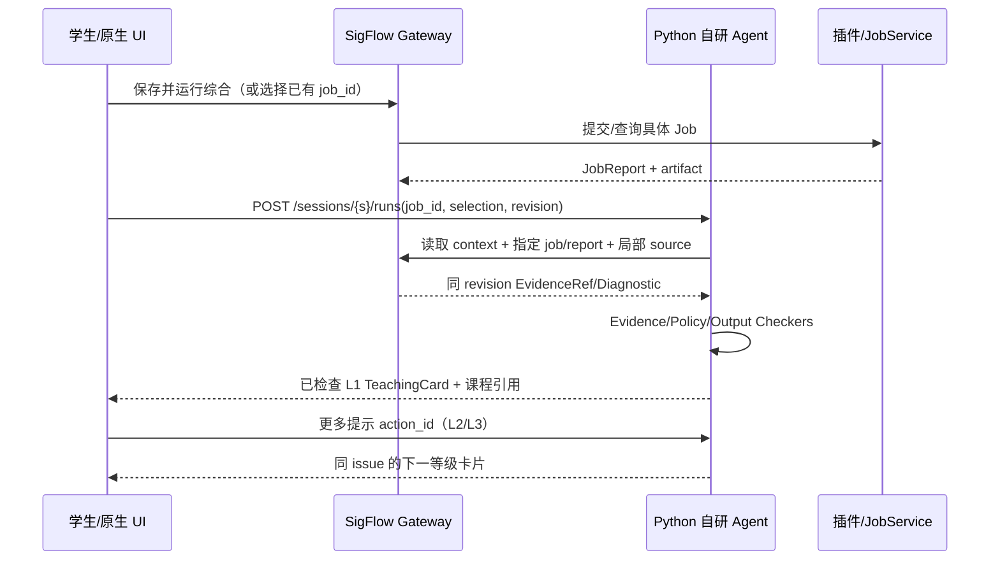
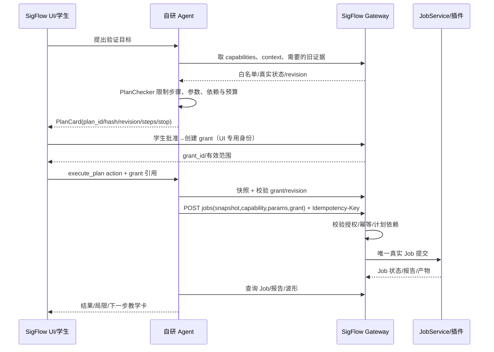

# SigFlow Edu × 自研 Agent：双方实现协作与接口对照

> 版本：v1.1 · 2026-10-07  
> 适用范围：SigFlow 教育版一期，Python 教学 Agent 自研、仅参考 UCAgent 架构，经本机 HTTP 与 C++ SigFlow 通信。  
> 两组各 3 人，原 10 周排期待 W2 自研 spike 后重估；W1 从实际开工日算起。本文是实现期共同对照，不代表契约文件或功能已创建。  
> 计划入口：[SigFlow spec](sigflow/spec.md) / [SigFlow task](sigflow/task.md) / [Agent spec](ucagent/spec.md) / [Agent task](ucagent/task.md) / [自研决策](DECISION-2026-10-07.md)。历史目录名 `ucagent/` 不构成软件依赖。

## 1. 本文的使用顺序和效力

每次跨组实现或评审，先定位本文件中的责任与时序，再核对现有 `contracts/edu-agent/v1/` 的 OpenAPI/JSON Schema/fixtures 和两侧 task 的验收项。**机器契约是已覆盖字段与枚举的真源**，尚缺的 Agent API/卡片 DTO 由双方补齐；[SigFlow spec §5](sigflow/spec.md#5-共享-http-契约-v1两组共同执行) 是语义与边界真源；本文是端到端协作及变更流程真源。若发现冲突，S1/U1 共同记录并更新这三处，不能在各自服务里单独“兼容”一个未冻结格式。

本期只交付教育版。已完成的插件化和跨平台底座作为输入，接入/验证/打包属于本期。工程版后续自研，Docker/远端部署仅按用户需求另评估；自动改 RTL、Python 侧直接跑 EDA、实板烧录代理和全量课程平台不进入本期验收。

### 1.1 五条不可混淆的边界

1. **事实来源**：工程、RTL、选中节点、EDA Job、报告、波形和 artifact 由 SigFlow C++ 产生；课程、提示等级、教学状态和学习历史由自研 Python Agent 产生。模型结论不是 EDA 事实。
2. **调度与执行**：Python 选能力、定有界计划和参数；SigFlow 校验、排队、启动现有插件/JobService、取消并存报告。Python 不传任意可执行文件、脚本或输出路径。
3. **权限**：用户在 SigFlow 原生 UI 批准计划，C++ 签发执行 grant；Agent 只能携带已签 grant 执行。L4 的教学策略由 Agent 判定，用户二次确认由 SigFlow UI 产生独立凭据。两种权限互不替代。
4. **版本**：每条证据绑定 project/revision 和必要的 snapshot/job/artifact hash；旧报告能讨论历史，不能证明新修改有效。dirty 缓冲可用于只读解释，EDA 执行必须基于已保存快照。
5. **展示**：C++ 只展示结构化、已检查的 Agent 卡片；L1–L3 无完整作业答案，L4 在第二次确认前不能进入普通 RAG、模型上下文或 UI 事件正文。

## 2. 人员与模块责任矩阵

| 人员 | 唯一主责 | 对口 | 所需对方输入 | 对外承诺 |
|---|---|---|---|---|
| S1 SigFlow 接口/运行时 | Gateway、鉴权、事件、幂等、执行 grant、Job 持久化/恢复、sidecar 宿主 | U1 | Agent API、启动/健康、重试与恢复策略 | SigFlow HTTP API、真实 Job/授权/状态、安装联调 |
| S2 SigFlow 数据/EDA | revision/snapshot、源码/节点查询、报告归一化、artifact/波形 | U2/U3 | 教学所需证据/样例、波形窗口、概念与诊断映射 | 可定位、同版本、可重复查询的 EDA 事实 |
| S3 SigFlow UI/集成 | 教学面板、卡片/动作、四视图定位、设置/历史入口、GUI 验收 | U2/U3 | 教学卡/计划卡 DTO、课程/历史状态与拒绝文案 | 人工审批、可靠定位、故障可见的用户体验 |
| U1 Agent 运行时/接口 | 自研状态机/工具/检查器、Agent API、typed client、模型/预算、恢复、Python 包与原生双平台 | S1/S3 | Gateway 契约/Mock、启动材料、真实 Job 语义 | 可运行 Python 服务与工具调用、契约测试 |
| U2 Agent 教学流程 | E0–E7、问题状态、L1–L4、Plan/Policy/Evidence/Outcome Checker、波形教学 | S2/S3 | 真诊断、source/wave refs、UI receipt/卡片交互 | 有证据的引导、有限计划与复测反馈 |
| U3 Agent 知识/学习数据 | 课程种子/索引、引用、SQLite、画像、样例/评测、教师试用 | S2/S3 | 真工具样例、历史/课程 UI 需求 | 可追溯资料与可管理的学习记录 |

### 2.1 接口对象的唯一写入者

| 对象 | 创建/写入 | 只读/消费 | 必须带的关联 |
|---|---|---|---|
| `project_id/revision/dirty` | SigFlow S2 | Python U1/U2、UI | instance_id、source/file hashes |
| `snapshot_id/input_fingerprint` | SigFlow S2 | S1 Job、U2 验证 | project/revision/target/tool config hashes |
| `JobRecord/JobReportView/artifact` | SigFlow S1/S2 | U1/U2、S3 UI | job/project/snapshot/revision/plugin/version |
| `SourceRef/EvidenceRef` 的 EDA 定位部分 | SigFlow S2 | U2、S3 | project/revision/source or artifact hash |
| `session_id/run_id/issue_id` | Python U1/U2 | SigFlow S3 | instance/project/learner/policy |
| `TeachingCard/PlanCard` | Python U2/U1 经 Checker 后发布 | SigFlow S3 | run/state_version/revision/evidence IDs |
| `grant_id` | SigFlow S1，在 S3 用户批准后 | Python U1/U2 | plan hash/snapshot/revision/steps/TTL/max_jobs |
| `ui_receipt/challenge_id` | challenge 由 Python U2 发起，UI 事件由 S3 触发，receipt 由 S1 签发 | Python U2 核销 | learner/session/issue/revision/policy/action |
| `learner_profile/learning_event/concept_summary` | Python U3 | SigFlow S3 | learner ID、来源 event/job、保留/删除状态 |
| `course_passage/index_version` | Python U3 | Python U2、SigFlow S3 | passage/source URL/license/hash/version |

两组均可写自己的审计日志，但不能双写对方事实。C++ 不推断概念“已掌握”，Python 不把自然语言回答写成真实 Job 状态。

## 3. 代码与构建边界

| 层次 | SigFlow 侧 | Agent 侧 | 对照原则 |
|---|---|---|---|
| 语言/进程 | C++ SigFlow 桌面进程，wx UI + Gateway/Job | 自研 Python 独立 sidecar，教育 profile | 进程间只走 HTTP JSON，不做 Python 嵌入 C++ |
| 构建 | 现有 CMake/GCC、工具插件与平台层，新增 Agent 构建/运行开关 | 自研运行时版本、Python 锁文件、教学包 | 两边发布版本与协议主版本写入 health/包清单；Docker 不作一期前提 |
| Job 执行 | `IJobService` + `IJobProvider`/官方插件 | typed 受限工具选择并申请 | Python 不另起 Yosys/Verilator，不用 shell 包装器 |
| 工程 | `sigflow.project`、主程序设计数据、`.sigflow/agent` 快照/授权/审计 | 用户数据目录的学习库/课程缓存 | Python 工作目录不设工程根，不共写 SQLite |
| 事件 | SigFlow project/job/artifact/selection，Agent session/card/run 各自服务事件 | 两边分别生成本服务序号 | 使用游标和状态快照恢复，不能假设精确一次投递 |

自研 Agent 的实体代码位置在 W1 定为本仓库 `agent/` 或独立仓库；共同契约与端到端 fixtures 应在 SigFlow 工作区有可访问的固定版本。若独立仓库，双方在发布清单固定双仓 commit，CI 用相同 contract 版本校验，不接受“本地目录刚好相同”作为一致性依据。

## 4. 协议、身份与命名表

### 4.1 双服务

| 服务 | 提供者 | 调用者 | 路径与功能 |
|---|---|---|---|
| SigFlow EDA Gateway | S1/S2 | U1/U2 的受控 HTTP client；S3 UI 的本地受信控制通道 | `/api/v1/health/capabilities`、项目 context/snapshot/source/design、jobs/reports/artifacts/waves/events、grants/receipts |
| Python Agent API | U1/U2/U3 | S3 的异步 UI client | `/api/v1/health/capabilities`、sessions/runs/actions/events/state/history/exports、learner summary/delete |

两服务监听 `127.0.0.1` 系统分配端口。启动材料通过受限继承管道传给 Python：instance_id、两边端口/协议、随机 nonce 和 Agent→EDA token。UI→Agent token 与 UI 专用控制身份单独管理，不放 URL、命令行、工程文件、模型提示、普通日志。初始 readiness 经管道回匹配 nonce，正式 HTTP health 也做认证。客户端检查主版本，不兼容时只停用 Agent 功能，IDE 继续可用。

普通 JSON 使用 UTF-8/snake_case，UTC 时间戳；64 位 tick/uid 用十进制字符串；只传工程相对路径或 opaque ID。成功与错误信封、状态码、体积/分页上限在契约中冻结。样例见 [SigFlow spec §5.5](sigflow/spec.md#55-最小交互示例字段子集)。

### 4.2 ID 与稳定范围

| ID | 生成方 | 稳定范围 | 禁止混用 |
|---|---|---|---|
| `instance_id` | SigFlow S1 | 一次 IDE 实例生命周期 | 不能当 project/learner |
| `project_id` | SigFlow S2 | 同一工程的生命周期，跨开窗稳定策略 W1 冻结 | 不能用绝对路径对外 |
| `revision` | SigFlow S2 | 同工程设计版本；保存/配置变化单调变更 | 选择变化不变 revision；dirty 不代表新已保存版本 |
| `snapshot_id` | SigFlow S2 | 固定一次工具输入 | 不能用“当前工程”替代 |
| `source_id/node_id` | SigFlow S2 | 绑定 project/revision；node_id 不保证跨重启稳定 | 不能缓存后跨版本直接定位 |
| `job_id/artifact_id` | SigFlow S1/S2 | 对应一次执行/具体产物，归属 project | “最近报告”先解析为具体 job_id |
| `session_id/run_id/issue_id` | Agent U1/U2 | 教学会话/一次处理/一个问题 | issue 跨 revision 可连续，run 不等于 Job |
| `trace_id/request_id` | 发起方/入口服务 | 一条调用链/单次 HTTP 请求 | trace 不作授权或幂等凭据 |
| `action_id` | SigFlow UI/S3 | 一次用户动作，重试不变 | 不同点击不能复用 |
| `grant_id/ui_receipt` | SigFlow S1 | 明确计划/教学动作及有效期 | 不互相替代；模型不能签发 |

### 4.3 教育能力与后端映射

| 教育 Agent 能力 | SigFlow provider/jobType | 允许输入 | 约束 |
|---|---|---|---|
| `eda.sim.build` | 插件实际 `sim.build` | top、注册源、受控测试输入 | 来源从 snapshot 解析，Python 不传任意路径 |
| `eda.sim.run` | 插件实际 `sim.run` | 前步编译 artifact、受控激励 | 必须属于同计划且构建成功；不接受任意可执行路径 |
| `eda.synth` | 插件实际 `synth` | top、策略枚举 | 参数按实际 provider schema；源/工具/脚本由 SigFlow 补 |
| `eda.pnr/pack/flash/debug` | 现有插件可保留手动功能 | Agent 不可用 | capabilities 返回 disabled/reason；不能从通用 invoke 绕过 |

能力可用性是“插件已加载 + 对应 provider ready + 运行工具可发现 + 当前项目/策略允许”的综合判断。已安装不等于 ready。`IJobProvider` 的参数 schema 与模型可见参数是两层；S1 输出白名单裁剪 schema，U1 按它校验并接受能力缺失反馈。

## 5. 数据契约中的责任细节

### 5.1 工程和代码

- S2 给 `GET /projects/{p}/context` 提供 top、目标、源清单/hash、selection、revision/dirty/policy_version，不直接传整个工程。
- 学生未保存的编辑缓冲可用于只读解释，但卡片必须标示 buffer hash 和“未用于工具执行”。需要运行时，S3 先引导保存，S2 创建同版本 snapshot；U2 不可把旧磁盘结果当当前编辑后的验证结果。
- `SourceRef` 使用 source_id、file_hash、1 基行/列和 revision；S2 负责 GUI UTF-8/字节偏移转换。U2 引用不存在的 ref 时应降级为不可定位，不生成猜测行号。
- 代码/日志/课程文本都是证据数据，可能包含对模型的“指令”；U1/U2 不让这些内容覆盖策略或工具权限。

### 5.2 Job 和报告

- S1/C++ 是 Job 唯一执行者；S2 将新 `eda.jobreport.v1` 与旧 `main/jobs` 报告适配为 `edu.jobreport.v1`。新 core `diagnostics` 当前为对象而非规范错误列表，旧 `errors[]`、状态、jobType 命名也不同；不能让 U2 再解析一份原始 Yosys 日志制造第二个真源。
- `JobReportView` 含 `job_id/origin/capability/plugin/version/project/revision/snapshot/state/diagnostics/metrics/artifacts/completeness/input_fingerprint`；缺字段用 null+reason，保留 raw code/原始 artifact。未知/解析失败与完整扫描无诊断严格区分。
- U2 对旧的 `legacy_unverified` 报告可解释历史现象，不能把它当本轮复测结果。`Succeeded` 表示 EDA 任务成功，不表示所有功能测试通过，更不表示学生掌握。
- S1 负责 Job 提交前幂等持久化与重启核对；U1 保留同一个 Idempotency-Key 重试，不能调用普通 retry 新建 Job。断线无法判定是否创建时先查询资源/恢复状态，不自动再投。

### 5.3 波形

- S2 返回 artifact 归属、timescale、width、完整信号名、闭区间 `[start_tick,end_tick]` 的初值和全部跳变，64 位 tick 为字符串；二态/四态来源显式给出。
- 单次 16 路、10,000 跳变、2 MiB 约束和分页/complete/exact 指示以机器契约为准；UI 缩略图可抽样，U2 的教学判断必须读取精确、足够完整的范围。
- 无波形、测试输入不完整、signal mapping 不可用或查询分页未完成时，U2 应提出下一步采集/缩窗建议，不能确定宣称设计行为。
- S3 接到 EvidenceRef 才跳转真实 `WaveformView` 的时间窗与可见信号；artifact 被删除则显示过期，不能加载同名新文件替代。

### 5.4 卡片、课程与历史

- U2 发布的 `TeachingCard/PlanCard` 必须经过策略和引用检查，带 run/state_version/revision/evidence refs/limitations。S3 不从卡片自然语言解析可执行动作。
- U3 是课程 passage/URL 元数据真源；模型只返回 passage_id，最终标题/URL 由受控元数据回填。没有可用来源就显示无匹配，不虚构链接。
- U3 是 SQLite 学习记录真源；S3 通过 Agent API 查询/导出/删除。profile 切换刷新会话/缓存，不能串学生；SigFlow 不另建第二份学习画像。
- 学生可见卡片沿共享 DTO 标记 `producer=model/rule`；Mock 仅用于测试或内测演示，单独在测试元数据中标明，不冒充真实模型答复。若 W1 决定对外暴露 Mock 作为第三种枚举，须双方同时更新 schema、UI 和验收说明。

## 6. 四条必须按顺序实现的端到端时序

### 6.1 学生解释一次综合问题（EDU-01）

预期：U2 不用“最近一次”盲选，先解析到具体 Job；所有卡片引用具体诊断/源码。学生修改后必须产生新 revision/snapshot 和新 Job，OutcomeChecker 对比新旧结果并说明适用范围。

### 6.2 学生查看 L4 参考解法

1. S3 渲染 L3 卡片的“申请参考解法”动作，创建稳定 action_id；U2 校验当前 issue/policy 后返回只含解释与 challenge_id 的确认卡，**不加载参考正文**。
2. 学生阅读确认卡并第二次点击“确认查看”。S3 经可信 UI 身份让 S1 签发绑定 challenge、learner/session/issue/revision/policy/过期时间的 UI receipt；Python 的 Agent→EDA token 本身无签发权。
3. U2 收到第二次 action，调用 `GET /ui-receipts/{id}` 验真，再以同 action_id 调 `POST /ui-receipts/{id}/consume` 原子核销。若 W1 契约将两步收敛为一次原子消费，以冻结文件为准，但不得失去两次学生动作和一次性核销语义。
4. U2 再次检查 L4 policy、issue/revision 与当前状态，才加载独立 reference 内容，经 OutputChecker 后发布卡片；S3 只显示该卡片。
5. 核销后 Python 事务若崩溃，恢复以相同 action_id 重取相同核销结果，不把重复请求当第二次确认，不重新提升等级。

负例：聊天文本“我同意”、伪造 UI receipt、跨 issue/learner、过期/新 revision、重复按钮和提前输出流都不能取得 L4 正文。

### 6.3 学生批准一个验证计划（EDU-04）

计划最多 3 个 Job，只允许 `eda.sim.build/sim.run/synth`；一个步骤失败、取消、超时、输入版本变化或服务断线时停止后继。grant 绑定 plan hash、snapshot/revision、具体步骤与参数、TTL/max_jobs。`sim.run` 的输入只能是本计划成功构建的 artifact。批准后的参数如变动，需新 PlanCard/grant。

S1 在执行前验证授权，U1 在提交前也校验策略；C++ 的拒绝是最终执行边界。Python 网络超时仅使用相同幂等键查询/重试，不生成新的执行尝试。用户点击“重新运行”才是新 attempt。

### 6.4 断线、事件游标过期与 sidecar 恢复（EDU-06）

1. 两侧各自为事件流维护单调 sequence/event_id。消费者按 event_id 去重；事件用于通知，Job/Run 状态以服务端资源为准。
2. 首次/重连先调用对应服务的 `/state` 获取当前状态和 `high_watermark`，再从该位置订阅 events；游标过期收到 410 时重复该过程。
3. SigFlow 若发现 Python sidecar 崩溃，S3 显示 Agent 不可用，S1 最多 3 次退避重启并轮换 token；已运行 EDA Job 可完成并持久化，但不会自动启动计划后继。
4. Python 恢复为 `RecoveryRequired`，U1 查具体 Job/报告、快照、grant，U2 重新核对 evidence 与策略；旧授权不能自动在新进程继续执行。若提交是否成功无法判明，保持待核对而非再投。
5. UI 恢复会话/卡片状态；旧 state_version 的按钮请求返回冲突并刷新，不无声推进新的 issue。

完成证据：同一 `Idempotency-Key` 的 20 次重复请求只产生 1 个 Job，重启后不会多出 Job；跨项目/跨 learner 会话不混淆；Agent 不可用时编辑与手动 EDA 功能继续。

## 7. 交付物、时间点与签收表

| 时间 | SigFlow 组交付（主责） | Agent 组交付（主责） | 联合 Gate/证据 |
|---|---|---|---|
| W1 D1–D2 | S1 基线/平台，S2 真 RTL/报告，S3 面板草图 | U1 自研运行时最小流，U2 提示样稿，U3 课程来源审查 | 有命令与样例，不只口头确认 |
| W1 D3 | Gateway schema/fixtures 草案（S1/S2） | Agent API schema、Mock、自研运行时接口草案（U1/U2） | S1/U1 双签字段与错误/身份表 |
| W2 / G0 | health/capabilities/context/report 最小真服务 + Mock UI | 原生双平台最小 sidecar + 自研阶段/工具/检查器/恢复 trace + Mock 卡片 | 无模型项目→报告→卡片；双方契约测试；主版本不兼容有提示 |
| W3 | snapshot/真实 synth/receipt/grant/源码定位基础 | L1–L4 Checker、幂等 typed client、历史库最小版 | 合同 fixture 对齐；可独立调用/诊断 |
| W4 / G1 | S2 真锁存器报告与新旧 revision、S1 受控 synth、S3 UI 两步 L4 | U2 真引导/复测、U3 8–12 课程片段/学习记录 | 学生自行改代码→新 Job；L4 无提前泄露 |
| W5 | sim.build/run 与波形 artifact/信号、局部映射 | 计数器教学/验证计划/OutcomeChecker | 同一计数器测试输入与 timescale |
| W6 / G2 | 四视图、精确波形、取消/旧版本 | 预测→观察→复测反馈与可点回 EvidenceRef | EDU-02/03/04 真工具+GUI 闭环 |
| W7–W8 / G3 | 事件恢复、Beta 包、主动提示/历史 UI | 8 类正反例、≥20 课程片段、画像/删除/对抗评测 | 故障注入、重复执行保护、双平台安装 |
| W9–W10 / G4 | 发布包、GUI/既有功能回归、目标平台矩阵 | 真实模型回归、教师评审/试用、Python 包/手册 | EDU-01…06 + 双侧 AC 列表逐项有证据 |

每周两次定时联调、一次端到端演示；时间建议由 W1 D1 两组确定。每次联调记录当前 contract commit、双方 build/commit、真实/Mock 数据标识、通过/失败、问题 owner 和截止周。等待对方接口时使用共同 fixtures/Mock 继续各自开发，但 Gate 必须按表替换成真实数据和真实平台验证。

### 7.1 交接包最小格式

每个跨组交接包至少包含：版本/commit、启动或构建命令、依赖环境、具体请求/响应 fixture、成功及错误样例、字段来源与可空条件、限额/超时、测试结果、已知限制、对应 Gate/任务 ID。S1/U1 为接口交接双责任人；领域样例由 S2/U2/U3 共同签事实与教学预期；面板动作由 S3/U2 共同签。

## 8. 契约和代码变更流程

### 8.1 契约冻结与变更

1. 提变更的人在 `contracts/edu-agent/v1/CHANGELOG.md`（计划路径）写问题、旧/新字段和语义、影响路由、兼容性、迁移窗口、双方代码/测试清单。
2. S1/U1 同时审查 wire 格式、鉴权、错误和恢复；S2/U2 审查数据事实/教学语义；S3 审查 UI 状态/操作。跨责任边界的变更必须有两个侧别的 reviewer。
3. 先改 schema + 成功/失败 fixtures，再改 Mock 与两边实现；双方 CI 跑同版本 golden fixtures。非兼容变更升主版本或由双方明确版本化路径，不能悄悄给字段换意思。
4. 修改完成后更新本文件中相关流程和两侧 task 状态，记录新 Gate 影响。旧 fixture 保留一段时间用于兼容性测试。

可向 v1 增加可选字段，但客户端必须忽略未知可选字段；未知枚举/缺必填字段明确 unsupported/error，不猜默认成功。用户可见的新能力若涉及权限或版本，不能只靠新增可选字段偷偷放宽。

### 8.2 PR/提交评审边界

| 变更类型 | 必要 reviewer | 必跑检查 |
|---|---|---|
| Gateway/DTO/鉴权 | S1 + U1 | 双方 contract、身份/路径/幂等负例 |
| Snapshot/报告/波形 | S2 + U2 | 同 revision、真实工具 fixture、边界/缺失/过期样例 |
| 教学策略/L4/计划 | U2 + S3，执行相关另需 S1 | 等级/假确认/旧 grant/模板泄露和真实 GUI |
| 课程/历史/删除 | U3 + S3 | passage URL 元数据、跨 learner、导出/删除/缓存 |
| 自研运行时版本/第三方依赖 | U1 + S1 | Windows/Linux 原生最小流、工具 registry、恢复、协议与打包 |
| 发布包/目标平台 | S1/S3 + U1/U3 | 安装/回滚、EDU-01…06、既有 IDE 回归 |

双方可以在同一仓库分别改各自模块，但共享契约和同一个 `.sigflow` 数据布局不能无审查并行修改。跨组依赖失败先提供最小复现请求、response、版本和日志，不把问题直接推给另一组。

### 8.3 问题分流规则

| 现象 | 第一责任定位 | 交接必要信息 |
|---|---|---|
| HTTP 401/403、权限/receipt/grant | S1 或 U1（看服务端） | request_id、身份类别、scope、错误码，不附 token |
| 源/节点错误、旧 revision、混合版本 | S2 | project/revision/snapshot/source refs/hash |
| Job 未启动、双投、取消失败、报告缺失 | S1；报告解析由 S2 | plan/grant/job/idempotency key 的脱敏摘要、状态链、插件版本 |
| 波形值/单位/分页错误 | S2；解释问题由 U2 | artifact hash、query、expected/actual ticks、complete/exact |
| 等级越界、错误教学结论、RAG 链接 | U2/U3 | issue/policy/model/course 版本、证据 ID、输出卡片 |
| UI 错位、点击状态、不能定位证据 | S3；ref 源头由 S2/U2 | card/state version、EvidenceRef、UI 操作步骤 |
| sidecar 启动/平台依赖 | U1 与 S1 | OS/架构、包/运行时版本、退出码、最小命令与健康状态 |

## 9. 联合验证矩阵与发布判定

### 9.1 分层证据

| 层次 | 证明什么 | 不证明什么 |
|---|---|---|
| 共享契约/Mock | 路由、DTO、错误、状态机与恢复语义 | 真实工具或模型品质 |
| 真实 EDA 集成 | RTL/Job/报告/波形/产物关联，执行授权 | 教学内容是否易懂 |
| 真实模型评测 | 提示递进、引用、证据使用和限制遵守 | 所有学生都会独立掌握 |
| GUI/平台回归 | 原生交互、安装/关闭和旧功能 | 模型输出在新题目上一定正确 |
| 教师/学生试用 | 可理解性、干扰和学习行为初步观察 | 广泛学习成效或因果结论 |

### 9.2 阻塞级别与硬门槛

| 级别 | 示例 | 行动 |
|---|---|---|
| 发布阻塞 | 未授权执行、跨项目/学生泄漏、L4 未确认露出、重复执行、旧版本结果充当新结果、严重硬件误导、Agent 故障使 IDE 主流程不可用 | 停相关发布能力，补测试并双侧复查 |
| Gate 阻塞 | 必须场景仅 Mock、Windows 自研 Agent 最小流不运行、真实 wave 不完整却出确定结论、四视图错误定位 | 保持该 Gate 未通过；可并行不依赖任务 |
| 可带限制的 P1 | 主动提示、资源对比、向量检索、复杂画像 UI | 文档列明未交付；不影响已验收 P0 |

G0 要有双平台原生最小自研 Agent 运行和双方契约；G1 要有真锁存器/真实综合及 L4 门控；G2 要有仿真/波形/四视图；G3 要有模式覆盖、恢复与 Beta；G4 要有 EDU-01…06、SF-AC01…10、UA-AC01…11 的分层证据。全部 Gate 按各侧 task 清单逐项签，不能凭一次演示概括通过。

## 10. 数据、日志与生命周期协作

- SigFlow 在工程 `.sigflow/agent/` 保存快照/计划授权/审计索引；自研 Agent 在用户数据目录保存学习 SQLite、课程索引和服务检查点。两边各自控制迁移与清理，不直接打开对方数据库。
- 默认不把 Key/令牌、完整工程、整段 VCD 或原始模型请求正文记入普通日志。联调日志可记录 trace_id、DTO 版本、证据 ID、Job ID、状态、耗时、工具/model 版本及脱敏错误。
- 双方统一 UTC 时间戳；跨进程问题用 trace_id 串联，事件 sequence 只在各自服务流内单调，不假定全局统一排序。
- 学习历史删除由 U3 执行，S3 显示 purge 状态；SigFlow Job/EDA artifact 的保留由 S1/S2 的工程策略管理。删除学习历史不自动抹除用户工程的既有工具产物，UI 应说明这两种数据范围。
- 项目快照被活跃 Job/计划引用时 S2 固定保留；U2 在收到 artifact expired 或 source stale 后停用相应证据，提示重新取证，不把同名文件接上旧引用。
- 新版本升级时，S1/U1 分别迁移本侧存储并共同验证旧 session/Job 如何显示；不能因为 Python 数据库迁移失败而损坏 SigFlow 工程或阻止普通编辑。

## 11. 开工未落定项与结案条件

| W1 应定事项 | 主责 | 未定时的安全默认 |
|---|---|---|
| 实际开始日期、六人名单、联调窗口 | S1/U1 | 以 W1 相对周排，不宣称日历交付日 |
| 自研运行时接口/Python 版本/Windows 依赖 | U1 | 先做原生最小 spike，不承诺已支持 |
| Python 代码物理仓库与发布方式 | U1/S1 | 共享契约置 SigFlow 工作区，双仓版本必须锁定 |
| C++ HTTP 库/许可证/打包形式 | S1 | 最小跨平台样例通过后再冻结 |
| 已完成跨平台的具体 OS/架构清单 | S1/S3 | 只验已可用目标，不新增 ARM64/LoongArch 承诺 |
| 初始模型/配额/课程种子许可 | U1/U3 | 无 Key 规则模式可工作；未核验课程只保留链接/摘要 |
| 教师审阅与小规模试用资源 | U2/U3/S3 | 做教师走查并标记学生效果未验证 |

每项在 W1 决策记录中有结论或阻塞 owner；不把缺答案的决策藏在提示词、README 或个人机器配置里。W2 对人日和关键路径重估；W6 如超预算，两组一起调整 P1，维持执行授权、数据版本、幂等和证据真实性门槛。

**协作结案**：同一个学生场景中，SigFlow 能提供可信工程与 EDA 事实、执行受控计划并原生展示；自研 Agent 能依据这些事实给出逐级教学、可验证的下一步与学习反馈。任一侧独立运行成功只证明该侧工作包；两组按 G4 合同、真实工具、模型/教师评审、GUI 与平台结果共同签收教育版一期。
