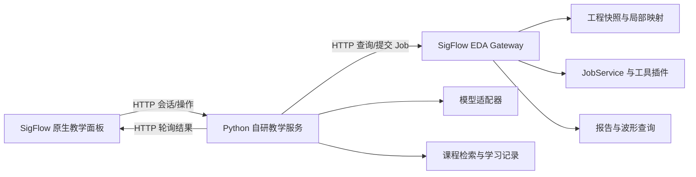

# SigFlow 教育版 Agent 驱动改造：SigFlow 组实施规格

> 版本：v1.1 规划评审稿 · 日期：2026-10-07  
> 责任团队：SigFlow 组（3 人）；协作团队：Agent 组（3 人）  
> 计划窗口：原 10 周为目标，W2 按自研运行时 spike 重估；W1 为实际启动周，尚未指定日历交付日。  
> 配套文档：[Agent 组 spec](../ucagent/spec.md)、[SigFlow 侧 task](task.md)、[双方协作对照](../Cooperate.md)、[自研决策](../DECISION-2026-10-07.md)。两份 spec 共同构成教育版一期实施基线。  
> 本文是待实施规格，不代表接口、功能或验收已经完成。

## 1. 目标与本次决策

交付可用于数字电路与 FPGA 入门实验的 SigFlow Edu：学生在原理图、RTL、波形和综合报告之间学习，Python Agent 能读取真实工程证据、提出验证计划、经授权调度 SigFlow 的 EDA 工具，并根据结果逐级引导学生自行修复。

固定架构：**Python 教学 Agent 自研，UCAgent 仅作架构参考；Agent 承担推理、教学策略、工具调度、课程检索与学习反馈；C++ SigFlow 通过本机 HTTP 提供工程数据、EDA 能力、执行控制及原生交互。** 工具调度指 Agent 选择能力和参数、提交请求；EDA 进程实际执行仍归 SigFlow 插件与 JobService。教学版必须原生支持 Windows/Linux；Docker 与远端部署按工程版用户需求另行评估，不构成一期门槛。

本期只交付教育版。工程版只保留 edition、能力发现和策略扩展点，后续按独立 spec/task 自研，不开发工程工作流、大规模设计浏览、自动改 RTL、自动修复循环或工程验证代理。

### 1.1 与历史文档的取舍

| 依据 | 继承 | 本期调整 |
|---|---|---|
| [0907 规划](../../SigFlow_Plan_0907.md) | 四视图联动、局部上下文、Job 执行、决策留痕、L1–L4 | 取消“3 人产品 + 2 人移植”分工；改为两个等规模产品团队；教育版提前成为唯一主线 |
| [团队产品说明](../../sigflowAgent产品说明.md) | 教学引导、课程引用、学习历史、异步 sidecar | 由只读问答扩展为受控工具调度；第一阶段手动触发，后续补可关闭的主动提示 |
| [0915 开发意见](../../sigflowAgent开发0915.md) | 经验驱动的教学工作流、可配置工具与检查器 | 借鉴 UCAgent 架构但自研运行时与扩展接口；跨语言协议统一为 HTTP |
| [早期总体 spec](../../spec.md) | 可追溯性、工具结果驱动反馈 | 不纳入全自动设计空间探索、自动修改和工程版全部目标 |
| 团队最新进展 | 工具链已插件化，跨平台工程已完成 | 本期做接入与回归，不重新立项插件重构、CMake 迁移或全平台移植 |

历史文档“AI 不直接执行工具”解释为“不在 Python 中另起 EDA 命令、不绕过 SigFlow 执行控制”，不再解释为“Agent 永远不能申请执行 Job”。旧文档中“不给答案”解释为 L1–L3 不提供完整作业解答，L4 在允许且二次确认后可展示参考解法，始终不自动修改学生工程。

旧文档的“确定性诊断 100% 可靠”、未核验的学习效果百分比不作为立项依据。确定性只意味着规则可复现；规则覆盖、误报、漏报需要样例验证。

### 1.2 交付层级

| 层级 | 时间 | 必须交付 |
|---|---|---|
| M0 接通 | W2 | 双向 HTTP、版本协商、Mock 会话、能力/报告查询、Windows/Linux 最小联通 |
| M1 教学 MVP | W4 | 真实锁存器案例，定位 RTL，L1–L4 门控、一次授权综合、记录与最小课程引用 |
| M2 证据闭环 | W6 | 仿真编译及运行、精确波形片段、四视图锚点、复测后反馈 |
| M3 教学 Beta | W8 | 8 类教学模式、课程检索与个性化完善、主动提示、断线恢复 |
| M4 一期发布 | W10 | 跨平台安装包、回归与联合验收、试用整改、文档与故障支持材料 |

P0 表示一期阻塞项；P1 表示一期增强项且可按第 12 节降级；P2 表示后续立项。不得用“工程版预留”扩大 P0。

## 2. 用户体验与范围

### 2.1 必须跑通的六条用户旅程

| ID | 触发与流程 | 完成证据 |
|---|---|---|
| EDU-01 | 学生综合出现锁存器 → 点“解释此问题” → L1/L2/L3 → 手动修复 → Agent 建议复测 → 学生执行 | 新 Job 引用新 revision，诊断消失，Agent 说明验证范围而非宣布全设计正确 |
| EDU-02 | 学生点选原理图元件/RTL 信号 → “它与这段代码有什么关系” | 卡片引用有效节点和源码位置；没有映射时明确说明，不能猜测 |
| EDU-03 | 计数器复位行为异常 → 框选波形 → Agent 查复位与计数输出 → 引导验证 | 波形值、时间单位、Job 和源码版本可追溯；学生可跳回该时间窗 |
| EDU-04 | 学生问“接下来怎么验证” → Agent 给出目标、仿真/综合步骤和预期观察 → 批准单步或有界计划 | SigFlow 调用插件执行，取消有效，计划条件满足才进入下一步 |
| EDU-05 | 同类错误再次出现 → 展示已有学习记录和适当提示 → 查看课程章节 | 个性化有记录依据；可删除记录；资源有来源，不强制联网才能读已缓存资料 |
| EDU-06 | 无模型 Key/网络断开/Agent 崩溃 | IDE 仍能编辑、仿真、综合；显示规则提示或明确的服务状态，不伪装成模型回答 |

### 2.2 一期包含与排除

**P0**：原生教学面板、上下文选择、能力发现、报告与诊断、只读 RTL、局部设计映射、仿真与综合调度、波形查询、计划卡、提示卡、课程引用、学习记录入口、授权与审计、断线与版本过期处理、跨平台回归。

**P1**：可关闭的 Job 完成主动提示、综合资源对比、课程包内默认策略导入、小规模课堂试用。综合资源只比较同目标器件/插件/策略且标记工具版本，不承诺估算性能准确性。

**P2**：工程版、任意 HDL 完整语义 IR、任意反向图码同步重构、全量课程平台、教师班级后台、云端多租户、考试防作弊、自动修改文件、自动布线打包烧录、TraceBridge Agent 调试。原有手动布线/烧录/调试功能保持可用；教育 Agent 一期不暴露实板执行能力。

## 3. 已有工程资产与接入差距

以下为 2026-09-23 的静态源码核查，不替代运行验收；平台完成状态采纳团队说明，具体 OS/架构发布清单在 W1 记录。

| 资产与代码 | 复用方式 | 新工作/限制 |
|---|---|---|
| `CMakeLists.txt`、`core/src/eda-platform/`、`main/platform/` | 现有 GCC/MinGW 与 POSIX/Win32 基础 | 根 README、BUILD 历史描述存在差异；本期维护准确构建入口，不再按旧 MSVC 计划排期 |
| `include/eda/api/jobs.hpp`、`core/src/eda-core/JobService.*` | 新能力执行入口，复用状态/取消/产物 | 外部报告适配、持久化幂等、并发策略及恢复需补，不把接口存在当端到端完成 |
| `main/Composer.*`、`include/eda/api/capabilities.h`、`InnerPlugin/eda-*` | 发现、选择插件、读取参数 schema | GUI 仍有 `SIGFLOW_USE_JOB_SERVICE` 可选路径；Agent 一律接新服务，GUI 旧结果经报告适配读取，不能双投任务 |
| `main/jobs/` 与 `main/jobs/schemas/job-report.schema.json` | 旧任务和历史结果可读 | 旧 `errors` 与新 `diagnostics`、`synthesis` 与 `synth`、单体 simulation 与 `sim.build/sim.run` 均需归一化 |
| `main/SigTree.*`、`main/VerilogManager.*` | uid、图码映射、源代码索引 | uid 不假定跨重启或所有编辑稳定；不要求先完成整个 eda-ir 拆包 |
| `main/trace/TraceQueryService.*`、`include/eda/api/waveform.hpp` | 后台查询、VCD 信号和值 | HTTP 限流/分页/边界值、单位和 artifact 归属需包装 |
| `main/fpga/FpgaYosysLogParser.*`、`NextpnrLogParser.*`、`CstValidator.*` | 诊断与报告解析 | 校验插件报告是否携带诊断；缺失则接解析适配，不让 Python 再解析一遍工具日志 |
| `include/eda/api/events.hpp` | 复用项目、Job、选择事件主题 | HTTP 事件信封、序号、重放和 GUI 接线是新工作 |
| `Plugin_DeepSeek/` | 旧功能兼容，借鉴现有 UI 接入 | 不承担本期教学工作流；避免同时弹两套教学提示 |
| `tests/contract/`、`tests/plugins/`、`tests/ir/` | 延续现有测试体系 | 新增边界与端到端测试；历史文档中的 19/19 不视为本次已运行结果 |

当前检索的 `main/core/include` 未发现可直接复用的 `ModeController`、`CourseMapping`、完整 ContextEngine 或 Agent HTTP 服务。因此产品说明中的“11 条既有课程映射”等不能算现成交付物；Agent 组按新建最小规则/课程种子预算。

## 4. 架构、职责与数据所有权



图中双向通信由客户端请求/服务端响应实现，无需远端反向连接。采用两个本地 HTTP 服务：SigFlow 持有 EDA Gateway，Python 持有 Agent API。UI 请求 Python；Python 请求 SigFlow。首版以 JSON + 游标长轮询保证正确性，SSE 为可选增强，不同时开发 WebSocket/gRPC/MCP 三套协议。

| 事项 | 唯一主责 | 对方职责 |
|---|---|---|
| 工程文件、当前编辑缓冲、revision、快照、目标板配置 | SigFlow | Agent 只通过 HTTP 读受限上下文 |
| EDA 进程、插件、日志、报告、波形、取消/超时 | SigFlow | Agent 选择能力和参数、解释结果 |
| 计划与教学状态、L1–L4 规则、课程关联 | Agent | SigFlow 结构化展示、转交真实 UI 操作 |
| 运行授权与实际执行拦截 | SigFlow | Agent 提交建议，不能签发执行权限 |
| L4 策略判定与内容生成 | Agent | SigFlow 提供确认事件及由 UI 产生的凭据，Python 校验凭据 |
| 学习记录与课程索引 | Agent | SigFlow 展示查询/导出/删除入口 |
| 教学模式标签与前端开关 | SigFlow | Agent 仅接受 `edu` 策略，不接受模型切换工程权限 |
| HTTP 契约、golden fixtures、验收 | 双方联合 | S1/U1 双负责人签核；字段不能各自漂移 |

### 4.1 进程与线程

SigFlow 负责 sidecar 启停、握手和健康提示。每个 IDE 实例独立 Python 进程、实例 ID 和随机端口；sidecar 可同时持有多个项目会话，但同项目默认单个活跃教学 run，其他排队。Python 的工作目录为独立 Agent 数据目录，非工程根目录。

C++ HTTP 工作线程只能访问不可变 DTO、线程安全服务或通过队列请求 UI 快照，不直接调用 wx 控件、遍历正在修改的 SigTree。UI 线程生成有界快照后立即返回；EDA 和波形解析均在后台。网络结果经 `CallAfter`/事件投递；销毁窗口后回调必须能失效。

网关应作为宿主服务/官方内建模块接入 Composer 和服务注册表；不新增一个可从网络任意调用插件 `invoke` 的通用桥，也不为了 Agent 改动插件 ABI。

## 5. 共享 HTTP 契约 v1（两组共同执行）

本节是通信语义的唯一规范源；配套 spec 引用本节。W1 由 S1/U1 将其落成 `contracts/edu-agent/v1/{sigflow.openapi.yaml,agent.openapi.yaml,schemas/,fixtures/}`（规划路径，尚未创建）。先给 Mock 再接真服务。OpenAPI/JSON Schema 的机器可读文件冻结后以其作为字段真源，语义变更同时更新两份 spec。

### 5.1 通用约定

- 基础路径：两服务均 `/api/v1`；只监听 `127.0.0.1`，端口由系统分配。禁止默认 `0.0.0.0`；远程部署不属一期。
- UTF-8 JSON、snake_case；所有时间戳为 UTC ISO 8601；路径只返回工程相对 POSIX 形式或 opaque ID。64 位时间 tick 与 uid 用十进制字符串，避免前端数值精度损失。
- 标识区分：`instance_id`（实例）、`project_id`（工程）、`revision`（已接受设计版本）、`snapshot_id`（不可变输入）、`session_id`（教学会话）、`run_id`（一次 Agent 处理）、`job_id`（EDA 任务）、`trace_id`（全链路）。任何“最近报告”必须先解析成具体 `job_id`。
- 鉴权：宿主通过受限继承管道传递启动材料；分别签发 UI→Agent、Agent→EDA 的高熵 Bearer token。UI token 不交给模型或工具上下文。Key 不放在命令行、URL、工程文件或日志中。启动材料含 instance_id、端口、协议与随机 nonce，Python readiness 回传匹配 nonce。
- loopback 同样验证 token、Host，拒绝非预期 Origin；不启用通配 CORS；未知来源浏览器请求拒绝。会话必须校验 project/instance 归属。
- 普通成功 `200/201`；创建 run/Job 返回 `202` 与资源 ID/查询地址，不等长任务结束。成功信封统一为 `schema_version, request_id, trace_id, data`；无集合项也返回空数组。
- 失败信封统一为 `schema_version, request_id, trace_id, error:{code,message,retryable,details}`。`details` 不携带 Key 或完整绝对路径。
- 错误：`400 INVALID_ARGUMENT`、`401 UNAUTHENTICATED`、`403 POLICY_DENIED`、`404 NOT_FOUND`、`409 STALE_REVISION/IDEMPOTENCY_CONFLICT/PROTOCOL_MISMATCH`、`410 CURSOR_EXPIRED/ARTIFACT_EXPIRED`、`422 CAPABILITY_UNAVAILABLE/UNSUPPORTED_MAPPING`、`429 RESOURCE_EXHAUSTED`、`503 SERVICE_UNAVAILABLE`。模型网络错误用 Agent 领域错误，不伪装为 RTL 失败。
- 主版本不兼容禁用 Agent 接口且 IDE 可用；同 v1 新增可选字段，客户端忽略未知可选字段；未知枚举必须显示 unsupported，不能默默当 success。
- 默认请求体上限 1 MiB、普通响应上限 2 MiB、集合每页 100/max 500；超限显式分页或报错，不能无提示截断。

### 5.2 SigFlow EDA Gateway（S1/S2 提供，U1 消费）

| 方法与路由 | 输入/返回最小字段 | 优先级与语义 |
|---|---|---|
| `GET /health`、`GET /capabilities` | instance/protocol/build/edition；能力 ID、plugin_id/version、ready/reason、input schema、参数限制 | P0；capabilities 返回实际可用状态，不只插件安装状态 |
| `GET /projects/{p}/context` | revision、dirty、top、target、source 清单与 hash、selection、policy_version | P0；不返回整个项目源文件 |
| `GET /projects/{p}/state` | context、活跃 Job/授权摘要、high_watermark | P0；以一致性快照恢复事件订阅 |
| `POST /projects/{p}/snapshots` | expected_revision、require_saved=true；snapshot_id/revision/file hashes/target/tool config hashes | P0；本期工具只跑已保存且同步完成的版本；dirty 则要求学生先保存，不静默忽略编辑 |
| `GET /projects/{p}/sources/{source_id}` | revision、start_line/end_line；文本、hash、source_ref | P0；有界行区间；仅已登记源文件与允许的 include |
| `GET /projects/{p}/design/nodes/{node_id}` | revision；类型/名称/层级/端口/source refs/mapping_status | P0；仅已有可靠局部结构，不承诺完整语义图 |
| `POST /projects/{p}/context/query` | revision、selection refs、needs、max_bytes；证据包及 omitted/reason | P0；SigFlow 负责字节/记录预算，Python 负责模型 token 预算 |
| `POST /projects/{p}/jobs` | snapshot_id、expected_revision、capability、plugin_id、params、grant_id、plan_id/step_id | P0；`Idempotency-Key` 必填；返回 job_id、state、input fingerprint |
| `GET /projects/{p}/jobs` | revision/type/cursor；任务列表 | P0；历史 Job 带执行来源与版本 |
| `GET /jobs/{j}`、`GET /jobs/{j}/report` | 归属、状态、进度/nullable、时间、report | P0；按 ID 查询，不以 last.json 为稳定引用 |
| `POST /jobs/{j}/cancel` | reason；accepted、当前 state | P0；只允许本会话授权范围任务，取消请求不等于已经终止 |
| `GET /artifacts/{a}` | kind、sha256、size、job_id、revision、available | P0；禁止任意路径下载 |
| `GET /artifacts/{a}/content` | offset/limit，日志/报告受限文本段 | P0；只开放允许类型，默认不提供整个 VCD 二进制到模型 |
| `GET /waves/{a}/signals` | prefix/cursor；signal_id/full_name/width/timescale | P0；signal_id 只在该 artifact 内有效 |
| `POST /waves/{a}/query` | signal_ids、start_tick/end_tick、limit/cursor；initial values、transitions、单位与 exact | P0；详细语义见 §6.3 |
| `GET /projects/{p}/events?after={cursor}&wait_ms=20000` | events、next_cursor、high_watermark | P0；project/job/artifact/selection 事件，断线可重取 |
| `POST /projects/{p}/grants` | UI 专用；plan hash、revision、steps、TTL、max_jobs | P0；只能宿主 UI 身份调用，Agent token 禁止 |
| `GET /grants/{id}`、`POST /grants/{id}/revoke` | scope/status；撤销动作限 UI | P0；Python 可读自身 grant 状态 |
| `POST /projects/{p}/ui-receipts`、`GET /ui-receipts/{id}` | UI 专用签发 hint/L4/教学操作凭据；Agent 只读验真 | P0；绑定 issue/level/policy/session，单次消费 |
| `POST /ui-receipts/{id}/consume` | run_id、action_id、expected_state_version | P0；Agent 服务用专用客户端调用，原子核销；相同 action 幂等，其他 action 重用拒绝；不暴露为模型工具 |

`capability` 是本期网关稳定名称：`eda.sim.build`、`eda.sim.run`、`eda.synth`。其后端分别适配已存在的 `sim.build`、`sim.run`、`synth`；不得假定所有 provider 参数完全相同。网关暴露经白名单裁剪的输入 schema，工作目录、可执行文件、脚本、输出路径由 C++ 生成。`eda.pnr/pack/flash/debug` 对教育 Agent 标记 disabled。

### 5.3 Python Agent API（U1 提供，S3 消费）

| 方法与路由 | 内容 | 语义 |
|---|---|---|
| `GET /health`、`GET /capabilities` | 自研 Agent 运行时版本、protocol、model 状态、policy/RAG 版本 | 无 Key 时仍健康，但 model=unconfigured |
| `POST /sessions` | project/instance、learner_profile_id、policy_id、edition=edu | 创建会话；策略从受控配置读取，模型不能覆盖 |
| `POST /sessions/{s}/runs` | user_text、trigger、revision、selection refs、可选 job_id | 幂等创建 run，返回 202；trigger=user 或已同意的 job_finished |
| `GET /runs/{r}` | 状态、stage、等待原因、final cards、关联 Job | 正式结果只输出经过策略校验的卡片 |
| `GET /sessions/{s}/events?after={cursor}&wait_ms=20000` | stage/card/status/job-link 等事件 | 游标语义同 Gateway；一期不将未检查 token 直接显示给学生 |
| `GET /sessions/{s}/state` | 活跃 run、卡片/issue 摘要、high_watermark | 一致性快照，用于首次订阅及游标过期恢复 |
| `POST /runs/{r}/actions` | action_id、card_id、expected_state_version、UI receipt/grant 引用 | hint_next、reference_request、reference_confirm、execute_plan、reject、feedback；每个动作幂等 |
| `POST /runs/{r}/cancel` | cancel_owned_jobs、reason | 停止推理并取消本 run 创建的 Job；禁止取消学生其他手动任务 |
| `GET /sessions/{s}/history` | 游标、日期范围 | 返回教学轨迹摘要 |
| `POST /sessions/{s}/exports` | format=json/markdown、include_source=false | 返回受控 artifact ID；不默认导出源码/密钥/他人信息 |
| `GET /exports/{artifact_id}`、`GET /exports/{artifact_id}/content` | 导出元数据/分页内容 | Agent 服务自己的导出资源，与 Gateway EDA artifact 分属不同服务；仅 UI 身份可读取对应 learner 的数据 |
| `GET /learners/{id}/summary`、`DELETE /learners/{id}/history` | 概念摘要；确认删除及 purge 状态 | 删除语义由 Agent spec 定义；UI 显示清楚影响范围 |

### 5.4 共同 DTO

| DTO | 必填字段与约束 |
|---|---|
| `SourceRef` | project_id、revision、source_id、file_hash、start_line/end_line（1 基、包含端点）；可选 node_id；列为 1 基 Unicode code point，C++ 负责与编辑器字节列转换 |
| `EvidenceRef` | evidence_id、kind、project_id、revision、job_id（可空）、artifact_id（可空）、source_ref（可空）、locator、content_hash；至少能解析一种定位对象 |
| `Diagnostic` | id、code、raw_code、severity、stage、summary、origin、evidence_refs、location（可空）、confidence_kind=tool/rule/hypothesis；规则错误码版本化 |
| `JobReportView` | schema_version=`edu.jobreport.v1`、job_id、origin=core/legacy、capability、plugin/version、project/revision/snapshot、state、exit_code、diagnostics[]、metrics、artifacts[]、completeness、input_fingerprint |
| `TeachingCard` | schema_version、card_id、run_id、state_version、type、issue_id、revision、title、body、hint_level（可空）、evidence_refs[]、citations[]、actions[]、limitations[]、producer=model/rule |
| `PlanCard` | plan_id、plan_hash、revision、learning_goal、steps[]、expected_observations、stop_conditions、max_jobs、expires_at；每步含 capability/provider、params、depends_on、success_condition |
| `Event` | event_id、sequence（实例流内单调）、instance_id、project_id、timestamp、type、trace_id、data；Job 完成属于状态事实，LLM 输出不是事实事件 |
| `LearningOutcome` | issue_id、before/after job IDs、revisions、observed_result、hint_max、reference_viewed、student_explanation（可空）、limitations；区分工具通过和概念掌握 |

报告适配保留 `raw_report_schema` 和原始报告 artifact，空诊断列表必须区分“完整扫描且未发现”与“未提供/解析失败”。旧产物没有输入指纹时 `revision=null, completeness=legacy_unverified`，可以解释历史记录，但不得用于本次复测通过判断。

`metrics` 每项带 value、unit、source 与 availability；资源按工具/器件提供的真实分类记录，缺失值用 null 和原因，不能填 0。综合阶段未测得的 fmax/布局后时序不能由 Agent 补造。卡片使用的 `issue_id` 对非问题型介绍/计划可为 null；DTO 的必填字段不等于每个值均非空。

UI 专用的 grant/receipt 路由由宿主本地可信控制通道或独立 UI 凭据访问，不能复用 Agent→EDA token。一次参考确认包含绑定到先前 reference_request 的 challenge_id；Python 和 Gateway 都检查相同 session/issue/revision/policy，避免把两次相互无关的点击当作二次解锁。

### 5.5 最小交互示例（字段子集）

```json
{
  "snapshot_id": "snap-12",
  "expected_revision": "rev-12",
  "capability": "eda.synth",
  "plugin_id": "eda-synth-yosys",
  "params": {"top_module": "latch_demo", "strategy": "baseline"},
  "grant_id": "grant-7",
  "plan_id": "plan-3",
  "step_id": "check-synthesis"
}
```

该请求使用 Agent→EDA token 和 `Idempotency-Key: run-8-step-1-attempt-1`。`grant-7` 必须由学生批准的原生计划卡创建，不能接受模型生成的 `requireConfirm=true` 作为授权。参数映射到 provider 时，源文件集合从 snapshot 解析。

```json
{
  "schema_version": "edu.api.v1",
  "request_id": "req-9",
  "trace_id": "trace-3",
  "data": {"job_id": "job-21", "state": "Queued", "revision": "rev-12"}
}
```

### 5.6 幂等、事件与恢复

幂等键作用域为 instance/project/session/endpoint；请求规范化 hash 相同返回同一资源，不同返回 409。提交前把键与预分配 job_id 写入持久化记录，再进入队列，不能在超时重试时重复运行。恢复时不能判断是否启动则返回 `RECOVERY_REQUIRED` 并核对记录，不自动再投。Agent actions、run 创建也执行相同原则。最少保留 7 天或直到会话归档，以较晚者为准。

事件采用至少一次投递；消费者按 event_id 去重，乱序状态以 state_version/Job 状态查询为准。日志可以合并，状态变化不可静默丢失。初始保留最近 10,000 条或 24 小时（任一超过可淘汰最旧），过期游标返回 410；客户端先读取状态快照和 high_watermark，再订阅之后的事件，避免恢复窗口漏事件。事件不是报告的唯一存储。

默认 HTTP connect 2 秒、普通请求 10 秒、长轮询 25 秒；只读临时故障退避重试至多 3 次。写请求只带原幂等键重试。Job 等待与 HTTP timeout 分离；仿真/综合默认 Job timeout 600 秒，UI 可在受控范围调整。

## 6. SigFlow 核心改造要求

### 6.1 工程版本与快照（SF-DATA-01，P0）

revision 由 SigFlow 单调更新，覆盖保存后的 RTL、图码同步产物、include、参数、约束和影响执行的配置。选择变更不修改设计 revision。编辑缓冲 dirty 单独记录，不能误用旧磁盘版本回答“当前代码”。源码解释可针对带 buffer hash 的只读编辑快照；提交工具必须保存并生成正式 snapshot。

快照按内容 hash 保存源文件清单和内容，保留相对目录以及 include 关系，不要求复制整个工作区。项目引用外部 include 时在快照前明确登记与收集；未登记返回错误，不允许 Agent 读工程外任意路径。工具只从快照读取；原工程继续编辑不会影响在跑 Job。

卡片点击与计划执行检查 revision。旧卡片可查看但显示“基于旧版本”；不能在新版本重新批准旧 plan。Agent 读多个对象必须同 revision，期间变更返回 409 重新取上下文。node_id 限定于 project/revision，不承诺跨重开永恒稳定。

### 6.2 诊断与上下文（SF-DATA-02，P0）

确定性层给出可复现的观察，不直接宣布教学根因。锁存器推断可来自 Yosys 报告；“无复位”并非任何电路都错，应结合实验规范由教学层判定。

首批规范化类别：语法错误、锁存器推断、位宽/符号扩展、多驱动/未驱动、组合反馈、端口连接、复位行为异常、仿真结果不符。后两类需要期望行为/测试与波形；无法确定时标 hypothesis。没有真实检测器的类别标记 unsupported，不能以 LLM 生成一个 diagnostic 冒充底层事实。

上下文优先级：所选对象 → 相关诊断 → 小范围源码 → 同版本 Job 摘要 → 必要波形。每个裁剪结果给 omitted/reason；源码行和日志定位可按需扩展。大型依赖图与完整 HIR/NIR/BusIR 不作为一期前置。

### 6.3 波形数据（SF-WAVE-01，P0）

查询返回 artifact_id、job_id、revision、timescale（例如 1 ns）、闭区间 `[start_tick,end_tick]`、信号 full_name/width、区间起点前最后已知值 `initial_value` 和区间跳变。区间起点有跳变时明确 initial 为起点前值，跳变包含起点事件；无前值返回 null，不能假定 0。四态 x/z 保留；Verilator 产物若不保留四态，标记 source_semantics，不制造 x/z。

每次最多 16 路、总 10,000 跳变、2 MiB；超限分页，cursor 绑定 artifact/query hash/每信号偏移，不能丢弃同一 tick 的多项变更。返回 `complete/next_cursor/exact`；教学判断只能消费 exact 完整所需区间或明确说明证据不足。UI 缩略图允许降采样，精确教学证据不能直接取屏幕降采样结果。

### 6.4 计划执行（SF-JOB-01，P0）

学生可批准单步，或一次批准固定的“仿真编译→仿真运行→综合”有界计划。授权绑定完整 steps/provider/参数 hash、snapshot/revision、有效期（默认 10 分钟）、最多 Job 数（默认 3）及停止条件。已批准且参数不变的步骤不重复弹窗；新增步骤/参数改变/过期/版本变化必须重建计划。

同项目 EDA 执行默认串行；已有手动 Job 与 Agent Job 共用调度资源。取消/超时/失败即停止后继；`Succeeded` 只代表该工具任务成功，教学预期仍由 Checker 检查。sim.run 只接受来自该计划且成功验证的 sim.build artifact；禁止传任意可执行路径。

同一步允许的网络重试不能新建 Job；学生选择“重新运行”才生成新 attempt 与新授权/计数。Python 失联 30 秒后禁止启动后继，已执行 Job可完成并保存结果；IDE 退出则按现有安全关闭机制取消其管理的任务。Agent 恢复读取 Job 事实，不自动启动新步骤。

### 6.5 教学 UI（SF-UI-01，P0）

新增停靠面板，不重做画布/代码/波形布局。面板包含：当前项目与上下文标签、会话输入、状态进度、提示卡、计划卡、课程引用、学习摘要。入口包括右键“解释所选”、报告诊断“请助教解释”、波形框选“分析这段行为”。

四视图联动按可靠性显示：卡片→RTL 行、卡片→原理图节点、卡片→波形区间、卡片→报告诊断。原理图↔RTL 复用现有映射；综合可能优化或改名，无法一一对应时显示“映射不可用”并降级为模块/源码定位，禁止高亮不相关对象。

必须覆盖空工程、dirty、工具未安装、服务启动中、无模型、运行中、等待学生、证据过期、取消中、失败、恢复待确认等状态。不能用一直旋转的加载图标掩盖永久失败。

提示升级由 Python 策略决定，UI 不自行计算等级。L4 两次操作为“申请参考解法”→说明学习影响的确认卡→“确认查看”；第一步不携带答案。受控内容检查完成后才显示正文，禁止流式提前泄露完整解法。拒绝 L4 不影响继续 L1–L3 学习。

Agent 关闭时恢复普通 IDE；DeepSeek 旧面板是否显示由用户设置，但不会收到教学事件/受限参考答案。主动教学只在用户启用后，根据新完成 Job 显示非模态提示，每个 issue/revision/job 去重，可一键静音。

### 6.6 建议代码落点与修改边界

以下是待创建模块建议；W1 可调整文件命名，但职责保持独立。

| 代码位置 | 新增/修改内容 | 责任 |
|---|---|---|
| `core/src/eda-agent-gateway/` | HTTP 服务、DTO/序列化、鉴权、事件缓存、幂等/授权仓储；不依赖 wx 控件 | S1 |
| `main/agent/AgentServiceController.*` | sidecar 启停、握手、健康与故障恢复 | S1/S3 |
| `main/agent/AgentContextBridge.*` | UI 线程选择与编辑快照、局部 SigTree/source 映射、异步桥 | S2 |
| `main/agent/AgentPanel.*` 与卡片控件 | 会话、计划/提示卡、课程和历史入口、状态展示 | S3 |
| `main/agent/ReportAdapter.*`、`SnapshotService.*` | 新旧报告归一化、输入指纹与快照；纯数据逻辑后续可下沉 core | S2 |
| `main/Composer.*`、`MainFrame.*`、`MainMenuBar.*` | 服务装配、入口与菜单、受控 UI 操作接线；不把 HTTP/教学逻辑堆入 MainFrame | S1/S3 |
| 现有 `main/trace/`、`main/wave/`、`VerilogManager` | 只补可靠查询与定位桥、事件；保留现有解析和图码同步算法 | S2/S3 |
| 根/子目录 CMake、`tests/contract`、新 `tests/agent` | 编译开关、依赖版本、协议/故障测试及安装装配 | S1 |

新增 `SIGFLOW_BUILD_EDU_AGENT` 构建开关建议控制 UI/Gateway 装配；运行时 `agent.enabled` 控制启用。HTTP 库经 MinGW/Linux 小样例验证后固定版本；不改变现有插件 ABI，不把 Python 嵌入 C++ 进程，也不为一期强制完成全部 IR 插件拆包。

## 7. 生命周期、配置和数据

新增配置建议：`agent.enabled`、`agent.edition=edu`、`agent.auto_prompt=false`、`agent.profile_id`、`agent.policy_id`、`agent.context_share`。这是待实现配置，不假定已有字段。应用级配置存 sidecar 位置、模型配置引用；工程只保存实验/策略 ID，不保存模型 Key。

SigFlow 保存 `.sigflow/agent/` 下的计划、授权、审计与快照索引；已有 Job/波形/TraceBridge 路径不迁移。自研 Agent 学习库存用户数据目录，并按 learner/profile/project 隔离，详见其 spec。只由各自服务写自己的库；不共写 SQLite 或 JSONL。

sidecar 崩溃最多自动重启 3 次，指数退避且明确状态；每次新 token，旧 token 作废。已批准计划不在新实例自动继承。模型 Key 只到 Python Provider 层，不到 C++ Job 参数、模型提示或课程索引。

默认快照保留最近 20 个或 7 天；被活跃 Job、待确认计划或验收记录引用的快照固定保留。删除 artifact 后返回 expired，不能把同名新文件当旧证据。学习数据与诊断日志分别管理，学生可按项目导出/删除。

## 8. 性能、可靠性与发布约束

指标是待验证目标，不是当前实测结果。W1 固定测试机器、发布 OS、工具版本及样例集合；默认基准 4 核/16 GiB、工程源码 ≤1 MiB、VCD ≤100 MiB。

| 项目 | 一期目标 | 验证方法 |
|---|---|---|
| UI 响应 | 点击/键入反馈 p95 <100 ms；无等待模型的主线程阻塞 | 100 次操作记录与卡顿探针 |
| 普通本地元数据 API | 热路径 p95 <300 ms | 固定基准 100 次；排除 Job/冷索引 |
| 精确波形查询 | 已索引、限额内 p95 <2 s | 多信号/边界/大文件样例；冷索引异步报告进度 |
| 提交与取消 | 提交确认 <500 ms；cancel ack <500 ms；通常 5 s 内子进程退出 | 慢工具与子进程树故障注入；终止失败显式报错 |
| 无泄露/越权 | 不向模型发送 Key；越界路径、伪造 grant 全拒绝 | 自动化负例与日志扫描 |
| 版本正确性 | 过期执行、重复提交、跨项目读取负例全部拦截 | 双客户端并发和故障恢复 fixture |

Windows x64 + 现有 Linux x64 发布环境为必测；麒麟按团队已有交付架构复测。没有目标硬件/安装包验证的 ARM64、LoongArch、macOS 不新增支持承诺。W1 检查自研 Python sidecar 的原生 Windows/Linux 依赖、路径、进程生命周期与打包；不能以 WSL 或 Docker 替代原生验收。

## 9. 工作包与均衡分工

原 10 周容量假设为每组 150 毛人日（3×10×5），计划工作 120 人日，另留 30 人日用于联调、故障和试用整改；并非 300 人日全可用于新功能。改为自研运行时后，双方必须在 W2 按 spike 重新估算范围和日程，不得把联调算成对方额外义务。

| 人员 | 工作包 | 计划人日 | 完成条件 |
|---|---|---:|---|
| S1 接口/运行时 | SF-01 契约与双服务握手 | 7 | Mock/真服务均过契约测试 |
| S1 | SF-02 Gateway、鉴权、事件/幂等 | 12 | 断线/重复/越权负例通过 |
| S1 | SF-03 Job 适配、grant、恢复 | 13 | 真实综合/仿真和取消通过 |
| S1 | SF-04 sidecar 打包、跨平台联调 | 8 | 两平台安装及故障演练 |
| S2 数据/EDA | SF-05 快照与版本 | 10 | dirty/并发编辑/外部 include 一致性通过 |
| S2 | SF-06 报告归一化与诊断 | 11 | 新旧报告 golden fixtures 可追溯 |
| S2 | SF-07 局部映射与上下文 | 9 | 节点/源码定位、过期降级 |
| S2 | SF-08 波形查询与数据回归 | 10 | 精度/分页/边界值通过 |
| S3 UI/集成 | SF-09 教学面板、卡片、操作 | 14 | EDU-01/04 完整交互 |
| S3 | SF-10 四视图联动 | 10 | EDU-02/03 可靠定位 |
| S3 | SF-11 历史/引用/设置/主动提示 | 8 | 数据入口与静音/删除可用 |
| S3 | SF-12 GUI 验收、安装指南、试用 | 8 | 验收证据与发布指南 |
| 合计 | 三名成员各 40 计划人日 + 10 缓冲人日 | 120 | 缓冲总 30 人日 |

## 10. 联合 10 周排期与交接物

| 时间 | SigFlow 组 | Agent 组 | 联合 Gate 与可验收交接 |
|---|---|---|---|
| W1–W2 / M0 | API schema、报告 fixture、Gateway/sidecar、最小面板与版本 ID | 自研运行时/工具/检查器最小流、原生 Windows/Linux spike、HTTP client/server、Mock 教学流程 | G0：同一 fixtures 在双方 CI 通过；无模型跑通“选项目→读报告→显示卡片”；能力缺失可解释 |
| W3–W4 / M1 | 真实 synth、快照/grant、源码定位、L4 UI 凭据 | 锁存器规则、L1–L4 Checker、最小课程种子与 SQLite | G1：真实锁存器正/反例、受控综合、二次解锁、学习轨迹；无 Key 降级 |
| W5–W6 / M2 | sim.build/run、波形接口、局部图码/报告联动 | 波形解释、验证计划、复测 Checker、RAG 扩展 | G2：学生修计数器→仿真/综合→解释结果，引用均可点回；取消及旧版本测试 |
| W7–W8 / M3 | 事件恢复/主动提示、资源对比、打包 Beta | 8 类模式、个性化、预算控制、对抗与质量评测 | G3：8 类各有正/负/证据不足案例；断线/重复提交不误执行；Beta 安装成功 |
| W9–W10 / M4 | 全平台回归、试用问题修复、发布包/手册 | 教学评审、回归语料、运行与教师说明 | G4：联合发布清单、阻塞缺陷清零、试用结论、已知限制 |

W1 第 3 个工作日前交 schema 草案与最小 fixture；W2 前交锁存器真实报告及当前 API baseline。每周两次固定联调，每周一次端到端演示。W4 之前不能只演示聊天内容而没有真实 Job 与源码定位。

关键路径：真实 report/revision → 自研证据检查器 → UI 卡片；snapshot/grant → 工具调度 → 复测；wave artifact 归属 → 波形解释。Agent 组用 Mock API 独立推进，但最终必须替换成真实服务通过同一测试。上述周次待 W2 重估，Gate 的安全与证据门槛不因此降低。

## 11. 验收与测试矩阵

| ID | 验收项 | 责任/通过条件 |
|---|---|---|
| SF-AC01 | 新旧 Job 报告归一化 | S2/U1；原码、来源、严重度、产物 hash 不丢失；未知字段/解析失败可见 |
| SF-AC02 | 授权执行与幂等 | S1/U1；同请求重复 20 次仅创建 1 个 Job；冲突参数 409；模型伪造确认 403 |
| SF-AC03 | 快照与过期 | S2/U2；运行中编辑不改变输入；旧卡不能执行；旧报告不能算新版本修复 |
| SF-AC04 | 取消与故障 | S1/U1；取消只作用于本 run，进程树退出或明确 failure；断网恢复不重投 |
| SF-AC05 | 波形事实 | S2/U2；边界值、x/z 或二态说明、tick 精度、分页无丢失；不完整结果不作确定结论 |
| SF-AC06 | 四视图 | S3/U2；原理图/RTL/波形/报告引用定位正确；不可映射明确降级 |
| SF-AC07 | 教学门控 | S3/U2；L1–L3 不显示完整解法；L4 两步且策略允许；无预生成答案流出 |
| SF-AC08 | 关闭与无模型 | S3/U1；Agent 关闭/崩溃不影响现有编辑、图码同步、仿真、综合 |
| SF-AC09 | 跨平台 | S1/S3/U1；Windows/Linux 正常启动、中文/空格路径、端口冲突、多实例；已有麒麟目标复测 |
| SF-AC10 | 教学闭环 | 双方；EDU-01 至 EDU-06 均有真实运行记录、版本/配置、必要录屏 |

自动化包括：DTO/报告/映射单元测试，HTTP 契约正负例，Fake provider 故障注入，真实 Yosys/Verilator 集成，以及 GUI 手动脚本。现有 Job、插件、图码同步、波形与 TraceBridge 冒烟按受影响范围运行，不为文档修改重复构建整个项目。

验收样例需含正确版本、错误版本、期望诊断/波形、工具版本及教师解释；“Mock 通过”“真实工具通过”“真实模型通过”“课堂试用”四种证据分别记录，不互相替代。

## 12. 风险、范围收缩和待落定事项

| 风险 | 负责人 | 检查点与处理 |
|---|---|---|
| 自研 Agent 或第三方依赖无法原生 Windows 运行 | U1/S1 | W1 spike，W2 Gate；锁依赖并修复路径/进程/打包差异；不可行则形成明确阻塞与方案比较，不能静默交付 Linux-only |
| 新插件与旧 GUI 数据语义不一致 | S1/S2 | W2 对同工程双报告比对；新增 Adapter，不重写整个 Job 系统 |
| SigTree 非线程安全与映射失效 | S2/S3 | UI 快照、revision 检查、弱引用回调；先保证源码定位再扩展图形定位 |
| 未授权泄露 L4 或参考答案 | U2/S3 | 服务端策略+UI 凭据+发布前检查；LLM 审核不能当绝对保障，保留人工样本评审 |
| 两组接口分叉 | S1/U1 | 唯一契约目录、同 fixtures、破坏变更需双方评审 |
| 波形大文件导致卡顿 | S2/U1 | 后台查询、边界/分页；限制上下文，不把整个 VCD 送模型 |
| 教学规则开发超期 | U2/U3 | 先锁存器、语法、位宽、复位四类；其余作为明确未完成项，不能宣称 8 类 Gate 已达 |

若 W6 前消耗超过 70% 计划人日，优先后置资源对比、主动提示、向量检索与图形映射覆盖扩展；保留源码/报告/波形基础定位、L1–L4、真实工具闭环、基本课程检索/学习历史与跨平台。需修改交付范围时双方更新 Gate 与发布说明，不降低鉴权、版本、幂等和证据真实性要求。

W1 必须落定：实际启动日；已完成跨平台的 OS/架构与工具版本清单；自研运行时接口、Python 版本及第三方许可证文件；HTTP 库版本；初始模型与测试预算；课程种子授权/链接；教师评审人和试用招募。前三天由 S1/U1 维护 decision log。这些是开工任务，不要求在本规划交付前全部具备。

## 13. SigFlow 组最终交付清单

- [ ] `contracts/edu-agent/v1/` 契约、双方 golden fixtures 与兼容性记录。
- [ ] C++ Gateway、Job/报告/快照/波形适配、授权与审计、sidecar 生命周期管理。
- [ ] 原生教学面板、计划/提示/引用卡、四视图定位和故障降级。
- [ ] 可复现示例、接口与故障测试、现有功能回归记录。
- [ ] Windows/Linux 与既有麒麟目标的实际验证清单及安装包。
- [ ] 用户手册、接口文档、运维排障、演示脚本、发布已知限制。

## 14. 参考与可信度说明

本规格基于上列团队文档和当前工作区静态代码审阅。UCAgent 只作为架构思想参考，不能据其平台支持范围推断自研 Python sidecar 的兼容性；Windows/Linux 原生安装与完整教学闭环均须本项目实测。[UCAgent 官方仓库](https://github.com/XS-MLVP/UCAgent)

本次仅修订与核对规划，没有执行 C++ 构建、EDA 工具回归或自研 Agent 安装验证；文中的性能与验收值均为未来 Gate。
