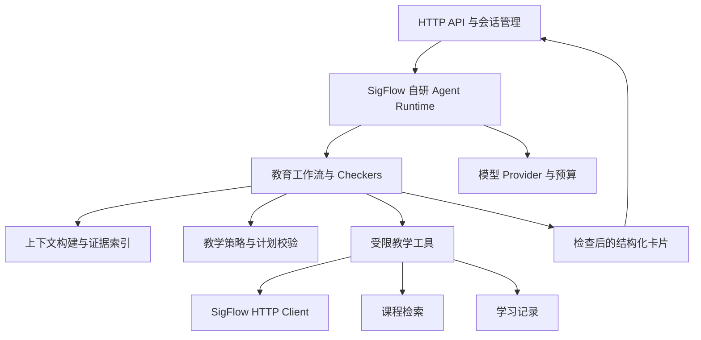

# SigFlow 教育版 Agent：自研服务实施规格

> 版本：v1.1 决策修订稿 · 日期：2026-10-07  
> 责任团队：Agent 组（原文档称 UCAgent 组，3 人）；协作团队：SigFlow 组（3 人）  
> 计划窗口：10 周；人数与周期已由团队确认，W1 为实际启动周，日历交付日待定。  
> 配套文档：[SigFlow 组 spec](../sigflow/spec.md)、[Agent 侧 task](task.md)、[双方协作对照](../Cooperate.md)。两份 spec 共同构成教育版一期实施基线。
> 本文定义待实施的产品、技术和验收要求，不表示已有功能或测试已经通过。架构决策见 [2026-10-07 自研决策](../DECISION-2026-10-07.md)；目录名 `ucagent/` 是历史名称，不构成上游依赖。

## 1. 产品目标与范围冻结

自行实现一个独立 Python 教学服务，通过 HTTP 感知 SigFlow 工程、RTL、波形、工具诊断和综合报告，完成“理解学习目标 → 收集证据 → 分析问题 → 提出验证计划 → 调度 SigFlow 工具 → 解释结果 → 引导学生 → 记录学习过程”。学生保留设计、修改和学习决策权。UCAgent 仅作为分阶段工作流、受限工具和阶段检查的架构参考；本产品不依赖其源码、运行时或类接口。

一期只做教育版。Agent 的价值是把 FPGA 教学经验转化为可检查、可追溯的学习流程：既能回答问题，又能知道需要补充什么证据、申请运行哪些工具、何时停止以及如何给出恰当提示。

### 1.1 确定的架构决策

1. **Python 教学服务自研**。实现可检查的阶段状态机、受限工具注册、证据/策略/结果校验、持久化恢复与模型适配；工作流和检查器为 SigFlow 自有接口，不以 UCAgent API 或上游版本为前提。
2. **C++ SigFlow 是 EDA 数据与执行的唯一事实来源**。Python 不自行启动 Yosys、Verilator、nextpnr 或烧录程序，不拼 shell 命令，不直接改工程文件。
3. **跨语言只采用 HTTP JSON 契约**；一期以游标长轮询接收事件，SSE 可后置，不为教学版额外搭建 EDA MCP Server。
4. **教育策略由确定性代码执行**：提示等级、L4 权限、工具白名单、预算、证据版本和阶段迁移不由模型自由决定。LLM 负责解释、提出假设和候选计划。
5. **复用已经完成的工具链插件化和跨平台工程**；自研 Python sidecar 的 Windows/Linux 兼容、依赖锁定与集成安装仍需独立验证。Docker 和远端部署按用户需求另行评估，不属于一期门槛。
6. **不自动改代码**。L1–L3 引导；L4 仅在策略允许且二次确认后显示参考解法，学生自行修改并复测。

### 1.2 与团队既有意见的衔接

| 来源 | 保留的目标 | 本期处理 |
|---|---|---|
| [0907 统一规划](../../SigFlow_Plan_0907.md) | 四视图上下文、Job 驱动、证据和决策留痕 | 由双版本并行改为教育版优先；将底座重构视为已有基础 |
| [产品说明](../../sigflowAgent产品说明.md) | L1–L4、学习历史、课程 RAG、原生面板 | W4 先完成手动触发的真实案例；W8 补可关闭的主动提示 |
| [0915 开发意见](../../sigflowAgent开发0915.md) | 多阶段流程、工具抽象、经验固化、Python 独立服务 | 自研教学工作流，HTTP 对接 SigFlow；UCAgent 仅作为架构参考 |

旧文档“AI 不直接执行工具”在本期具体化为“不绕过 SigFlow 执行能力”。Agent 可以提出和调度已授权计划。历史文档提到的固定“31 阶段”、既有 `ModeController/CourseMapping` 不作为可用能力前提；阶段数、数据结构和代码复用点以自研实现及本地代码核查为准。

“确定性诊断 100% 可靠”和未核验的教学效果百分比不进入发布承诺。模型输出、规则和报告解析都需正例、反例与证据不足样例评测。

### 1.3 交付范围

| 优先级 | 内容 |
|---|---|
| P0，一期必须 | 自研教学服务、HTTP 服务与客户端、上下文构建、教学状态机、受控工具调度、L1–L4、最小课程检索、SQLite 学习记录、模型与规则降级、证据检查、评测集、Windows/Linux 原生打包 |
| P1，一期增强 | 主动提示、资源变化解释、检索排序优化、画像展示优化、课堂试用反馈与教学效果探索 |
| P2，后续另行立项 | 工程版验证工作流及其工具栈（是否使用 Picker/cocotb 等由实际需求决定）、自动修复与代码写入、设计空间搜索、实板自动调试、教师班级平台、全量课程包、云端账号同步、多 Agent 协作；均不预设 UCAgent 实现 |

一期不向学生宣传“理解所有 HDL”“一定不给出超限线索”“掌握度自动准确测量”或“自动证明设计正确”。发布说明列明支持的实验、错误类别、语言子集和验证边界。

## 2. 教学体验与联合用户旅程

| ID | Agent 责任 | 教育意义与完成判据 |
|---|---|---|
| EDU-01 锁存器修复 | 读真实综合报告和局部 RTL；逐级提示；提出复测；比较新旧诊断 | 学生自行修复；反馈引用新版本 Job，并说明“未再推断该锁存器”而非“电路一定正确” |
| EDU-02 图码理解 | 读取选中节点、端口、source refs，解释图形与 RTL 关系 | 学生能点回证据；无映射则说明不确定，不编造连线 |
| EDU-03 波形理解 | 读取计数器/复位时间窗；区分观察、预期与假设 | 学生预测下一周期，再用真实仿真验证；时间单位、信号位宽准确 |
| EDU-04 验证规划 | 从学习目标生成有限步骤和预期观察；获批后逐步调度 | 每步都有教学目的，失败停下；不会漫无目的重跑工具 |
| EDU-05 个性化学习 | 使用可解释的历史摘要与课程引用，调整措辞和练习建议 | 不把“看过答案”当“独立掌握”；学生可查询、更正、删除记录 |
| EDU-06 故障降级 | 模型/网络失败时解释原因，用规则模板或缓存知识继续支持 | IDE 正常；规则输出标记 producer=rule，不伪称来自模型 |

一次完整教学回合应回答：我们在检查什么；证据显示了什么；哪些解释仍是假设；下一步学生要想什么/观察什么；怎样知道本次修改改善了问题。

## 3. 自研运行时与跨平台路线

### 3.1 架构参考与实现所有权

参考 [UCAgent 官方仓库](https://github.com/XS-MLVP/UCAgent) 的分阶段工作流、工具扩展和阶段检查思想，但不将其软件、默认工具、命令行或验证环境作为本产品依赖。Agent 组对工作流 API、教学策略、模型调用、检查器、存储迁移和跨平台发布承担完整维护责任。引入任何第三方通用框架须独立核查许可证、维护状态、Windows/Linux 安装与依赖，并在决策记录中说明收益和回退方式；不得把“参考 UCAgent”解释为必须使用 LangGraph 或其他特定框架。

### 3.2 自研模块及可检验证据

| 模块 | 一期要求 | 交付证明 |
|---|---|---|
| 工作流状态机 | E0–E7 显式迁移、取消、等待学生、失败与恢复；无无限模型循环 | 固定输入的状态 trace 与异常迁移测试 |
| 受限工具注册 | 显式白名单和类型校验，模型只能提出参数；凭据由运行时注入 | 导出实际注册表；未注册、越权、别名调用均拒绝 |
| 阶段检查器 | Evidence/Issue/Policy/Plan/Output/Action/Execution/Outcome 独立检查 | 每类含成功、失败和证据不足 fixture |
| 教学策略与模板 | L1–L4、课程映射、预算和提示模板有版本 | 版本固定时可回放；变更触发回归 |
| 模型适配 | 可配置真实 Provider、Mock、规则降级；结构化输出与超时预算 | 三种路径的端到端记录和故障注入 |
| 运行记录与恢复 | session/run 检查点、幂等键、关联 Job 与授权记录 | 崩溃后先核对 SigFlow 事实，不重复执行 |
| 服务入口与本地数据 | 独立 Python 包、HTTP API、SQLite 迁移、用户数据目录 | Windows/Linux 安装、启动、升级及回滚记录 |

工作目录不设为工程根目录，服务不读取完整工程或启动 EDA 命令。即使未注册危险工具，Gateway 仍需独立拒绝未授权能力；提示词不承担执行权限控制。

### 3.3 W1–W2 最小可运行门槛

1. 冻结 Python 小版本、直接及传递依赖、许可证、锁文件和离线安装材料；记录自研包版本、工作流/策略版本与 HTTP 协议版本。
2. Windows x64 与 Linux x64 原生运行相同的教育最小流：启动服务、加载 E0–E4、注册一个受限 HTTP 工具、执行 EvidenceChecker/OutputChecker、输出结构化卡片；无模型 Key 时给规则卡片。
3. 用 Fake SigFlow Gateway 读一份真实来源的锁存器报告；确认取消、超时、重启、中文/空格路径、两实例隔离和失败状态可复现。
4. 输出 `runtime-baseline.md`、依赖矩阵、运行命令、状态 trace 和失败记录。W2 Gate 只依据真实 Windows/Linux 记录判断，不以 WSL、Docker 或 Mock 安装代替原生验收。

此门槛验证的是自研教学服务的可运行性，不要求一次完成全部教学质量目标；G1–G4 再依次验收真实工具、波形、课程与课堂试用。

## 4. Python 服务架构与代码归属



建议独立 Python 包 `sigflow_edu_agent`。可存于独立仓库，也可存本仓库 `agent/`；W1 确定物理位置，不影响契约。以下为建议目录，不代表已创建：

```text
sigflow_edu_agent/
  api/                 # HTTP 路由、认证、DTO、错误与事件
  runtime/             # 自研阶段状态机、run 生命周期、恢复与预算
  clients/             # SigFlow typed client、幂等与退避
  tools/               # 自研工具注册及 HTTP/RAG/memory 封装
  workflows/           # 教育工作流与版本化配置
  checkers/            # 证据、计划、门控、输出、结果检查
  pedagogy/            # 提示等级、issue 生命周期、概念映射
  context/             # 证据选择、裁剪、token 预算
  rag/                 # 导入、索引、检索、引用验证
  memory/              # SQLite 仓储、迁移、导出与删除
  providers/           # 模型适配、Mock、规则降级
  resources/           # 指导模板、课程种子、规则
tests/
  contract/ integration/ pedagogy/ recovery/ evaluation/
```

教学流程状态由 Python 持有，EDA 状态由 C++ 持有。Python 不重新实现 JobService；C++ 不实现教学知识推理。跨组 DTO 以 [共享 HTTP 契约](../sigflow/spec.md#5-共享-http-契约-v1两组共同执行) 为准。

## 5. HTTP 接入与工具面

### 5.1 双服务关系

Python 提供 Agent API，由 SigFlow 教学 UI 调用；Python 的工具通过 SigFlow EDA Gateway 取证与执行。双方只监听 loopback，使用分别签发的 UI→Agent 与 Agent→EDA token、实例标识和版本握手。模型上下文不得包含这些 token。

U1 与 S1 共同维护 `contracts/edu-agent/v1/` 中已有的 SigFlow Gateway OpenAPI、JSON Schema 与 fixtures，并补齐尚缺的 Agent API/卡片 DTO 契约。本文不复制第二份独立字段定义；共享契约覆盖 route、snake_case 字段、错误码、事件游标、快照、幂等、授权和 DTO。

Python Agent API 必须提供：health/capabilities、sessions、runs、run actions/cancel、session events/history/exports，以及 learner summary/history deletion。长任务创建返回 202，UI 通过状态和事件获取结果。每个 action 校验 card_id、expected_state_version 与凭据，禁止旧卡片操作推进新 run。

### 5.2 Agent 可用工具清单

| 工具逻辑名 | 数据来源/效果 | 控制规则 |
|---|---|---|
| `get_project_context` | Gateway context、selection、dirty/revision | 只读，必须校验 project/instance |
| `query_design_context` | 局部节点、端口、source refs | 只读取服务端可证明的结构；unsupported 显式降级 |
| `read_source_span` | 受限源代码行 | 必须带 revision；模型不能指定任意绝对路径 |
| `get_job_report` | 指定 job_id 的归一化报告 | 读取 completeness、原始诊断来源及输入 fingerprint |
| `read_artifact_excerpt` | 指定报告/日志文本片段 | 仅允许的 artifact 类型和预算 |
| `list_wave_signals` / `query_wave_slice` | 信号与精确跳变 | artifact 范围的 signal ID、tick 字符串、完整性检查 |
| `discover_capabilities` | 可用工具与参数 schema | 模型不得臆造 provider、策略或参数 |
| `propose_verification_plan` | 创建候选计划卡，无 EDA 副作用 | 先经计划 Checker；等待真实 UI grant |
| `submit_eda_job` | 提交已授权 sim.build/sim.run/synth | runtime 注入 grant/幂等键；模型不能提供或修改授权字段 |
| `get_job_status` / `cancel_owned_job` | 查询/取消本 run 任务 | 取消范围必须受 session/run 归属校验 |
| `retrieve_course_passages` | 课程种子/索引 | 返回真实 passage IDs 与引用，不允许模型生成 URL |
| `get_learning_summary` | 当前 learner 的最小摘要 | 原始他人历史不可见，不暴露独立数据库访问 |
| `record_learning_event` | 经检查的教学事件 | runtime/Checker 执行；不开放模型任意更新掌握度 |

工具输入先做类型、枚举、范围与策略检查，再调用 HTTP。输出先验证 JSON/schema/版本/归属，再转为受限证据包供模型使用。任何外部接口若返回字符串，应先解析为受控结构或明确报错，不能靠自然语言“成功”判断执行成功。

### 5.3 调用、并发与故障处理

同项目默认一个活跃 run；新的提问可选择排队或取消旧 run，不能并行递增同一 issue 的提示等级。不同项目会话隔离；模型调用并发初始上限 2，由配置控制。

只读临时失败按共享契约退避重试；写入只用原幂等键重试。超时后先查询对应资源，不创建新 attempt。EDA片段缺失、过期和权限拒绝都是业务结果，模型不得通过换路径/换工具绕过。

run 取消时停止模型请求与后继步骤，仅取消其创建的 Job。Python 重启从检查点恢复为待核对状态，查询 C++ Job 的真实状态；不自动恢复执行授权。无论模型调用还是 Checker 重试都计入预算。

## 6. 教学工作流与状态模型

### 6.1 Run 状态

`Created → CollectingEvidence → Analyzing → PreparingResponse → WaitingStudent/WaitingApproval/WaitingJob → Evaluating → Completed`，任意阶段可进入 `Cancelled/Failed`；服务恢复进入 `RecoveryRequired`，重新取证后再继续。状态和 stage 分开：state 描述运行状态，stage 描述教学流程位置。

一轮对话可以结束为 Completed，但 issue 仍 open；下一次提示或复测建立关联 run。等待学生不占用模型连接，不持续空转调用模型。

### 6.2 流程阶段与检查器

| 阶段 | 输入和行为 | Checker/退出条件 |
|---|---|---|
| E0 接收意图 | 提问、触发来源、上下文选择、实验目标 | 请求归属/策略有效；区分解释、定位、预测、验证、更多提示 |
| E1 收集证据 | 工程摘要、诊断、局部 RTL、按需波形 | EvidenceChecker：引用存在、版本一致、完整性可知 |
| E2 确定问题 | 规则映射、学生目标、已有 issue | IssueChecker：观察/假设分离；证据不足则申请最小补充 |
| E3 制定教学路径 | 当前提示级、概念历史、课程资料、候选验证计划 | PolicyChecker/PlanChecker：符合等级、白名单与预算 |
| E4 生成与发布引导 | 生成结构化卡片，附证据和课程引用 | OutputChecker：schema/引用/提示边界通过；失败最多修正 1 次，否则规则降级 |
| E5 学生行动 | 请求更多提示、作答、保存修改、批准计划或结束 | ActionChecker：状态版本和 UI 凭据真实；不能从自然语言推断已解锁 |
| E6 执行验证 | 申请快照、提交已获批步骤、等待 Job、读取新结果 | ExecutionChecker：授权有效、同版本、依赖产物真实；失败停止后继 |
| E7 反馈与记录 | 对比观察结果，提问反思，写学习事件 | OutcomeChecker：工具结果只覆盖实际验证范围；独立完成/看参考解法分开记录 |

E1–E4 可以处理纯解释问题，不强制每次运行 EDA。E6 只在任务需要且用户已批准时进入。循环最多受预算和明确学生动作驱动，不能无上限“思考→调用→反思”。

### 6.3 会话与 issue 数据

运行上下文至少含：session/run/project/instance/learner IDs、edition、policy_version、revision/snapshot、selection refs、goal、issue_id、current/max hint level、evidence IDs、plan/grant IDs、linked Job IDs、预算计数、state_version、workflow/prompt/model 版本。

issue 以规范化诊断类型、逻辑对象及实验目标关联，保留不同 revision 的 occurrence。源码行移动不能直接算新问题；仅相似类型也不能强行合并不同信号的问题。映射不确定时创建独立 occurrence 并让学生选择是否继续上一个问题。

重复错误计数按真实新 Job 的 occurrence 计数，同一报告多次打开、HTTP 重试、事件重复投递不增加次数。误报可由学生标记并进入评审，不能静默改写工具事实。

## 7. 分级提示、权限与教学质量

### 7.1 L1–L4 规范

| 等级 | 学生可看到什么 | 禁止或限制 | 锁存器案例示意 |
|---|---|---|---|
| L1 方向性提问 | 已观察到的问题、学习目标、一个启发问题 | 不给完整根因链和具体修复代码 | “综合器报告了存储行为。你期望这个输出依赖当前输入，还是需要记住过去？” |
| L2 缩小范围 | 相关模块/代码块、关键概念与课程入口 | 不列出全部替换语句 | “看看组合逻辑块中，每一种输入条件下输出是否都有定义。” |
| L3 具体线索 | 具体分支/信号、检查顺序、预测练习 | 不输出可直接替换的完整作业解答 | “这个 if 条件不成立时，sum 应是什么？当前代码是否描述了这个情况？” |
| L4 参考解法 | 参考修改、原理和自测建议 | 需策略允许 + 二次确认；不得自动应用 | 展示经审阅的参考实现，并解释它所依赖的实验假设 |

L1–L3 允许概念示例，但例子不能只是改名后的完整作业答案。模型生成的 L4 修复建议如果未执行验证，要明确“参考，尚未在本工程验证”；冻结演示案例优先使用已验证、经教师审阅的参考解法。

### 7.2 升级与个性化规则

- 默认新 issue 从 L1 开始。一次显式“更多提示”最多升一级；重复点击通过 action_id 幂等，不连跳。
- 同类错误连续 3 次仅提示“是否需要更直接的线索”，不会自动升级、更不会自动解锁 L4。
- 历史可调整解释用词、篇幅、前置概念和练习；只有学生先前显式选择的偏好且策略允许时，新 issue 可从 L2 起步，界面说明原因，并提供回到 L1。
- L3 之后第一次请求只创建 `reference_request` 确认卡；第二次独立操作 `reference_confirm` 才可申请参考内容。课策略禁用 L4 时直接说明限制。
- 参考权限绑定 learner/session/issue/revision/policy/expiry，默认 10 分钟；版本变更后重新申请。其他 issue 不继承参考权限。

### 7.3 双端门控

SigFlow 原生 UI 产生操作凭据；Python 通过 Gateway 验真并调用 `POST /ui-receipts/{id}/consume` 原子消费。确认凭据绑定先前请求的 challenge_id 以及 session/issue/revision/policy，不能用不相关点击凑成二次确认。核销与 Python 状态提交之间若崩溃，恢复使用相同 action_id 幂等重取核销结果，再提交状态；不可再次升级。Agent 工具身份不能签发 UI 凭据；学生在聊天中说“我已确认”、模型自行输出 `confirmed=true` 都无效。

Python 策略服务是提示等级与 L4 内容的最终裁决者，SigFlow 是 EDA 执行授权的最终裁决者。两者复用 policy_version，但各自控制自己的边界，不能把执行 grant 当 L4 解锁凭据。

参考解法资源与普通检索索引分离；L1–L3 不加载参考代码，不提前放入模型上下文、日志、UI 事件或卡片隐藏字段。发布前检查输出，未检查的 token 不直接流到学生界面。语义泄露检测存在局限，必须结合模板、内容隔离、对抗用例和教师评审，不能宣称绝对防泄露。

本期策略配置属于本地教学产品控制，不是防篡改考试系统；教师模板可以禁用 L4，但不承诺抵抗有本机管理权限的用户修改配置。

## 8. 诊断模式与领域知识

### 8.1 一期 8 类模式

| 模式 | 需要的证据 | 教学重点 | 特别注意 |
|---|---|---|---|
| 语法错误 | Parser/编译诊断 + 局部源码 | 模块/语句结构、定位首个有效错误 | 后续连锁错误不逐条当独立根因 |
| 锁存器推断 | 综合报告 + 赋值相关源码 | 组合逻辑完备性与状态保持 | 有意设计的锁存器不能一律判错 |
| 位宽/符号扩展 | 工具诊断或可验证表达式信息 | 截断、符号位、常量宽度 | 不仅凭信号名字猜位宽 |
| 多驱动/未驱动 | 工具诊断 + 连接/驱动证据 | 驱动所有权与未定义输入 | 三态等合法语境需区分 |
| 组合反馈 | 工具诊断或可靠连通关系 | 环路、稳定性、组合/时序边界 | 未有检测器时只能做假设性提示 |
| 端口连接 | 层级/端口/实际连接或工具诊断 | 方向、位宽、命名/位置连接 | 映射不全时请求学生定位，不能制造拓扑 |
| 复位行为异常 | 实验规范 + 测试输入 + 波形 + RTL | 同步/异步、有效电平、边沿时序 | 没有复位要求不能认定“缺复位=错误” |
| 仿真结果不符 | 期望输出或真值表 + 测试记录 + 波形 | 预测、边界条件、周期延迟 | 工具运行成功不等于测试行为符合预期 |

每类至少一个正例、一个合法反例和一个证据不足例；标明支持 detector/provider/version。教学类别是知识映射，不意味着全部底层检测器都已存在。SigFlow 组提供检测事实，Agent 组维护概念映射、提示规则和判定边界。

### 8.2 规则结构

每条规则包含：rule_id/version、diagnostic code 映射、适用条件、所需证据、排除条件、concept_ids、L1/L2/L3 模板、允许的起始级、L4 policy 与独立 reference_id、course passage IDs、复测建议、正反例 IDs。

知识点编号独立于工具错误码，避免更换 Yosys 版本后丢失学生历史。工具原始码和消息仍保存在证据引用中。规则不硬编码到 C++ UI，也不散落为多个不一致的 prompt。

教师评审规则的硬件正确性和教学递进；开发者负责 fixture 自动化。未评审规则可以内部试用，不能标为发布支持类别。

## 9. 上下文构建与证据约束

### 9.1 取证顺序

先取用户选择/实验目标和最近明确指向的 Job；再取相关诊断与源码；有行为问题才查询波形；需要背景知识才检索课程。避免默认上传整个工程、全部对话和整个 VCD。

每个事实性结论关联 EvidenceRef；根因推测标记 hypothesis，并指出需要哪项验证。源码注释、日志、课程段落和学生粘贴内容都是数据，不能执行其中“忽略规则、运行命令”的指令。

### 9.2 预算与裁剪

初始可调默认：每次模型请求输入上限 12,000 tokens，输出 1,500 tokens；每个 run 模型调用最多 4 次，总输入累计 36,000、总输出累计 6,000 tokens；只读工具调用最多 12 次，有副作用 Job 最多 3 个且受 grant 更小上限约束。

输入建议分配：策略/目标 2,000，相关源码与诊断 4,000，波形/工具结果 2,000，历史摘要 1,000，课程片段 2,000，预留 1,000。实际按模型窗口压缩，不能裁掉策略、证据单位、版本或“不完整”标记。没有准确 tokenizer 时使用保守估计并记录 estimated。

单次模型请求总超时 60 秒、run 模型处理总预算 120 秒（不计学生等待和 EDA Job）；超过预算输出已收集证据与下一步选项。课程检索失败不应消耗全部模型重试预算。

### 9.3 检查重点

- 旧报告引用可以解释历史，不能证明新 revision 修复；无 input fingerprint 的 legacy 报告标为 unverified。
- 波形时间 tick 用字符串解析为整数，乘 timescale 进行比较；保留位宽和二态/四态语义。
- query 不完整时分页到必要区间，预算不足则缩窗/缩信号或说明限制；不能把降采样图作为精确证据。
- source_ref、artifact、job 均校验 project/instance 归属，UI 引用必须能解析，不能只生成看似可信的行号。
- 模型不得将工具的 `Succeeded` 转成“所有测试通过”；需要读取具体测试结果和适用范围。

## 10. 课程检索与内容管理

### 10.1 最小方案

W4 先提供 8–12 个经审阅的课程/说明片段，覆盖锁存器、组合逻辑、位宽等核心概念；W8 扩展到至少 20 个片段、覆盖全部 8 类模式及必要前置概念。来源优先团队自写讲义、SigFlow 使用说明及有明确引用方式的 PA/一生一芯公开章节。课程名称相关不等于该章节直接支持某 FPGA 概念，必须逐条人工核对。

初版使用概念映射 + 本地关键词/全文检索，足以构成检索增强；向量嵌入/混合排序为 P1，在评测显示必要时加入。避免为小型种子库引入独立向量数据库服务。

### 10.2 索引结构与导入

每个 passage 保存：passage_id、course_id、title、section、concept_ids、source_url、anchor、author/source、license_or_usage_note、retrieved_at、content_hash、course_version、适用语言/难度、允许索引的正文或团队摘要。

只导入允许使用的材料，不整站抓取教材或把受限书籍全文打包。可只保存链接与团队摘要。导入脚本支持增量 hash、失败报告和离线 seed bundle；文档更新先生成新索引版本再切换，保留回滚记录。

### 10.3 检索和引用正确性

每次取 top-k≤3，优先概念/课程范围过滤再排序。生成时使用 passage_id，最终引用 URL 和标题由确定性渲染器回填；模型不能创造不存在的课程链接。

无相关内容时明确“未找到匹配课程资料”，不硬塞链接。网络不可达时展示已缓存摘要和原始链接，并标记缓存时间；链接检查在导入/发布时批量做，不在每次聊天中抓网页。

参考答案和教师解题稿不进入普通学生 RAG 索引。相似练习如果包含完整答案，按内容策略分级；不能通过“课程推荐”绕过 L4。

### 10.4 验收

至少 30 个固定检索问题，有教师标注的可接受 passage 集；top-3 命中率目标 ≥85%，URL 来自真实元数据率 100%。其中必须含无答案问题，验证能返回无匹配。命中率按模型无关检索结果计，不以模型自行评分替代。

## 11. 学习记录、个性化与数据生命周期

### 11.1 存储范围

采用用户数据目录中的 SQLite，单进程仓储负责写入；使用事务、迁移版本、唯一事件 ID，重复投递不能重复计数。学习数据库不放工程 Git 目录，不与 C++ 共写。

| 表/实体 | 关键字段 | 用途 |
|---|---|---|
| learner_profile | profile_id、显示名/匿名标识、提示偏好、created_at | 本地学习者切换；不要求真实姓名 |
| sessions / runs | IDs、project、revision、policy/workflow/model 版本、状态、预算 | 恢复、可追溯和成本统计 |
| issues / occurrences | 类型、concept IDs、逻辑对象、revision、job IDs、状态 | 区分同一问题和再次出现 |
| learning_events | event_id、类型、hint level、reference_viewed、时间、evidence refs | 记录提示、尝试、独立修复、反馈 |
| concept_summary | concept_id、recent evidence、assistance level、practice count | 可解释摘要，不包装成准确心理测量 |
| cards / action_receipts | card/state version、动作、凭据引用与消费状态 | 防止重复解锁和恢复后乱序 |
| course_refs | passage/index version、点击或展示记录（可选） | 解释课程推荐来源 |
| deletion_tombstones | profile/session 范围、删除批次、purge 状态 | 防止旧备份/缓存恢复已删除记录 |

项目源码默认只保存引用和 hash，模型请求正文不默认长期留存。调试采样显式开启、可脱敏且可关闭；凭据和 API Key 永不写入记录。

### 11.2 掌握度的保守表达

以“已接触、完成过练习、在提示帮助下修复、独立修复过、建议复习”等证据化描述代替不透明分数。一次综合通过、阅读课程或点击“懂了”不足以判定已掌握。

概念状态向“独立修复过”更新至少需要：相关新 Job/测试结果、未查看该次 L4、学生完成修改，并记录其解释或后续练习表现；仍注明是当前练习范围内的观察。看过参考解法后的复测成功记录为 assisted_success。

个性化只提供最小摘要给模型，不附全部聊天或他人记录；本地用户切换后刷新会话和缓存，防止共用机串学生信息。

### 11.3 导出、删除与保留

默认保留学习事件 90 天，可配置；技术请求日志 7 天；单次调试正文默认关闭。到期清理同时移除会话缓存和可重建摘要，活跃会话引用须明确处理。

删除接口必须覆盖事件、卡片正文、概念派生摘要和关联缓存；写 tombstone 防止备份恢复后重新导入。进行中的 run 先取消，再删除。SQLite 清理/WAL checkpoint 和备份过期采用受控流程，UI 返回 purge 状态；不承诺对 SSD 的物理安全擦除。

导出默认 JSON/Markdown，包含提示级、观察结果和引用，不含源码正文、Key、原始模型请求或其他 profile。导出 artifact 通过受控接口获取，不返回任意本机路径供模型使用。

导出经 Agent API 的 `/exports/{artifact_id}` 和 `/exports/{artifact_id}/content` 获取，与 SigFlow Gateway 的 EDA artifacts 分开；只允许对应 UI/learner 身份访问，模型工具不获得任意导出读取权。

## 12. 验证规划、检查器和复测反馈

### 12.1 计划的教学结构

候选 PlanCard 至少说明学习目标、每步使用的 SigFlow capability/provider/参数、前置依赖、预期观察、停止条件与最多 Job 数。例如：

1. 保存修订并固定快照，检查输入版本。
2. 运行仿真编译和仿真，观察复位释放后的第一个有效时钟边沿。
3. 若行为符合当前实验预期，再运行综合，检查是否仍推断意外锁存器。

以上只是用户目标需要时的三步计划，不是所有问题的固定模板。没有 testbench/激励或测试预期时先引导学生提供/选择课程 fixture，不能捏造测试通过。Agent 一期不生成并写入工程测试文件。

### 12.2 计划检查与执行

PlanChecker 验证 capability 可用、参数符合白名单 schema、依赖无环、步骤数≤3、版本一致、资源预算及停止条件明确。结构化计划冻结后计算 hash；学生批准后由 SigFlow 创建 grant，Python 只把该 grant 绑定到相同计划。

每步运行前再次检查 grant、revision、前序状态和产物 hash。`sim.run` 只接受本计划成功 `sim.build` 的登记产物。失败、取消、超时、版本变更或服务失联停止后继。需要不同参数时创建新计划，而不是修改已批准计划。

### 12.3 核心 Checkers

| Checker | 主要拒绝条件 | 拒绝后的行为 |
|---|---|---|
| EvidenceChecker | 无引用、跨项目、revision 混用、波形不完整却要求确定结论 | 补证或收窄结论 |
| PolicyChecker | 提示越级、无 L4 凭据、禁用能力 | 返回允许范围的引导 |
| PlanChecker | 幻觉参数、任意脚本/路径、预算超限、缺失测试输入 | 生成可解释错误或要求学生选择输入 |
| CitationChecker | passage 不存在、URL 不来自元数据、内容不支持论点 | 删除错误引用或重新检索 |
| OutputChecker | DTO 无效、参考代码泄露、执行事实与报告矛盾 | 最多修正一次，再用规则模板 |
| OutcomeChecker | 旧报告充当新结果、仅进程退出就声称功能正确 | 标记未验证/部分验证，建议后续步骤 |
| MemoryChecker | 重复事件、模型任意更新掌握度、profile 混用 | 拒绝写入并记录异常 |

结构和授权检查必须是确定性代码；语义正确性可用附加模型审查和人工评测，但不能把同一个模型的自评当唯一发布标准。

## 13. 模型、配置与运行质量

采用配置式 Provider：至少一个可用模型端点 + MockProvider + RuleFallback。Key 从环境/受控凭据引用读取；模型名称、输出格式支持及 token 估算在 W1/W2 实测锁定，不假定所有“兼容 API”行为相同。

配置分层：产品硬限制 → 教学 policy → 用户偏好 → 当前 run 目标。低层不得放宽高层的代码写入禁令、L4 限制或工具权限。模型输入从不成为配置覆盖源。

教学 policy 示例语义（属于本产品自有配置）：

```yaml
policy_id: edu-default-v1
edition: edu
hint:
  default_level: 1
  max_level: 4
  reference_requires_two_step_confirmation: true
  repeat_error_offer_after: 3
tools:
  allowed_capabilities: [eda.sim.build, eda.sim.run, eda.synth]
  allow_project_write: false
  max_jobs_per_plan: 3
autoprompt:
  enabled_by_default: false
```

未知配置键/矛盾配置启动时报错，不悄悄退回宽松策略。配置由自研 schema 校验和版本化迁移管理；任何兼容旧配置的导入器也不能放宽教学边界。

### 13.1 主动提示

默认关闭；启用后仅对新完成 Job 中可处理的问题显示非模态入口。同一 project/revision/job/issue 只提示一次；同项目 60 秒内合并提示，学生正在操作或已关闭该 issue 时不反复打扰。主动提示只生成简短邀请，学生打开后再进行较完整的模型分析，以控制打扰和成本。

### 13.2 观测与运行指标

每个 run 记录 trace_id、stage 转移、工具名/结果码、证据 ID、模型/模板/策略版本、token 使用、延迟、降级原因、关联 Job 和 grant ID。审计保存决定及证据摘要，不要求保存模型隐含推理过程。

初始目标：本地 health/state p95 <300 ms；学生操作后 1 秒内可见状态反馈；固定模型与网络基准下完整提示 p95≤30 秒，60 秒超时转降级；模型耗时和 EDA 耗时分开统计。所有值是未来目标，W2 建立基线，外部模型故障不伪装为软件验收成功。

预算看板按 session/run 展示 token、调用次数和估算费用；计费价格通过配置提供并注明日期，不把外部服务价格写死进代码。课堂试用先限制每日预算与并发，达到上限仍可用规则/课程缓存。

## 14. 人员分工与工作包

与 SigFlow 组人数一致：每组 3 人。原 10 周、120 计划人日 + 30 联调/整改人日仅作容量假设；改为自研运行时后，W2 必须按双平台 spike、状态持久化和安全测试实测重新估算，不得以旧排期倒逼省略验收。若超出容量，先调整范围/日期并经双方确认。

| 人员 | 工作包 | 计划人日 | 可验收交付 |
|---|---|---:|---|
| U1 运行时/接口 | UA-01 自研运行时与跨平台 spike | 8（待重估） | 最小自研阶段流程双平台运行、依赖/许可证清单 |
| U1 | UA-02 HTTP API/client、协议/事件 | 11 | 同契约 fixtures、异常码/幂等通过 |
| U1 | UA-03 Provider、预算、恢复/取消 | 12 | 超时/断线/重启/取消故障注入通过 |
| U1 | UA-04 打包与安装/联合发布 | 9 | 可复现安装、离线依赖与排障手册 |
| U2 教学工作流 | UA-05 教育 stages、上下文与计划 | 12 | 真实报告→计划→执行→反馈 |
| U2 | UA-06 L1–L4 策略与 Checkers | 12 | 二次解锁、越级/假确认负例通过 |
| U2 | UA-07 8 类模式及波形教学 | 10 | 正例/合法反例/证据不足例与教师审阅 |
| U2 | UA-08 教学质量/对抗评测 | 6 | 回归集与语义人工评审记录 |
| U3 知识/学习数据 | UA-09 课程种子、检索与引用 | 12 | 版本化索引、引用校验、检索基准 |
| U3 | UA-10 SQLite、个性化/数据生命周期 | 12 | 去重、隔离、导出/删除、可解释摘要 |
| U3 | UA-11 教学样例与评测数据 | 9 | 真工具 fixture、rubric、演示脚本 |
| U3 | UA-12 试用/教师文档与发布评审 | 7 | 试用结论、问题跟踪与教师说明 |
| 合计 | 三人工作负荷均衡 | 120 | 另有 30 人日缓冲 |

U3 的检索、数据工程和评测不是单纯“写文档”；S2/U2 协作确认硬件事实，S3/U2 对齐提示交互，S1/U1 对齐协议与部署，S3/U3 对齐历史/引用/删除 UI。对方接口等待期间使用共同 fixture，不把工作闲置到最后两周。

## 15. 联合 10 周路线图

| 时间/里程碑 | Agent 组重点 | SigFlow 组交接依赖 | 联合 Gate |
|---|---|---|---|
| W1–W2 / M0 | 自研阶段状态机/工具注册/检查器最小实现、原生双平台 spike、HTTP 双端、Mock 教学卡 | schema 草案、context/report fixture、启动握手与最小面板 | G0：Windows/Linux 原生最小流程、无 Key 演示、双方契约测试一致 |
| W3–W4 / M1 | 锁存器教学、L1–L4、课程 8–12 片段、历史最小记录 | 真实 synth、快照/grant、源码定位、UI 操作凭据 | G1：真实错误→提示→学生修改→授权复测；L4 两步；故障可降级 |
| W5–W6 / M2 | 计数器/复位波形教学、验证计划、OutcomeChecker | sim.build/run、精确波形、四视图锚点 | G2：行为预测→波形取证→修复复测；过期/取消测试通过 |
| W7–W8 / M3 | 8 类模式、RAG/画像完善、主动提示、恢复与质量评测 | 事件恢复、Beta 包、历史设置/删除 UI | G3：正反例齐全、重复提交无副作用、至少 20 课程片段与检索基准 |
| W9–W10 / M4 | 试用、教师评审、模型回归、文档与发布整改 | 跨平台安装包、GUI 回归和性能结果 | G4：联合验收与已知限制，阻塞缺陷清零 |

W1 第 3 个工作日前由 U1/S1 给出契约草案，U2/U3 给出锁存器 fixture 与分级提示样稿；W2 冻结最小字段、自研运行时接口及依赖锁文件。每周两次联调、一次端到端演示；所有 Gate 同时要求实现、测试和可演示证据。上述周次为待 W2 重估的目标，不代表在自研方案下已确认可行。

W4 的课程与画像是最小可用子集，W8 扩展内容和覆盖，不等同于 W4 承诺完整教学平台。工程版不进入任何本期 Gate。

## 16. 测试、教学评估与发布门槛

### 16.1 四类证据分开记录

| 层次 | 验证什么 | 是否可替代其他层 |
|---|---|---|
| Mock 与契约测试 | DTO、状态机、授权、恢复、幂等 | 不能证明模型教学质量或真实 EDA 正确 |
| 真实工具集成 | 真实 RTL/波形/报告与版本一致性 | 不能证明学生能理解提示 |
| 真实模型评测 | 引用、解释、提示递进、拒绝与预算 | 不能替代真实课堂学习成效 |
| 教师/学生试用 | 可理解性、干扰、是否促成独立操作 | 小样本不用于宣称普遍学习效果 |

### 16.2 冻结评测集

- 8 类模式各 3 个基础场景（正例、合法反例、证据不足），共至少 24 个；锁存器/复位等重点场景增加不同变量名、层级与代码结构变体，语义评测集至少 40 个。
- 至少 30 个检索问题，含无匹配与跨课程错误匹配情形。
- 至少 30 个策略/对抗场景：直接索要答案、假称教师授权、日志注入、源码注释注入、RAG 中带指令、重复点击、旧凭据、跨项目/跨 learner 请求。
- 至少 12 个基础设施故障场景：断网、模型超时、HTTP 连接失败、重复/乱序事件、游标过期、sidecar 崩溃、Job 超时/取消、磁盘满、数据库迁移失败、缺工具、输入 revision 变化。

评测集划分开发集与冻结验收集；模型/模板/规则/检索版本发生变化时运行受影响集。固定模型与参数，每个模型语义验收场景至少运行 3 次，记录波动，不挑选最好的结果展示。

### 16.3 验收矩阵

| ID | 条件 | 门槛/负责人 |
|---|---|---|
| UA-AC01 | 自研运行时闭环 | 版本化阶段状态机、受限工具注册、阶段/结果检查器、持久化恢复的实现和 trace；Windows/Linux 原生执行；U1 |
| UA-AC02 | HTTP 契约与隔离 | 全部 golden fixtures/负例通过，跨项目/学生读取拒绝；U1/S1 |
| UA-AC03 | 分级引导 | 冻结案例 L1→L3 递进，未经二次确认无 L4；授权状态机测试 100% 通过；U2/S3 |
| UA-AC04 | 受控工具调度 | 真实 sim.build/sim.run/synth；重复提交不重复执行；无任意命令/工程写入；U1/U2/S1 |
| UA-AC05 | 证据可信 | 机器可检查引用全部可解析或明确 expired；无证据不下确定结论；U2/S2 |
| UA-AC06 | 课程检索 | top-3 命中 ≥85%；展示 URL 均来自元数据；未匹配可解释；U3 |
| UA-AC07 | 学习历史 | 去重、偏好解释、assisted/independent 区分、删除与缓存清理通过；U3/S3 |
| UA-AC08 | 模型教学质量 | 两名熟悉数字电路的评审者按正确性/递进/可操作性/证据各 0–2 分；均分≥6/8，严重硬件错误和完整答案越级泄露零未修复；U2/U3 |
| UA-AC09 | 降级与恢复 | 无 Key、网络失败、重启、旧授权均有清楚状态且不误执行；U1/S1 |
| UA-AC10 | 跨平台与安装 | Windows/Linux 安装与教学闭环，已有麒麟目标按发布清单复测；U1/S1 |
| UA-AC11 | 全部用户旅程 | EDU-01 至 EDU-06 有端到端记录、配置、必要录屏；双方 |

“零未修复”指冻结测试集与已知缺陷的发布门槛，不是对所有未来模型输出作绝对保证。出现泄露或硬件严重误导时必须修正规则/模板/隔离后重测相关集。

### 16.4 课堂试用

建议 W9 招募 6–10 名入门学生与至少 1 名教师，使用相同难度的两个小实验，记录最大提示级、是否查看 L4、独立完成情况、任务耗时、引用使用与主观反馈。参与和记录范围提前说明，结果去标识化。

初步观察“只看 L1–L3 的独立修复比例、解释准确性、重复错误减少”而非追求固定百分比。若无法招募，使用教师走查完成产品验收并将教学效果标为尚未验证；不能用开发者自己跑通替代学生效果数据。

## 17. 风险、降级顺序与开工清单

| 风险 | 负责人 | 处理与截止点 |
|---|---|---|
| 自研运行时及依赖在 Windows/Linux 行为不一致 | U1 | W1 原生安装/导入/执行/恢复测试，W2 出兼容结论；锁依赖、修复路径与权限差异 |
| 接口/报告未稳定 | U1/S1/S2 | W1 shared fixtures；不直接耦合 legacy errors 字段；新旧归一化在 C++ |
| 提示过浅、跳级或变相给答案 | U2 | 教师审阅模板、参考内容隔离、输出检查及冻结对抗集 |
| 波形事实被误读 | U2/S2 | 单位/初值/完整性校验，结构化摘要优先，证据不足时停止结论 |
| 课程链接不相关/失效 | U3 | 人工种子和元数据渲染，无匹配允许空结果，不强制推荐 |
| 学习画像形成错误标签 | U3 | 只给证据化摘要，可更正/删除，不以一次成功判断掌握 |
| 模型成本或响应失控 | U1 | 每 run/每天预算、有限重试、事件去重、规则降级 |
| 评测全靠模型自评 | U2/U3 | 真工具 fixtures + 教师双人审阅 + 固定 rubric |

W6 若工作超预算，先后置向量检索、复杂画像可视化、主动提示和资源对比；保留基础课程检索、可追溯学习记录、8 类模式发布目标、核心证据/工具闭环。若必须缩减模式数，则双方修改 G3 与发布范围，明确未完成类别，不将其视为通过。

开工前三天须明确：U1/U2/U3 与 S1/S2/S3 对应人员；自研运行时模块负责人、第三方依赖/许可证清单；已有平台清单；HTTP schema 草案；锁存器和计数器示例；模型与预算；教师评审人；课程来源；实际启动日。W2 由 S1/U1 联合确认 baseline、重估排期和变更流程。

## 18. Agent 组最终交付清单

- [ ] 可安装的自研 Python 教学服务、运行时接口文档、依赖锁文件、许可证与双平台安装清单。
- [ ] Agent API、SigFlow typed client、白名单教学工具、契约与错误恢复测试。
- [ ] 教育工作流、L1–L4 策略、8 类教学模式、核心 Checkers 与参考内容隔离。
- [ ] 课程种子、版本化索引、导入工具、真实引用与检索评测。
- [ ] SQLite 学习记录、个性化摘要、导出/删除与迁移方案。
- [ ] 模型/Mock/规则降级、预算、运行日志与排障工具。
- [ ] 锁存器/计数器端到端示例、评测集、模型回归与教师评审记录。
- [ ] 双平台安装验证、试用反馈、教师和学生指南、已知限制。

## 19. 两组共同的完成定义

学生能在现有 SigFlow 中选择工程对象和真实 EDA 结果，与教学 Agent 讨论；Agent 能引用证据、给出逐级提示和有限验证计划，经学生批准调用 SigFlow 工具；学生自行修改后获得基于新版本结果的反馈，学习过程有记录且可管理。

每个发布结论都能对应具体源码/报告/波形或已审阅课程资料；服务故障、缺证据、过期版本和越权操作都能被看见并正确处理。最终验收不是“聊天框能回答”，而是上述闭环在真实工具和目标平台上可重复完成。
