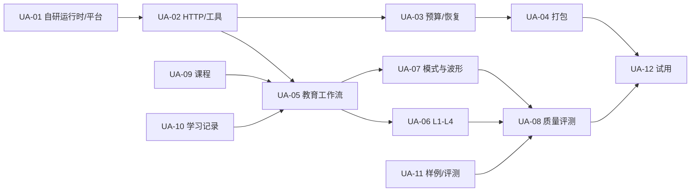

# SigFlow 教育版 Agent：自研 Agent 组执行任务清单

> 2026-10-10：10.8 调整的基础教学动作、授权执行、课程/记录服务已实现，见 [AD 对照与验收](../sigflow/10.10-Agent接口调整实现与验收.md)。后续仍需问题模式/课程审校扩充、跨 revision 教学策略、真实模型/双平台与压力验收；不把最小闭环当成下文完整 U2/U3 任务完成。

> 版本：v1.1 · 2026-10-07  
> 依据：[Agent 组 spec](spec.md)；跨组接口见 [SigFlow 组 spec](../sigflow/spec.md#5-共享-http-契约-v1两组共同执行)；联合执行见 [Cooperate.md](../Cooperate.md)；架构决策见 [自研决策](../DECISION-2026-10-07.md)。  
> 责任团队：Agent 组 3 人（U1 运行时/接口、U2 教学工作流、U3 课程与学习数据，保留 U 编号方便追踪旧任务）；SigFlow 组 3 人（S1/S2/S3）提供 EDA 数据、执行与 UI。  
> 计划：原 10 周、120 + 30 人日为容量假设；W2 根据自研运行时 spike 重估。W1 是实际开工周。  
> 状态：`[ ]` 待做、`[~]` 进行中、`[x]` 完成且证据已归档、`[!]` 阻塞。本文创建时新增任务全部待做。

## 0. 执行约定与当前基线

本文件是实施任务，不声称自研教育 Agent 已经完成。完成每一项时补充 commit/PR、环境与运行命令、测试结果、对应 fixture、演示和接口版本，再勾 `[x]`。仅能用 Mock 演示时标为 `[~]`；依赖未到位标 `[!]` 并写明临时替代、责任人与下次核对时间。目录名 `ucagent/` 为历史名称，不代表软件依赖。

**固定边界**：Python 教学 Agent 自行实现阶段状态机、受限工具、检查器、模型适配、课程检索和学习历史；UCAgent 仅供架构参考，不依赖其源码或运行时。Agent 通过 HTTP 请求 C++ SigFlow 提供的工程、报告、波形、插件 Job；不在 Python 中直接调用 EDA 命令、不修改 RTL、不提供任意 shell/工程文件写入能力。工程版独立立项后实现；Docker/远端部署仅按用户需求评估，不是教学版发布前提。

共享 HTTP 字段真源是现有 `contracts/edu-agent/v1/`，其中 SigFlow Gateway 契约已有部分实现，Agent API 与卡片 DTO 仍需双方补齐并冻结；语义参考 [SigFlow spec §5](../sigflow/spec.md#5-共享-http-契约-v1两组共同执行)。本任务中的工具名是 Python 内部逻辑名，跨进程路径和 DTO 以契约文件为准。任何破坏性字段变更由 U1/S1 同时更新 OpenAPI/Schema、双方 fixtures、Mock、实现和变更记录。

本期第一项真实交付是自研最小运行时在原生 Windows/Linux 上可安装、可执行、可观测、可恢复；第三方通用依赖单独锁版本和查许可证，不把 UCAgent 的平台兼容性当作本服务兼容性证明。

### 0.1 计划代码位置

W1 决定自研代码放在本仓库 `agent/` 还是独立仓库；无论在哪，目录职责与共享契约保持一致。建议包名为 `sigflow_edu_agent`，包含 `api/`、`runtime/`、`clients/`、`tools/`、`workflows/`、`checkers/`、`pedagogy/`、`context/`、`rag/`、`memory/`、`providers/`、`resources/`，测试分 `contract/integration/pedagogy/recovery/evaluation`。下文路径均为计划位置，创建前不代表文件已存在。

自研模块按 API、运行时、策略与存储分层提交；引用 UCAgent 的思想时记录设计对应关系，但不复制其类接口。W2 必须有本项目阶段、工具与检查器的真实运行 trace，含状态恢复、拒绝危险工具和无 Key 降级。

## 1. 开工决定与首批共同输入

### D-01 自研基线、环境与范围冻结｜U1 主责，U2/U3 配合｜W1 D1–D2

- [ ] 指定 U1/U2/U3 的实际人员与替补，记录 W1 日期、目标 OS/架构、SigFlow 对口联系人和两次每周联调时间。
- [ ] 固定自研运行时模块接口、Python 小版本、第三方依赖/许可证与 Windows/Linux 原生安装方案；创建 `docs/edu-agent/ucagent/runtime-baseline.md`（计划产物）。
- [ ] 在两个目标平台运行最小教育配置：导入自研运行时、注册受限工具、执行阶段检查器、走一个阶段并保存/恢复状态；记下命令、错误、性能与平台差异。
- [ ] 工具注册表采用默认拒绝：只显式允许受限 SigFlow HTTP 读/申请 Job 和本地受控学习存储；启动时检查没有 shell、任意文件写入、实板烧录或任意网络调用入口。
- [ ] 与 S1 确定本地服务启动材料、令牌传递、随机端口/nonce、数据目录、日志目录及无模型启动方式。

**完成证据**：自研接口/锁文件草案、两个平台的最小运行及恢复日志、工具注册清单、第三方许可证清单。**依赖**：无。**影响 Gate**：G0。

### D-02 联合契约与教学样例｜U1/U2/U3 联合，S1/S2 参与｜W1 D1–D3

- [ ] U1 与 S1 共写 Agent API/Gateway API、共同 DTO、错误码、版本与幂等、事件恢复、grant/receipt 字段；SigFlow 侧维护 EDA 路由语义，U1 维护 Agent 路由语义。
- [ ] U2 与 S2 冻结锁存器真实报告/RTL、合法锁存器反例、计数器复位波形的源/Job/版本/预期；缺失真实输出先记录生成命令与 Mock fixture，不伪装成真实报告。
- [ ] U2 提交 L1–L4 锁存器提示样稿和 reference_request/reference_confirm 操作序列；S3 核对面板字段与两次确认。
- [ ] U3 提交课程来源、章节/许可/链接审查表，标出可打包的团队自写摘要与只能引用链接的材料。
- [ ] 建双方共用 fixture：新旧报告、脏工程、旧版本、缺能力、波形区间、授权/取消、游标过期、无 Key 与 schema 不兼容。

**完成证据**：W1 D3 契约草案与 fixture 清单，W2 前冻结 v1 最小字段。**依赖**：D-01；SigFlow S1/S2/S3 输入。**影响 Gate**：G0–G4。

### D-03 策略、预算和数据边界｜U2/U3 主责，U1 配合｜W1

- [ ] 冻结教育版只可用 `eda.sim.build/eda.sim.run/eda.synth`，每计划最多 3 个 Job；Agent 的工具注册表不得加载任意 shell、文件写入或实板烧录。
- [ ] 冻结提示等级与 L4 两步确认、reference 内容独立存储、默认新 issue 从 L1 开始；学习历史仅在学生明确偏好和 policy 允许时影响起始级。
- [ ] 冻结 model/mock/rule 三种输出的 `producer` 标识、每 run 上下文/调用预算、无模型降级与错误展示。
- [ ] 冻结本地学习记录/导出/删除的默认保留与缓存清理，模型请求正文不长期记录，API Key 不写入工程或日志。

**完成证据**：可读的 policy v1 草案和拒绝用例，U1/S1 确认执行边界。**依赖**：D-02。**影响 Gate**：G0。

### D-04 自研工期与发布范围重估｜U1/U2/U3、S1 联合｜W2

- [ ] 根据两个原生平台的安装/运行/恢复结果，拆分自研运行时、工具与检查器、HTTP/存储、教学规则、课程数据和跨平台打包的剩余工作；逐项记录依赖与风险缓冲。
- [ ] 对照真实可用的 SigFlow 检测器、报告/波形与 UI 接口，标明 8 类教学模式分别是可支持、仅假设还是缺数据；不要把教学模式名称当现有检测能力。
- [ ] 重估 10 周和 120 + 30 人日假设，给出人员分配、关键路径与 Gate 日期。若无法按原目标交付，优先调整增强项和日期；任何安全、授权、证据真实性及跨平台门槛不得被静默删除。
- [ ] S1/U1 将结果写入决策记录并同步两侧 spec/task 与联合 Gate，标出仍待验证的课堂教学效果；双方签收后才把新日期作为承诺。

**完成证据**：带实测依据的工作量表、风险/范围取舍、两组共同签收记录。**依赖**：D-01/02/03 与 UA-01 spike。**影响 Gate**：G0–G4。此协调工作计入 UA-01/12 和跨组缓冲，不重复计人日。

## 2. 工作包、工作量与关键依赖

| ID | 主责 | 计划人日 | 目标周 | 前置 | 验收摘要 |
|---|---|---:|---|---|---|
| UA-01 自研运行时与跨平台 spike | U1 | 8（待重估） | W1–W2 | D-01 | 自研教育最小流在原生 Windows/Linux 运行 |
| UA-02 HTTP API/client 与事件 | U1 | 11 | W1–W5 | D-02、SF-01/02 | 双向契约、幂等与游标一致 |
| UA-03 Provider、预算、恢复 | U1 | 12 | W3–W8 | UA-02、SF-03 | Mock/真模型、取消重启、无重复 EDA 执行 |
| UA-04 sidecar 包装与发布 | U1 | 9 | W7–W10 | UA-01/02/03、SF-04 | 两平台安装、升级、排障、联合发布 |
| UA-05 教育阶段、上下文与计划 | U2 | 12 | W2–W6 | UA-01/02、SF-05/06 | 真实证据→计划→批准→复测反馈 |
| UA-06 L1–L4 与 Checkers | U2 | 12 | W2–W5 | UA-05、S3 receipt | 逐级提示、双确认、越级拒绝 |
| UA-07 8 类模式与波形教学 | U2 | 10 | W5–W8 | UA-05/06、SF-07/08 | 正例/合法反例/证据不足例 |
| UA-08 教学质量与对抗评测 | U2 | 6 | W7–W10 | UA-06/07、UA-11 | 冻结评测集、教师审查与整改 |
| UA-09 课程种子与检索引用 | U3 | 12 | W1–W8 | D-02/03 | W4 8–12、W8 ≥20 片段与真实引用 |
| UA-10 学习数据与个性化 | U3 | 12 | W2–W8 | D-03、UA-05/06 | 轨迹、画像、去重、导出删除 |
| UA-11 教学样例与评测数据 | U3 | 9 | W1–W8 | D-02、SF-06/08 | 真工具 fixture、rubric、30+ 检索题 |
| UA-12 试用与发布评审 | U3 | 7 | W8–W10 | UA-09/10/11、SF-12 | 教师/学生试用、说明与发布证据 |

原计划按人汇总：U1 40、U2 40、U3 40 计划人日，另有每人 10 人日联调/整改；改为自研后这些数字待 W2 重估，不能视为承诺。D-01/02/03 包含在对应 UA 工作包内。对方服务未好时可用共同 Mock/fixture 独立推进，但 Gate 的真实工具/平台验收不因此免除。

## 3. U1：自研运行时、HTTP 与发布（原估 40 人日，待重估）

### UA-01 自研运行时、教育 profile 与平台 spike｜原估 8 人日，待重估｜W1–W2

- [ ] 实现版本化阶段状态机、受限工具注册、阶段/策略/结果检查器的最小接口；建立 Python 锁文件、第三方许可证与可重复安装说明。
- [ ] Windows 原生 x64、Linux x64 各运行：导入核心、加载教育 profile、注册一个受限 HTTP 工具、执行检查器、跑到 `Completed` 并持久化/恢复；记录命令、输出与异常，不以 WSL/Docker 当原生验证。
- [ ] 教育 profile 默认拒绝 shell、任意文件读写/网络调用、实板烧录和工程验证阶段；运行时导出实际 registry 与允许清单比对，未知工具启动失败。
- [ ] 定义阶段输入/输出、转移、重试/取消、检查器失败与状态序列化格式；非法转移、重复动作、旧版本状态有明确错误或迁移路径。
- [ ] 接入最小 Mock SigFlow HTTP 工具读一个报告并生成结构化卡片，验证自研 stage trace、取消、恢复和无模型运行。
- [ ] W2 输出兼容性报告：哪些依赖必须安装，哪些能力禁用，Windows/Linux 路径/进程/信号差异与解决结果；未解决阻塞按风险表升级。

**修改点**：计划 `sigflow_edu_agent/runtime/`、教育 profile、环境锁文件、`runtime-baseline.md`。**交给 S1**：可启动 sidecar 命令、协议版本、健康响应、依赖/错误日志。**完成条件**：自研阶段/受限工具/检查器与恢复轨迹在双平台可复现；UA-AC01/10。**依赖**：D-01、S1 Mock Gateway。

### UA-02 Agent API、SigFlow typed client 与事件｜11 人日｜W1–W5

- [ ] 实现 `/api/v1/health`、`/capabilities`、`/sessions`、`/sessions/{s}/runs`、`/runs/{r}`、`/runs/{r}/actions`、`/runs/{r}/cancel`、`/sessions/{s}/state` 与 events/history/exports、learner summary/history 删除与导出读取 API；所有字段按共享 OpenAPI，长任务返回 202。
- [ ] API 只接受正确 UI→Agent token/instance/project/learner 范围；限制 Host/Origin/CORS、JSON 体积与分页；错误信封统一，未知枚举或 schema 版本显式失败。
- [ ] SigFlow typed client 覆盖 context/state/snapshot、sources/design/context/query、capabilities、Job/report/artifact、wave、grant 查询、receipt 核销和 project events；HTTP 客户端不直接接触本机工程路径。
- [ ] 自研受限工具参数用 schema 校验，输出再按 DTO 验证并封装结构化结果；模型不能直接构造 HTTP Header、grant_id、receipt ID 或重放 idempotency key。
- [ ] `POST /runs`、动作与有副作用工具的幂等键持久化：同键同规范化请求返回同 run/action/Job，不同请求 409；只读请求短退避，写请求只能用原键重试。
- [ ] 实现事件消费去重/乱序处理、cursor 保存，过期 410 后先读 `/state` + high_watermark 再续订；状态事实以 Gateway Job 查询为准，不从纯文本事件推断成功。
- [ ] 并发限制：同项目一个活跃教学 run，多项目隔离；同 issue 同一时刻只处理一个升级动作；服务忙时返回明确队列/429 状态。
- [ ] 与 S1 运行双方 contract fixtures，覆盖中文/空格、64 位 tick、缺字段/未知可选字段、跨项目/跨 learner、认证失败、慢请求、断线、事件重复/游标过期。

**修改点**：`api/`、`clients/`、`tools/`、契约测试。**交给 S3**：Agent API Mock/真服务、卡片/状态/动作 fixture。**完成条件**：双向 v1 契约、权限及事件恢复通过；UA-AC02。**依赖**：UA-01、SF-01/02。

### UA-03 Provider、预算、状态恢复与取消｜12 人日｜W3–W8

- [ ] 提供至少一个真实可配置模型 Provider、MockProvider 和 RuleFallback；模型名称/API Base/Key 引用从受控配置读取，Key 不写进工程、日志、事件或模型上下文。
- [ ] 模型与运行预算按 spec 默认值起步：单请求输入/输出、每 run 调用/工具/Job 限额，模型调用超时与 Job 等待分离；超额输出结构化降级卡，不死循环请求。
- [ ] 每次 run 持久化 stage、state_version、策略/模型/模板版本、预算、evidence IDs、plan/grant/Job IDs 与 idempotency key；事务更新卡片和动作状态。
- [ ] 重启进入 `RecoveryRequired`：先查询 Gateway 的 Job、grant、快照和事件快照；不能自动继承旧审批或启动新步骤；同 action_id 重试核销已消费 receipt 时得到同一结果，不再升一级。
- [ ] `POST /runs/{r}/cancel` 停止推理/后继步骤，只取消本 run 的 Job；取消 ack 与真实 Job 终态分开显示，重试不误取消他人手动任务。
- [ ] 凭据/网络失败时区分 `model_unconfigured`、`model_unavailable`、`gateway_unavailable`、`stale_revision`、`policy_denied` 与 `job_failed`；降级输出 `producer=rule`。
- [ ] 记录 trace_id、工具/模型耗时、token 与预算、关联 Job/证据；默认不长期存原始源码或模型请求正文，敏感字段脱敏。
- [ ] 故障注入：模型慢/断网、Gateway 超时、Job 提交回应丢失、sidecar 崩溃、磁盘写失败、事件重放、旧 grant 与计划变化；验证不重复执行、状态可解释。

**修改点**：`runtime/`、`providers/`、`memory/` 中 run 检查点、恢复测试。**交给 S1/S3**：健康/故障状态与恢复演示、日志诊断字段。**完成条件**：无 Key 可教学降级；重启/重试不导致第二个 Job 或旧 L4 解锁；UA-AC09。**依赖**：UA-02、SF-03。

### UA-04 sidecar 包装、跨平台安装与发布｜9 人日｜W7–W10

- [ ] 提供不依赖 Make/交互 TUI/Picker 的服务入口、health/readiness、退出码、优雅关闭与受限启动材料读取；遵循 S1 的随机端口/nonce/令牌协议。
- [ ] 固定平台锁文件、离线/受限网络安装所需依赖包清单、Python 运行时与许可证；发行包记录自研运行时、教学 profile 和协议版本。
- [ ] 在 Windows/Linux 上用 SigFlow 安装包真实启动/停止/重启 sidecar；覆盖中文空格路径、多实例、端口冲突、数据目录权限、升级后 SQLite 迁移与回滚。
- [ ] 对麒麟按 S1 的已交付目标架构复测；未实际验证的架构只列为未测，不写成已支持。
- [ ] 写安装、模型配置、无 Key 运行、课程索引更新、学习数据导出/删除、诊断日志、常见错误和回滚说明。
- [ ] 将本组契约/单测/集成/真实模型评测/依赖安全扫描按实际环境接入 CI 或可复现脚本；和 S1 完成联合发布清单。

**修改点**：服务入口、打包/安装脚本、用户与维护文档。**交给 S1/S3**：可再现的包、启动命令、版本矩阵、回滚操作。**完成条件**：目标平台从新安装到 EDU-01/03 成功，失败状态清楚；UA-AC10。**依赖**：UA-01/02/03、SF-04。

## 4. U2：教学工作流、提示与评测（40 人日）

### UA-05 教育阶段、上下文和验证计划｜12 人日｜W2–W6

- [ ] 在自研运行时上实现 E0–E7 教育阶段：接收意图→取证→确定问题→定教学路径→发布引导→学生行动→受控验证→复测反馈。纯解释问题可在 E4 完成，不自动运行 EDA。
- [ ] 建 `session/run/issue/occurrence` 状态模型：项目/实例/learner、policy、revision/snapshot、selection、证据、plan/grant/Job、预算和 state_version；同报告重读不新增重复错误 occurrence。
- [ ] 构建最小局部上下文：优先用户选择和具体 Job，再诊断/局部 RTL/按需波形/课程；按 byte/token 预算裁剪并保留 `omitted/reason`。项目不同 revision 的证据不可混用。
- [ ] `EvidenceChecker` 区分 tool/rule/hypothesis，验证 SourceRef/EvidenceRef 的项目、版本、artifact 与 completeness；证据不足时提出最小补充问题，不让模型虚构根因。
- [ ] 验证计划含目标、步骤、能力/provider/受限参数、前置依赖、预期观察、停止条件、max_jobs 和 hash；`PlanChecker` 拒绝幻觉参数、无测试输入、循环依赖、任意路径及超预算。
- [ ] 计划进入 `WaitingApproval` 时只输出候选卡；拿到 SigFlow UI grant 后才通过受限工具提交。每一步重新核对 grant/revision/前序 Job 和产物 hash；失败/取消/超时立即停后继。
- [ ] `OutcomeChecker` 用新 revision 的真实 Job 与旧 Job 对比，给出有限结论；工具成功不等于功能符合预期，也不等于学生掌握概念。
- [ ] 真实演示：锁存器问题学生自行修改后综合复测；计数器波形行为问题按计划仿真→观察→反馈；保存完整 trace。

**修改点**：`workflows/`、`runtime/`、`context/`、`checkers/`、`tools/`。**交给 S2/S3**：所需证据/卡片字段及缺证据降级样例。**完成条件**：EDU-01/04 的真实 Job 闭环，前后版本/证据可追踪；UA-AC04/05。**依赖**：UA-01/02、SF-05/06。

### UA-06 L1–L4 策略、门控与 Checkers｜12 人日｜W2–W5

- [ ] 写 policy v1：L1 方向性问题、L2 缩范围、L3 具体线索、L4 参考解法；每一级固定可见/禁止内容，参考内容独立索引，不进入普通检索或 L1–L3 模型上下文。
- [ ] 新 issue 默认 L1；一次显式 `hint_next` 最多升一级，相同 action_id 幂等。连续 3 次同类真实错误只建议“要更直接提示吗”，不自动升级。
- [ ] `reference_request` 只产出说明卡与 challenge；只有用户第二次独立 `reference_confirm` 且 SigFlow UI receipt 有效，服务端才加载 L4 内容。receipt 绑定 learner/session/issue/revision/policy/expiry，并调用 Gateway consume 原子核销。
- [ ] 处理核销与本地事务之间崩溃：恢复按相同 action_id 查询幂等结果，不重复升级或提前发布答案；过期/跨 issue/跨 profile/伪造确认全部拒绝。
- [ ] `PolicyChecker`、`ActionChecker`、`OutputChecker` 分别限制阶段动作、工具/提示等级、内容边界和卡片 schema；未通过的模型候选最多修正 1 次，再用规则模板输出。
- [ ] 锁存器 L1–L4 模板与教师审阅过的参考内容分离；L1–L3 不包含作业完整代码或等价的改名答案，L4 未在该工程验证时标记参考性质。
- [ ] 学生自然语言“我是老师/我已确认”、日志/课程段落中的指令、重复点击、流式输出早泄，均放入对抗测试；未审查 token 不直达 SigFlow UI。

**修改点**：`pedagogy/`、`checkers/`、`resources/`、动作路由。**交给 S3**：提示卡、确认卡、receipt/action fixture、拒绝文案。**完成条件**：真实锁存器 L1→L3 可演示，未经二次确认 L4 不可见；UA-AC03。**依赖**：UA-05 的 issue/state，S3/S1 receipt 接口。

### UA-07 8 类错误模式与波形教学｜10 人日｜W5–W8

- [ ] 建版本化教学模式注册表：语法错误、锁存器推断、位宽/符号扩展、多驱动/未驱动、组合反馈、端口连接、复位行为异常、仿真结果不符；每类保存所需证据、排除条件、concept IDs、提示模板、复测建议、来源 detector/provider。
- [ ] 逐类与 S2 对照真实检测能力；没有工具/可靠规则支持的类别返回 `unsupported` 或 hypothesis，绝不制造 `Diagnostic`。有意锁存器、合法三态/复位选择等做反例。
- [ ] 波形教学读取 signal/full_name/width/timescale、闭区间的 initial_value 和完整 transitions；不足 16 信号/10,000 跳变的限额内也检查 `exact/complete`，分页未完成不得断言确定行为。
- [ ] 设计“先预测再观察”交互：学生说出复位后第一个有效边沿预期，Agent 对比真实波形，并引用真实 artifact/job/revision；时间单位和二态/四态来源清楚。
- [ ] 对每类至少正例、合法反例、证据不足例各一；改变变量名、代码结构、信号宽度、时间单位运行回归。教师评审规则的硬件正确性和教学顺序。
- [ ] 复测结论按测试范围表述，如“本次测试所覆盖的复位释放窗口与预期一致”，不宣称全设计已正确；失败重新进入 E1/E2，不自动改 RTL。

**修改点**：`pedagogy/rules`、波形工具/上下文、回归 fixture。**交给 S2/S3**：每类所需真实数据与波形引用；所缺 detector 列表。**完成条件**：8 类均有明确支持/不支持及三种样例；EDU-03；UA-AC05。**依赖**：UA-05/06、SF-07/08。

### UA-08 教学质量、策略与对抗评测｜6 人日｜W7–W10

- [ ] 用 UA-11 的冻结集建立自动评测 runner：记录 runtime/workflow/policy/prompt/model/RAG 版本、temperature 等参数，每个真实模型场景至少 3 次，输出波动。
- [ ] 对事实引用、等级越界、L4 泄露、工具越权、引用伪造、误读波形和错误信心分类计分；结构/权限判定用确定性断言，语义由教师复核。
- [ ] 两名熟悉数字电路的评审者按正确性、递进、可操作性、证据四项各 0–2 分盲评；目标均分 ≥6/8，严重硬件错误/答案越级泄露无未修复项。
- [ ] 用日志注入、源码注释注入、伪造 UI 确认、跨项目读、过期 evidence、空报告、恶意课程片段对抗；修复后重跑受影响集。
- [ ] 区分 Mock、真实工具、真实模型、试用四类证据并发布结果；不能用模型自评替代教师判断。

**修改点**：`tests/evaluation/`、rubric 与评测报告。**交给 S1/S2/S3**：复现失败所需 trace/fixture 和修复验收。**完成条件**：冻结集结果、双人评审及所有严重问题整改证据；UA-AC08。**依赖**：UA-06/07/11、真实模型配置。

## 5. U3：课程、学习记录和教学数据（40 人日）

### UA-09 课程种子、检索与引用｜12 人日｜W1–W8

- [ ] W1 评审来源：团队自写讲义、SigFlow 说明、PA/一生一芯公开章节；每条记录标题、课程、章节、URL/锚点、concept IDs、来源、许可/使用说明和审阅人。不整站抓取受限教材正文。
- [ ] W4 前导入 8–12 个经审阅的种子片段，覆盖锁存器、组合逻辑、位宽等；W8 前扩至至少 20 个且覆盖 8 类模式的前置概念。
- [ ] 建版本化 passage/index：passage_id、course_version、content_hash、retrieved_at、语言/难度；更新先建新索引、测试后切换，保留回滚入口。
- [ ] 先做概念映射+本地关键词/全文检索，top-k≤3；无匹配返回空结果并解释。仅评测表明需要时加入向量检索，不引入必须联网的数据库服务。
- [ ] 模型只拿 passage_id 与受限片段；最终标题/URL 从受控元数据回填，禁止生成虚构章节或把参考答案索引给 L1–L3。
- [ ] 导入/发布时批量校验链接和章节对应性；运行时网络断开仍能显示缓存摘要、链接和缓存日期。
- [ ] 至少 30 个教师标注的检索问题，含无匹配和易误配问题；目标 top-3 命中 ≥85%，展示链接 100% 来自元数据。保存固定索引版本的结果。

**修改点**：`rag/`、`resources/courses/`、导入/检索测试。**交给 S3**：课程卡片字段、缓存/链接状态 fixture。**完成条件**：G1 最小引用、G3 检索评测与缓存可用；UA-AC06。**依赖**：D-02/03，教师审阅。

### UA-10 SQLite 学习轨迹、个性化与生命周期｜12 人日｜W2–W8

- [ ] 设计并迁移 learner_profile、sessions/runs、issues/occurrences、learning_events、concept_summary、cards/actions、course_refs、deletion_tombstones；一次事务保存 action 与状态，event_id 唯一防重复。
- [ ] 记录提示级、学生回应、Job 复测、是否查看 L4、概念/错误来源；相同 Job/事件重放不重复计数，误报反馈与工具事实分开保存。
- [ ] 画像以“已接触/有帮助下修复/独立修复过/建议复习”等有证据状态表示；一次成功、课程点击或“懂了”不能直接标掌握。student_explanation 缺失时降低结论强度。
- [ ] 个性化只改变措辞、篇幅、前置知识/练习；只有曾明确设定的偏好且 policy 允许时才可从 L2 开始，并在 UI 解释原因和提供回 L1。
- [ ] 实现 learner summary、history 分页、export JSON/Markdown、删除与 purge 状态的 Agent API；导出默认不含工程源码正文、Key、原始模型请求或他人资料。
- [ ] 删除进行中先取消 run，清理事件/卡片/派生摘要/检索缓存，写 tombstone 阻止旧备份恢复；处理 SQLite WAL/迁移失败，返回可观测状态。
- [ ] 默认学习事件 90 天、技术请求日志 7 天；调试正文采样默认关闭，完整源码不长期持久化。profile 切换后 session/cache 隔离。
- [ ] 测试重复事件、跨 profile/项目访问、旧备份恢复、导出再导入、删除后重启与迁移；S3 通过真实 UI 验收。

**修改点**：`memory/`、Agent 学习 API、隐私/生命周期测试。**交给 S3**：profile/history/export/delete DTO 和状态样例。**完成条件**：EDU-05 可解释、可导出/删且不会串学生；UA-AC07。**依赖**：D-03、UA-05/06、S3 UI。

### UA-11 教学样例、fixture 与评测数据｜9 人日｜W1–W8

- [ ] 与 S2 固定锁存器有错/正确/有意锁存器样例、计数器复位异常与正确样例；每个附 RTL、测试输入、期望报告/波形、目标工具/版本和教师解释。
- [ ] 将真实工具 artifact 与 Mock fixture 分目录/元数据保存，包含 job_id、revision、hash、report completeness、source/wave/evidence refs；产物不能因名称相同被错配。
- [ ] 8 类模式每类至少正例、合法反例、证据不足例（至少 24），重点模式增变体使语义评测集不少于 40；记录真实 detector 是否支持。
- [ ] 至少 30 个策略对抗场景和 12 个基础设施故障场景，覆盖假确认、日志/源码/课程注入、跨项目、过期、断网/重启/重复事件等。
- [ ] 至少 30 个课程检索问题及可接受 passage 集，开发集/冻结验收集分开，防止只针对验收输入调模板。
- [ ] 定义教师评审 rubric、样例运行脚本和学生演示步骤；每次固定模型/策略/课程索引版本，提供复现说明。

**修改点**：`tests/fixtures/`、`tests/evaluation/`、`examples/edu_agent/` 中由 U3 维护的预期/说明。**交给 S2/S3**：期望值与完整演示脚本；SigFlow 真实产物由 S2 产生。**完成条件**：正反例、故障、检索集数量和来源可核查；UA-AC05/08。**依赖**：D-02、SF-06/08。

### UA-12 试用、教师材料与发布评审｜7 人日｜W8–W10

- [ ] 与 S3 准备教师演示课、学生上手材料、提示等级/参考解法说明、模型不可用时的规则模式说明。
- [ ] 组织建议 6–10 名入门学生及至少 1 名教师试用两个小实验，记录提示级、是否查看 L4、独立修改/复测、引用使用、任务耗时和主观反馈；记录前告知范围并去标识化。
- [ ] 若无法招募，做教师走查并将教学效果标为“尚未验证”；开发者跑通不能代替学生结果。
- [ ] 联合梳理试用问题，按硬件误导/越权泄露/功能阻塞/可用性分级；阻塞问题修复后复测相关固定集。
- [ ] 输出发布说明：支持的 8 类模式实际证据边界、模型/课程版本、平台清单、成本与网络限制、数据导出/删除、已知问题和后续改进。
- [ ] 与 S1/S3 签收 G4：真实工具、真实模型、GUI、跨平台、教学评审四类证据分开归档。

**修改点**：`docs/edu-agent/` 教师/用户/试用材料、发布审查包。**交给 SigFlow 组**：教学质量与试用结论。**完成条件**：G4 无阻塞教学正确性问题，支持范围诚实可复查；UA-AC08/11。**依赖**：UA-09/10/11、SF-12。

## 6. 与 SigFlow 组的交接表

| 时间 | Agent 组交付 | 需 SigFlow 提供 | 双方签收依据 |
|---|---|---|---|
| W1 D3 | Agent API 草案、自研运行时接口草案、锁存器提示与课程种子样稿 | Gateway 草案、真实锁存器 RTL/报告、目标 OS 清单 | S1/U1 字段清单与 fixture 评审 |
| W2 / G0 | 原生双平台最小 sidecar、自研阶段/工具/检查器 trace、Mock 卡片、无 Key 降级 | health/capabilities/context/report 最小服务与 Mock UI | 双方契约测试；无模型项目→报告→卡片演示 |
| W3 | L1–L4 策略/确认卡、幂等客户端、最小 SQLite | snapshot/source/synth/report、grant/receipt fixture | 同 issue/revision/plan 字段逐项核对 |
| W4 / G1 | 真实锁存器提示、8–12 课程片段、记录、复测建议 | 真 Yosys、旧/新 revision、授权 synth、L4 UI | 学生自行修 RTL 后新 Job 诊断改变；无提前 L4 |
| W5 | 计划卡、仿真/波形教学、OutcomeChecker | sim.build/run、精确 wave API、artifact 归属 | 计数器预期/真实波形/时间单位共同验证 |
| W6 / G2 | 真实复测反馈、source/wave/evidence 引用、取消恢复 | 四视图定位、旧版本处理、Job/事件恢复 | GUI 端到端 EDU-02/03/04；旧证据不过期误用 |
| W7–W8 / G3 | 8 类规则、≥20 课程片段、画像/删除、对抗评测 | Beta 安装包、状态与主动提示 UI | 双平台故障测试，缺 detector 明确 unsupported |
| W9–W10 / G4 | 模型回归、教师评审、试用/限制文档、可安装 Python 包 | GUI/目标平台回归、发布包/回滚文档 | 联合签收 EDU-01…06、UA-AC01…11/SF-AC01…10 |

两组每周两次联调和一次真实端到端演示。对方未实现时使用共同 fixture/Mock 继续自身任务；交付签收记录必须区分 Mock、真工具、真模型和用户试用，不能以一类替代另一类。变更过程见 [Cooperate.md](../Cooperate.md)。

## 7. 两周 Gate 与每周检查点

### W1–W2：G0 接通

- [ ] W1 D1–D2：D-01 自研运行时/平台最小运行、工具 registry 检查、依赖锁定候选；D-02 真报告/锁存器 fixture 与提示样稿。
- [ ] W1 D3：和 S1 提交合同草案、双方 Mock；U3 提交课程来源许可/章节审查表。
- [ ] W1 D4–D5：无模型最小自研 stage→受限工具→检查器→结构卡，Windows/Linux 原生各跑一次；提交日志。
- [ ] W2：v1 最小字段冻结，Agent API/typed client、协议失败、无 Key 规则降级和异常响应可演示。
- [ ] G0 签收：真实自研教育运行时在双平台运行且可恢复；无模型从工程报告到卡片；双方同 fixtures 测试通过。

### W3–W4：G1 教学 MVP

- [ ] W3：锁存器真实证据输入、L1–L4 Checker、reference 两步、课程 8–12 片段与 SQLite 最小记录。
- [ ] W4：学生改 RTL→SigFlow 快照/授权 synth→Agent 比对新旧报告；假确认/旧 revision/重复点击拒绝。
- [ ] G1 签收：L1–L3 逐级且无完整答案，L4 需真实二次确认；新 Job 结果定位正确；无 Key 有可用规则提示。

### W5–W6：G2 证据闭环

- [ ] W5：计划卡/PlanChecker、sim.build/run、精确 wave 工具与计数器教学样例。
- [ ] W6：预测→仿真→波形观察→学生修复→复测反馈；旧报告/不完整 wave 不得当确定性证据。
- [ ] G2 签收：EDU-02/03/04 的 evidence refs 可点回 GUI；取消、过期版本、无测试输入均处理清楚。

### W7–W8：G3 Beta

- [ ] W7：8 类模式三种样例、恢复/预算/跨 profile 故障测试、主动提示事件去重。
- [ ] W8：至少 20 课程片段、30 个检索题、学习历史导出/删除、对抗评测与 Beta 安装包。
- [ ] G3 签收：每类模式标明所需/已有检测证据；重复提交不重跑；课程真实引用和学习数据隔离通过。

### W9–W10：G4 发布

- [ ] W9：真实模型多次评测、教师双人审查、试用/教师走查、Windows/Linux/既有麒麟目标联调。
- [ ] W10：严重硬件误导、未授权动作、越级答案泄露等阻塞项清零；文档、包和回滚签收。
- [ ] G4 签收：EDU-01…06、UA-AC01…11 和对应 SF 项证据完整，已知限制清楚。

若 W6 进度超预算，优先后置向量检索、画像可视化、主动提示和资源对比；基础课程检索/学习记录、真实工具闭环、门控与证据可信必须保留。若 8 类模式未全部达到三样例发布标准，双方更新 G3/发布范围，不能把缺证据类别写成已支持。

## 8. 自动化测试与人工验收矩阵

| 测试类型 | 主责 | 必须覆盖 | 证据 |
|---|---|---|---|
| 自研运行时 | U1 | 状态机/受限工具/检查器/模板加载与恢复，危险工具无法注册 | 两平台 trace/registry/恢复测试 |
| 双服务契约 | U1/S1 | DTO、异常、未知字段、鉴权、版本、幂等、事件 cursor | 共同 fixture/双方 CI |
| 教学状态机 | U2 | E0–E7、issue 去重、等待/取消、证据不足 | 状态转移和固定用例 |
| L1–L4 门控 | U2/S3 | 越级、双击、假教师/假确认、旧 receipt、流式提前泄露 | 负例 100% 拦截 |
| 受控执行 | U1/U2/S1 | grant 绑定 plan/revision、sim 产物依赖、重复 submit/重启、Job 失败停下 | 真工具/故障注入 |
| 波形/报告事实 | U2/S2 | timescale、初值、x/z、complete/exact、legacy 不可验证 | 真实 artifact + fixture |
| RAG 检索 | U3 | 30+ 题、无匹配、链接元数据、课程授权 | top-3≥85%、URL 100% 元数据 |
| 学习记录 | U3/S3 | 重复事件、独立/辅助修复、profile 隔离、导出/删除/恢复 | SQLite 测试与 GUI 演示 |
| 真实模型质量 | U2/U3 | 40+ 语义场景、每个至少 3 次；双评审四维 rubric | 平均≥6/8，严重已知问题零未修复 |
| 故障/平台 | U1/S1 | 无 Key、网络、崩溃、端口/权限、Windows/Linux/既有麒麟 | 安装和回滚记录 |
| 小规模试用 | U3/S3 | 入门学生/教师，提示级、独立操作与反馈 | 去标识化结果或明确未做原因 |

### 8.1 六条用户旅程：Agent 侧最小证据

| 旅程 | 必须保存的 Agent 证据 |
|---|---|
| EDU-01 锁存器 | 真实报告/源码 EvidenceRef、L1–L4 action trace、reference receipt、旧/新 Job 对比、learning event |
| EDU-02 图码 | selected node/source refs、无映射降级卡片、模型回答与引用核对 |
| EDU-03 波形 | artifact/signal/tick/time unit、initial_value 与完整区间、预期和观察分离的教学卡 |
| EDU-04 验证计划 | plan/hash/grant/Job IDs、每步条件、失败停止、取消与重启恢复 |
| EDU-05 个性化 | profile 变更依据、课程 passage IDs、历史导出/删除与缓存清理 |
| EDU-06 故障 | model/mock/rule producer、故障码、状态恢复、无 Key 时可展示的真实依据 |

## 9. 发布完成定义与风险处理

### 9.1 Agent 组完成定义

- [ ] 自研教育状态机、受限工具和检查器真实运行且可恢复；两个目标平台原生可重现，依赖锁与许可证清楚。
- [ ] Python Agent API 与 SigFlow typed client 按共同 v1 契约运行，认证、版本、幂等、事件恢复的正负例通过。
- [ ] 教学工作流能基于真实报告/源码/波形形成有证据的提示、计划与复测反馈；不能直接启动 EDA、写 RTL 或执行未授权计划。
- [ ] L1–L3 无完整解法，L4 真实两步确认且策略允许；错误、课程和学习历史均有可审查来源。
- [ ] 8 类模式、≥20 课程片段、30+ 检索题、40+ 语义场景、30+ 对抗和 12+ 故障场景按门槛完成或在发布范围明确裁剪。
- [ ] SQLite 历史可查、可导出、可删除，跨学生隔离；模型/网络失败有规则降级且标记 producer。
- [ ] 与 SigFlow 共同完成 EDU-01…06、UA-AC01…11、G0…G4 证据包及发布文档。

### 9.2 风险信号与立即动作

| 信号 | 动作 | 责任 |
|---|---|---|
| W2 原生 Windows 不能运行自研最小流 | 提交依赖/导入/平台具体根因和修复方案；Mock 继续接口开发；不标双平台 Gate 通过 | U1/S1 |
| 自研工具注册表出现危险能力 | 启动时 registry 强校验并拒绝启用教育 profile；修注册/权限边界，不靠提示词禁用 | U1 |
| SigFlow 新旧报告诊断不全 | 保留原始报告；U2 只基于可信字段解释，S2 补适配；无证据不写确定结论 | U2/S2 |
| 模型输出完整答案或硬件错误 | 暂停该规则发布，隔离参考内容，补负例与教师复审 | U2/U3 |
| 课程素材许可/相关性不清 | 只保留链接与团队摘要，撤除未审查正文/不相关章节 | U3 |
| 重启后可能重复 Job 或重复 L4 | 停有副作用路径，先补 action/idempotency/recovery 联合测试 | U1/S1 |
| 课堂试用无法招募 | 做教师走查，发布时标教学效果尚未验证 | U3/S3 |

Agent 组原估自身 120 计划人日，须在 W2 重估。SigFlow 组的 Gateway、快照、报告/波形、Job 执行、原生 UI 与跨平台宿主由 [SigFlow task](../sigflow/task.md) 管理；双方按 [Cooperate.md](../Cooperate.md) 交接并共同签收学生完整体验。
